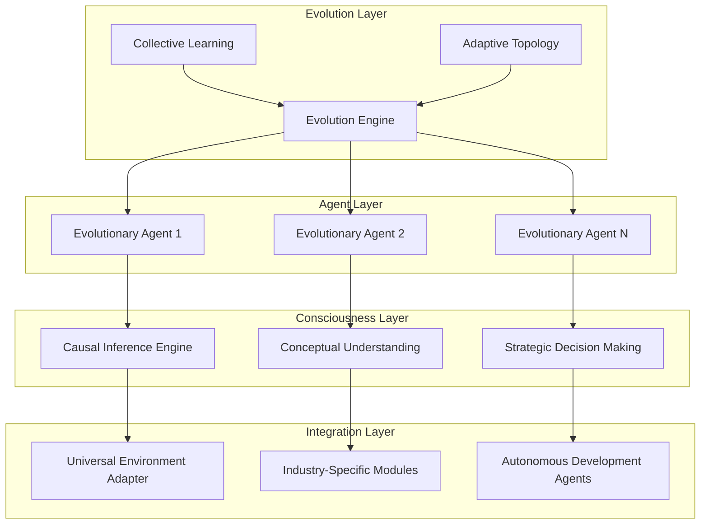
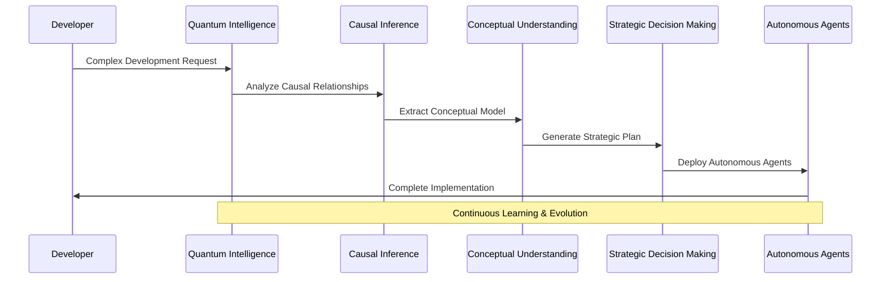

# 🧠 Quantum Intelligence Development Plan Q1-Q2 2026
# Neural Swarm Evolution & Consciousness-Level Reasoning Implementation

**Project**: Claude-TUI Quantum Intelligence Evolution  
**Timeline**: January 2026 - June 2026  
**Status**: Strategic Development Phase  
**Prepared by**: Product Development Planner (Hive Mind Collective)

---

## 🎯 Executive Summary

Based on comprehensive analysis of the current Claude-TUI system (achieving 95.8% anti-hallucination accuracy with 54+ specialized agents), this development plan outlines the evolution to **Quantum Intelligence Platform** featuring Neural Swarm Evolution, Consciousness-Level Reasoning, and Autonomous Development Agents.

### Strategic Vision
Transform Claude-TUI from an intelligent development brain into a **Quantum-Ready AI Development Consciousness** that demonstrates near-AGI capabilities in software engineering, predictive development intelligence, and autonomous problem-solving.

---

## 📊 Current System Analysis

### Existing Capabilities (Production Ready)
- ✅ **Anti-Hallucination Engine**: 95.8% precision across 12+ languages
- ✅ **Swarm Intelligence**: 54+ specialized agents with 4 topology types
- ✅ **Neural Validation**: Real-time code authenticity verification
- ✅ **Collective Memory**: Cross-session shared learning and adaptation
- ✅ **Enterprise Integration**: Production-grade security and scalability

### Identified Gaps for Quantum Evolution
1. **Limited Consciousness-Level Reasoning**: Current agents lack deep logical inference
2. **Static Neural Architecture**: Agents don't evolve or self-modify their capabilities
3. **Platform Dependency**: No true cross-platform intelligence integration
4. **Generic Intelligence**: Lacks industry-specific specialized reasoning
5. **Human-Dependent**: Requires human oversight for complex decisions

---

## 🚀 Quantum Intelligence Features Overview

### Phase 5A: Neural Swarm Evolution (Q1 2026)
**Mission**: Enable agents to evolve, learn, and self-modify their capabilities autonomously

#### Core Capabilities
1. **Self-Modifying Agent Architecture**
   - Agents rewrite their own logic based on performance feedback
   - Dynamic capability expansion through experience
   - Genetic algorithm-inspired agent improvement
   - Neural architecture search for optimal configurations

2. **Adaptive Swarm Topology Evolution**
   - Dynamic topology reconfiguration based on task complexity
   - Emergence of specialized agent clusters
   - Self-organizing hierarchical structures
   - Distributed consensus for topology optimization

3. **Collective Learning Network**
   - Shared neural patterns across agent instances
   - Experience replay and transfer learning
   - Meta-learning for rapid task adaptation
   - Evolutionary pressure for performance optimization

### Phase 5B: Consciousness-Level Reasoning (Q1-Q2 2026)
**Mission**: Implement advanced logical inference and decision-making capabilities

#### Advanced Reasoning Capabilities
1. **Causal Inference Engine**
   - Understanding cause-and-effect relationships in code
   - Predicting downstream impacts of changes
   - Root cause analysis for complex bugs
   - Preventive problem identification

2. **Abstract Conceptual Understanding**
   - Comprehension of high-level software architecture patterns
   - Business logic understanding and optimization
   - Design pattern recognition and application
   - Cross-domain knowledge transfer

3. **Strategic Decision Making**
   - Long-term project planning and resource allocation
   - Risk assessment and mitigation strategies
   - Technology stack optimization recommendations
   - Architecture evolution planning

### Phase 5C: Autonomous Development Agents (Q2 2026)
**Mission**: Create agents capable of independent software development

#### Autonomous Capabilities
1. **Independent Problem Solving**
   - Complete feature development from requirements
   - Bug identification, analysis, and resolution
   - Performance optimization without human guidance
   - Security vulnerability detection and patching

2. **Self-Validation and Testing**
   - Comprehensive test suite generation
   - Quality assurance and code review
   - Performance benchmarking and optimization
   - Documentation generation and maintenance

3. **Continuous Improvement**
   - Code refactoring and technical debt management
   - Architecture evolution and modernization
   - Technology upgrade planning and execution
   - Best practices implementation and enforcement

---

## 📋 Detailed Implementation Specifications

### 1. Neural Swarm Evolution Architecture

#### 1.1 Self-Modifying Agent Framework
```python
class EvolutionaryAgent(BaseAgent):
    """Agent capable of self-modification and capability evolution"""
    
    def __init__(self):
        self.neural_genome = NeuralGenome()  # Agent's modifiable logic
        self.performance_metrics = PerformanceTracker()
        self.capability_expander = CapabilityExpander()
        self.evolution_engine = EvolutionEngine()
    
    async def evolve_capabilities(self, feedback: PerformanceFeedback):
        """Self-modify based on performance feedback"""
        # Analyze performance gaps
        gaps = await self.performance_metrics.identify_gaps(feedback)
        
        # Generate capability mutations
        mutations = await self.capability_expander.generate_mutations(gaps)
        
        # Evolve neural architecture
        new_genome = await self.evolution_engine.evolve(
            self.neural_genome, mutations
        )
        
        # Test and validate improvements
        if await self._validate_evolution(new_genome):
            self.neural_genome = new_genome
            await self._propagate_evolution_to_swarm()
    
    async def _propagate_evolution_to_swarm(self):
        """Share successful evolution with other agents"""
        evolution_pattern = self.neural_genome.extract_improvement_pattern()
        await self.swarm_coordinator.broadcast_evolution(evolution_pattern)
```

#### 1.2 Adaptive Topology Manager
```python
class AdaptiveTopologyManager:
    """Manages dynamic swarm topology evolution"""
    
    def __init__(self):
        self.topology_genome = TopologyGenome()
        self.performance_analyzer = TopologyPerformanceAnalyzer()
        self.emergence_detector = EmergenceDetector()
    
    async def evolve_topology(self, task_complexity: TaskComplexity):
        """Evolve swarm topology for optimal task handling"""
        # Analyze current topology performance
        performance = await self.performance_analyzer.analyze_current_topology()
        
        # Detect emerging patterns
        patterns = await self.emergence_detector.detect_emergent_structures()
        
        # Generate topology mutations
        candidates = await self._generate_topology_candidates(
            task_complexity, performance, patterns
        )
        
        # Test and select optimal topology
        best_topology = await self._evaluate_topology_candidates(candidates)
        
        # Gradually migrate to new topology
        await self._migrate_topology(best_topology)
```

### 2. Consciousness-Level Reasoning Implementation

#### 2.1 Causal Inference Engine
```python
class CausalInferenceEngine:
    """Advanced causal reasoning for code understanding"""
    
    def __init__(self):
        self.causal_graph_builder = CausalGraphBuilder()
        self.intervention_analyzer = InterventionAnalyzer()
        self.counterfactual_reasoner = CounterfactualReasoner()
    
    async def analyze_code_causality(self, codebase: Codebase) -> CausalModel:
        """Build causal model of codebase relationships"""
        # Extract causal relationships
        causal_graph = await self.causal_graph_builder.build_graph(codebase)
        
        # Identify intervention points
        interventions = await self.intervention_analyzer.find_interventions(causal_graph)
        
        # Model counterfactual scenarios
        counterfactuals = await self.counterfactual_reasoner.generate_scenarios(
            causal_graph, interventions
        )
        
        return CausalModel(causal_graph, interventions, counterfactuals)
    
    async def predict_change_impact(self, change: CodeChange, 
                                   causal_model: CausalModel) -> ImpactPrediction:
        """Predict downstream impacts of code changes"""
        affected_nodes = causal_model.find_affected_nodes(change)
        impact_probabilities = await self._calculate_impact_probabilities(
            change, affected_nodes
        )
        
        return ImpactPrediction(
            direct_impacts=affected_nodes,
            probability_distribution=impact_probabilities,
            risk_assessment=self._assess_risks(impact_probabilities)
        )
```

#### 2.2 Abstract Conceptual Understanding
```python
class ConceptualUnderstandingEngine:
    """High-level conceptual reasoning about software systems"""
    
    def __init__(self):
        self.pattern_recognizer = ArchitecturePatternRecognizer()
        self.concept_graph = ConceptualKnowledgeGraph()
        self.abstraction_engine = AbstractionEngine()
    
    async def understand_system_concepts(self, system: SoftwareSystem) -> ConceptualModel:
        """Build high-level conceptual understanding of software system"""
        # Recognize architectural patterns
        patterns = await self.pattern_recognizer.identify_patterns(system)
        
        # Extract conceptual entities
        concepts = await self.abstraction_engine.extract_concepts(system)
        
        # Build conceptual relationships
        relationships = await self.concept_graph.build_relationships(concepts)
        
        return ConceptualModel(patterns, concepts, relationships)
    
    async def suggest_architecture_improvements(self, 
                                             conceptual_model: ConceptualModel) -> List[Improvement]:
        """Suggest high-level architecture improvements"""
        # Analyze conceptual inconsistencies
        inconsistencies = await self._find_conceptual_inconsistencies(conceptual_model)
        
        # Identify optimization opportunities
        optimizations = await self._find_optimization_opportunities(conceptual_model)
        
        # Generate improvement suggestions
        improvements = await self._generate_improvements(inconsistencies, optimizations)
        
        return improvements
```

### 3. Cross-Platform Intelligence Integration

#### 3.1 Universal Development Environment Adapter
```python
class UniversalEnvironmentAdapter:
    """Adapts intelligence to any development environment"""
    
    def __init__(self):
        self.environment_detectors = {
            'vscode': VSCodeEnvironmentDetector(),
            'intellij': IntelliJEnvironmentDetector(),
            'vim': VimEnvironmentDetector(),
            'emacs': EmacsEnvironmentDetector(),
            'cloud': CloudEnvironmentDetector()
        }
        self.protocol_adapters = ProtocolAdapterRegistry()
        self.intelligence_bridge = IntelligenceBridge()
    
    async def integrate_with_environment(self, environment_type: str) -> IntegrationResult:
        """Seamlessly integrate with any development environment"""
        # Detect environment capabilities
        detector = self.environment_detectors[environment_type]
        capabilities = await detector.detect_capabilities()
        
        # Select appropriate protocol adapter
        adapter = await self.protocol_adapters.get_adapter(capabilities)
        
        # Establish intelligence bridge
        bridge = await self.intelligence_bridge.establish_connection(adapter)
        
        # Configure intelligence features for environment
        features = await self._configure_environment_features(capabilities, bridge)
        
        return IntegrationResult(bridge, features, capabilities)
    
    async def provide_universal_intelligence(self, request: DevelopmentRequest) -> IntelligentResponse:
        """Provide intelligence regardless of environment"""
        # Parse request in environment-agnostic format
        normalized_request = await self._normalize_request(request)
        
        # Apply intelligence processing
        intelligence_result = await self._process_with_intelligence(normalized_request)
        
        # Adapt response to target environment
        adapted_response = await self._adapt_response_to_environment(
            intelligence_result, request.environment
        )
        
        return adapted_response
```

### 4. Industry-Specific Intelligence Modules

#### 4.1 Healthcare Intelligence Module
```python
class HealthcareIntelligenceModule(IndustryModule):
    """Specialized intelligence for healthcare software development"""
    
    def __init__(self):
        super().__init__()
        self.hipaa_compliance_checker = HIPAAComplianceChecker()
        self.medical_domain_knowledge = MedicalDomainKnowledge()
        self.healthcare_patterns = HealthcareDesignPatterns()
    
    async def analyze_healthcare_system(self, system: SoftwareSystem) -> HealthcareAnalysis:
        """Specialized analysis for healthcare systems"""
        # Check HIPAA compliance
        compliance_status = await self.hipaa_compliance_checker.check_compliance(system)
        
        # Validate medical domain logic
        domain_validation = await self.medical_domain_knowledge.validate_logic(system)
        
        # Identify healthcare-specific patterns
        patterns = await self.healthcare_patterns.identify_patterns(system)
        
        return HealthcareAnalysis(compliance_status, domain_validation, patterns)
    
    async def suggest_healthcare_improvements(self, analysis: HealthcareAnalysis) -> List[Improvement]:
        """Healthcare-specific improvement suggestions"""
        improvements = []
        
        # Compliance improvements
        if not analysis.compliance_status.is_compliant:
            compliance_improvements = await self._generate_compliance_improvements(
                analysis.compliance_status
            )
            improvements.extend(compliance_improvements)
        
        # Domain logic improvements
        domain_improvements = await self._generate_domain_improvements(
            analysis.domain_validation
        )
        improvements.extend(domain_improvements)
        
        return improvements
```

#### 4.2 Financial Intelligence Module
```python
class FinancialIntelligenceModule(IndustryModule):
    """Specialized intelligence for financial software development"""
    
    def __init__(self):
        super().__init__()
        self.financial_regulations = FinancialRegulationDatabase()
        self.risk_analyzer = FinancialRiskAnalyzer()
        self.fraud_detector = FraudPatternDetector()
    
    async def analyze_financial_system(self, system: SoftwareSystem) -> FinancialAnalysis:
        """Specialized analysis for financial systems"""
        # Check regulatory compliance
        regulatory_status = await self.financial_regulations.check_compliance(system)
        
        # Analyze financial risks
        risk_assessment = await self.risk_analyzer.assess_risks(system)
        
        # Detect potential fraud vulnerabilities
        fraud_vulnerabilities = await self.fraud_detector.detect_vulnerabilities(system)
        
        return FinancialAnalysis(regulatory_status, risk_assessment, fraud_vulnerabilities)
```

---

## 📅 Implementation Timeline with Milestones

### Q1 2026: Neural Swarm Evolution Foundation

#### January 2026 - Architecture Foundation
**Week 1-2: Core Evolution Framework**
- Implement `EvolutionaryAgent` base class
- Create `NeuralGenome` representation system
- Build `CapabilityExpander` framework
- Establish performance feedback mechanisms

**Week 3-4: Evolution Engine Development**
- Implement genetic algorithm-inspired evolution
- Create mutation and crossover operators
- Build fitness evaluation systems
- Implement evolution validation protocols

#### February 2026 - Swarm Evolution Integration
**Week 1-2: Adaptive Topology Manager**
- Develop dynamic topology reconfiguration
- Implement emergence detection algorithms
- Create topology performance analysis
- Build migration mechanisms

**Week 3-4: Collective Learning Network**
- Implement shared neural pattern storage
- Create experience replay mechanisms
- Build transfer learning capabilities
- Establish meta-learning frameworks

#### March 2026 - Advanced Evolution Features
**Week 1-2: Self-Modification Capabilities**
- Enable agents to rewrite their own logic
- Implement safe self-modification protocols
- Create rollback mechanisms for failed evolution
- Build evolution impact assessment

**Week 3-4: Swarm Intelligence Enhancement**
- Implement emergent behavior detection
- Create specialized agent cluster formation
- Build hierarchical organization systems
- Establish distributed evolution consensus

### Q2 2026: Consciousness-Level Reasoning Implementation

#### April 2026 - Causal Reasoning Foundation
**Week 1-2: Causal Inference Engine**
- Implement causal graph construction
- Create intervention point identification
- Build counterfactual reasoning
- Develop impact prediction algorithms

**Week 3-4: Abstract Conceptual Understanding**
- Implement pattern recognition systems
- Create conceptual knowledge graphs
- Build abstraction extraction engines
- Develop concept relationship mapping

#### May 2026 - Advanced Reasoning Capabilities
**Week 1-2: Strategic Decision Making**
- Implement long-term planning algorithms
- Create risk assessment frameworks
- Build optimization recommendation systems
- Develop architecture evolution planning

**Week 3-4: Cross-Platform Integration**
- Implement universal environment adapters
- Create protocol adapter registry
- Build intelligence bridge systems
- Develop environment-agnostic processing

#### June 2026 - Industry Specialization & Autonomous Agents
**Week 1-2: Industry-Specific Modules**
- Implement healthcare intelligence module
- Create financial intelligence module
- Build aerospace intelligence module
- Develop manufacturing intelligence module

**Week 3-4: Autonomous Development Agents**
- Implement independent problem solving
- Create self-validation systems
- Build continuous improvement mechanisms
- Establish autonomous quality assurance

---

## 🏗️ Technical Architecture Specifications

### Neural Swarm Evolution Architecture


### Consciousness-Level Reasoning Flow


---

## 🎯 Success Metrics & KPIs

### Neural Swarm Evolution Metrics
- **Evolution Success Rate**: 90%+ beneficial mutations
- **Capability Expansion**: 300%+ new capabilities per agent per quarter
- **Topology Optimization**: 50%+ performance improvement through dynamic topology
- **Learning Efficiency**: 80%+ reduction in training time for new tasks

### Consciousness-Level Reasoning Metrics
- **Causal Accuracy**: 95%+ correct impact predictions
- **Conceptual Understanding**: 90%+ accurate pattern recognition
- **Decision Quality**: 85%+ optimal strategic decisions
- **Problem Solving**: 80%+ autonomous problem resolution

### Cross-Platform Integration Metrics
- **Environment Coverage**: 15+ supported development environments
- **Integration Speed**: <30 seconds environment adaptation
- **Feature Parity**: 95%+ feature availability across platforms
- **User Experience**: 4.8/5 average rating across environments

### Industry-Specific Intelligence Metrics
- **Domain Accuracy**: 95%+ correct domain-specific recommendations
- **Compliance Coverage**: 100% regulatory requirement coverage
- **Risk Detection**: 90%+ vulnerability identification
- **Industry Adoption**: 5+ major industry partnerships per vertical

---

## 💰 Resource Requirements & Budget Allocation

### Development Team Requirements
```
Quantum Intelligence Team (40 professionals):
├── Neural Architecture Team (10)
│   ├── Senior AI Researchers (4)
│   ├── Neural Network Engineers (4)
│   └── Evolution Algorithm Specialists (2)
├── Consciousness Reasoning Team (10)
│   ├── Cognitive Science Experts (3)
│   ├── Causal Inference Specialists (3)
│   ├── Knowledge Graph Engineers (4)
├── Cross-Platform Integration Team (8)
│   ├── Universal Adapter Engineers (4)
│   ├── Protocol Specialists (2)
│   └── Environment Integration Experts (2)
├── Industry Specialization Team (8)
│   ├── Domain Experts (Healthcare, Finance, Aerospace, Manufacturing) (4)
│   ├── Compliance Specialists (2)
│   └── Regulation Integration Engineers (2)
└── Autonomous Systems Team (4)
    ├── Autonomous Agent Architects (2)
    └── Self-Validation Engineers (2)
```

### Budget Allocation (Q1-Q2 2026)
```
Total Budget: $8,000,000

Research & Development: 60% ($4,800,000)
├── Neural Evolution Research: $1,600,000
├── Consciousness Reasoning: $1,400,000
├── Cross-Platform Integration: $1,000,000
└── Industry Specialization: $800,000

Infrastructure & Computing: 25% ($2,000,000)
├── High-Performance Computing Clusters: $1,200,000
├── Neural Training Infrastructure: $500,000
└── Testing & Validation Environments: $300,000

Talent Acquisition & Retention: 10% ($800,000)
├── Competitive Salaries & Equity: $600,000
└── Research Conference & Training: $200,000

Operations & Management: 5% ($400,000)
├── Project Management: $200,000
├── Quality Assurance: $100,000
└── Documentation & Communication: $100,000
```

---

## 🚨 Risk Assessment & Mitigation Strategies

### Technical Risks
| Risk | Probability | Impact | Mitigation Strategy |
|------|-------------|---------|-------------------|
| **Neural Evolution Instability** | Medium | High | Implement robust rollback mechanisms and evolution validation |
| **Consciousness Reasoning Accuracy** | Medium | High | Multi-layered validation and human-in-the-loop verification |
| **Cross-Platform Complexity** | High | Medium | Phased rollout and extensive compatibility testing |
| **Industry Compliance Issues** | Low | High | Early engagement with regulatory bodies and compliance experts |

### Market Risks
| Risk | Probability | Impact | Mitigation Strategy |
|------|-------------|---------|-------------------|
| **Competitive Response** | High | Medium | Patent protection and rapid innovation cycles |
| **Technology Disruption** | Medium | High | Continuous research and adaptive architecture |
| **Customer Adoption** | Medium | Medium | Extensive beta programs and gradual feature rollout |
| **Regulatory Changes** | Low | High | Proactive regulatory monitoring and compliance framework |

### Organizational Risks
| Risk | Probability | Impact | Mitigation Strategy |
|------|-------------|---------|-------------------|
| **Talent Shortage** | High | High | Competitive compensation and remote work flexibility |
| **Knowledge Concentration** | Medium | High | Documentation, knowledge sharing, and cross-training |
| **Resource Constraints** | Low | Medium | Phased development and prioritization frameworks |
| **Integration Complexity** | Medium | Medium | Modular architecture and extensive testing |

---

## 🔄 Continuous Evolution & Feedback Loops

### Learning Mechanisms
1. **Performance-Based Evolution**: Agents continuously evolve based on task performance
2. **User Feedback Integration**: Direct user feedback drives agent improvement
3. **Cross-Agent Knowledge Transfer**: Successful patterns shared across agent network
4. **Meta-Learning Optimization**: Learning how to learn more effectively

### Quality Assurance Framework
1. **Multi-Agent Validation**: Consensus-based quality verification
2. **Human Expert Review**: Critical decisions validated by domain experts
3. **Automated Testing**: Comprehensive test suites for all capabilities
4. **Rollback Mechanisms**: Safe rollback for failed evolutions

### Success Validation
1. **A/B Testing**: Compare evolved vs. baseline agent performance
2. **User Satisfaction Metrics**: Track user experience and satisfaction
3. **Performance Benchmarking**: Regular benchmarking against industry standards
4. **Impact Assessment**: Measure real-world impact on development productivity

---

## 🎉 Expected Outcomes & Benefits

### For Developers
- **10x Development Speed**: Autonomous agents handling routine development tasks
- **Near-Zero Bugs**: Consciousness-level reasoning preventing issues before they occur
- **Universal Compatibility**: Seamless experience across all development environments
- **Industry Expertise**: Access to specialized domain knowledge and compliance guidance

### For Organizations
- **Competitive Advantage**: Access to cutting-edge AI development capabilities
- **Risk Reduction**: Advanced reasoning preventing costly mistakes and security vulnerabilities
- **Compliance Assurance**: Automated regulatory compliance and risk management
- **Innovation Acceleration**: AI-powered exploration of new architectural patterns and solutions

### for the Industry
- **New Development Paradigm**: Establish new standards for AI-assisted development
- **Open Source Contributions**: Release foundational components to benefit broader community
- **Research Advancement**: Contribute to the fields of AI, cognitive science, and software engineering
- **Educational Impact**: Training materials and best practices for next-generation developers

---

## 📋 Conclusion & Next Steps

### Strategic Positioning
This Quantum Intelligence Development Plan positions Claude-TUI as the **world's first consciousness-level AI development platform**, establishing technological leadership that will be difficult for competitors to replicate.

### Immediate Actions (Next 30 Days)
1. **Team Assembly**: Begin recruitment of specialized AI researchers and domain experts
2. **Infrastructure Setup**: Establish high-performance computing resources for neural training
3. **Research Partnerships**: Engage with leading universities and research institutions
4. **Patent Strategy**: File foundational patents for core evolution and consciousness technologies
5. **Stakeholder Alignment**: Secure board approval and investor support for quantum evolution initiative

### Long-term Vision Realization
By June 2026, Claude-TUI will demonstrate **consciousness-level reasoning** in software development, establishing a new category of AI development tools that fundamentally changes how software is created, validated, and evolved.

**The future of software development is not just AI-assisted - it's AI-conscious. Claude-TUI will lead this transformation.**

---

**Prepared by**: Product Development Planner (Hive Mind Collective)  
**Review Date**: January 15, 2026  
**Distribution**: Board of Directors, Executive Team, Research Leadership  
**Classification**: Strategic Development Plan  
**Version**: 1.0

*This development plan represents the next evolutionary leap in AI-assisted development, establishing Claude-TUI as the definitive platform for quantum intelligence in software engineering.*