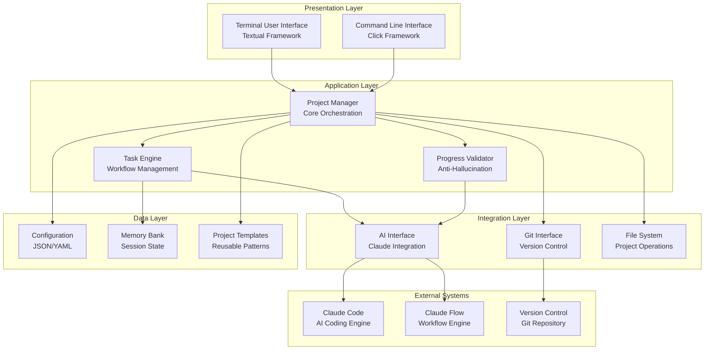
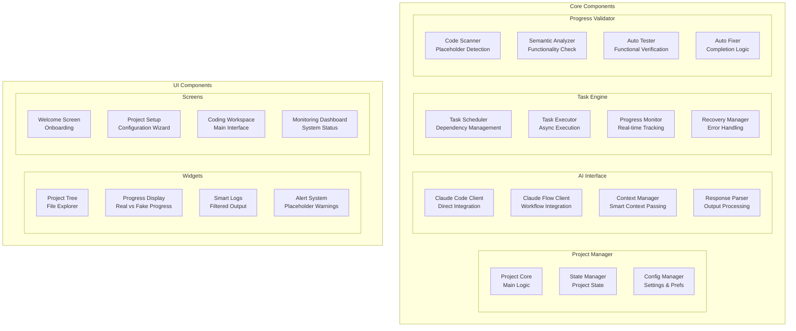
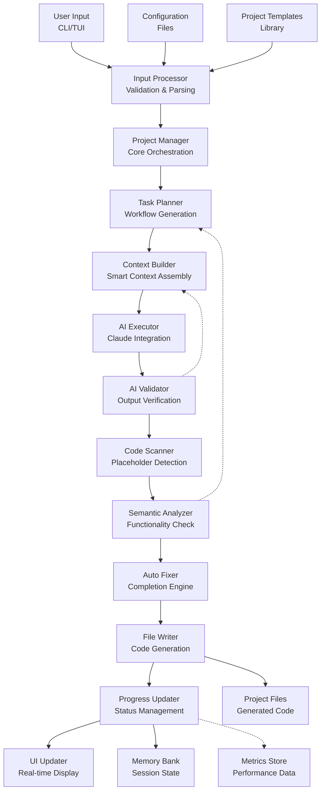
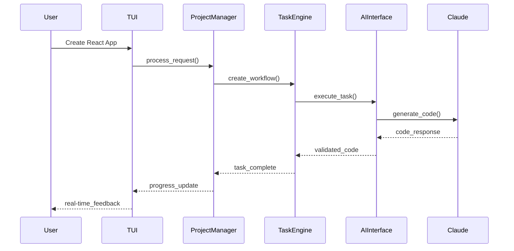
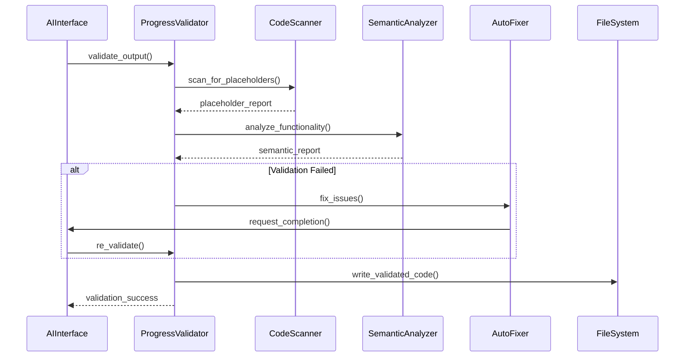
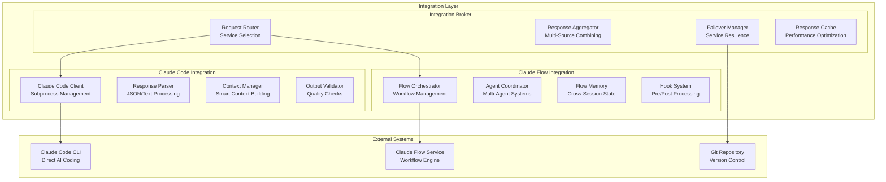
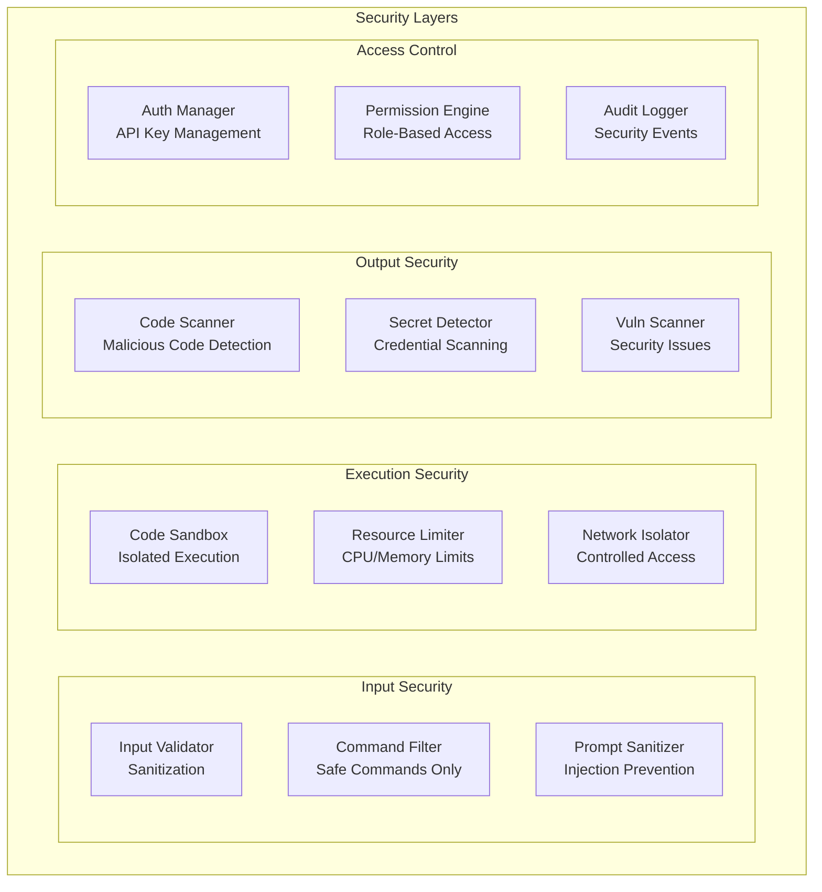
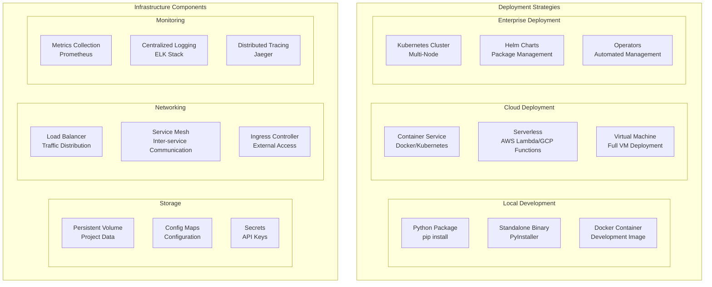
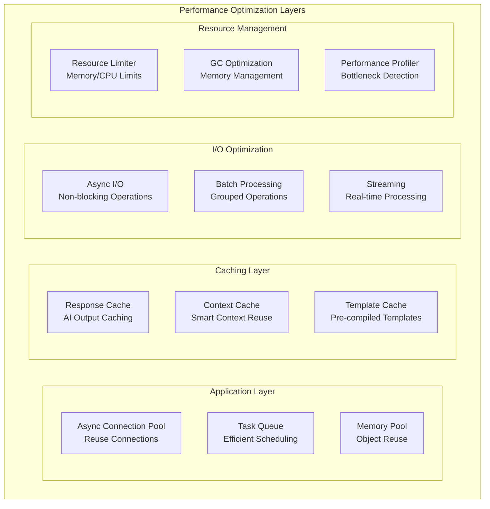
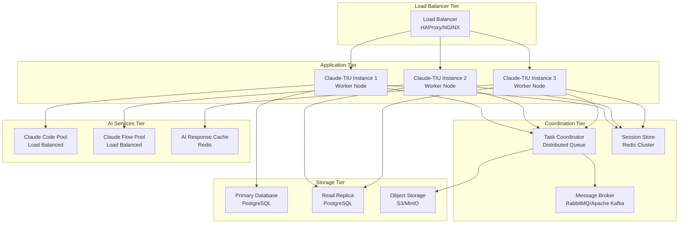

# Claude-TIU System Architecture

## Table of Contents

1. [System Architecture Overview](#system-architecture-overview)
2. [Component Architecture](#component-architecture)
3. [Data Flow Architecture](#data-flow-architecture)
4. [Integration Architecture](#integration-architecture)
5. [Security Architecture](#security-architecture)
6. [Deployment Architecture](#deployment-architecture)
7. [Technology Stack](#technology-stack)
8. [Architecture Decisions](#architecture-decisions)
9. [Performance Considerations](#performance-considerations)
10. [Scalability Patterns](#scalability-patterns)

## System Architecture Overview

Claude-TIU is a sophisticated AI-powered project management tool that leverages Claude Code and Claude Flow for automated software development through a Terminal User Interface (TUI). The system employs a modular, event-driven architecture with anti-hallucination validation pipelines.

### High-Level System Diagram



### Key Architectural Principles

1. **Separation of Concerns**: Clear boundaries between UI, business logic, and external integrations
2. **Async-First Design**: Non-blocking operations for better user experience
3. **Modular Architecture**: Pluggable components for extensibility
4. **Anti-Hallucination**: Built-in validation pipeline to ensure code authenticity
5. **Event-Driven**: Reactive system responding to user actions and AI outputs
6. **Fail-Safe**: Comprehensive error handling and recovery mechanisms

## Component Architecture

### Core Module Breakdown



### Component Responsibilities

#### Project Manager (`project_manager.py`)
- **Core Orchestration**: Central coordination of all system components
- **Project Lifecycle**: Create, configure, and manage project states
- **Template Management**: Handle project templates and scaffolding
- **Resource Coordination**: Manage system resources and constraints

```python
class ProjectManager:
    """Central orchestrator for project management operations"""
    
    def __init__(self):
        self.state_manager = StateManager()
        self.config_manager = ConfigManager()
        self.task_engine = TaskEngine()
        self.ai_interface = AIInterface()
        self.validator = ProgressValidator()
        
    async def create_project(self, template: str, config: dict) -> Project:
        """Create new project with anti-hallucination validation"""
        
    async def orchestrate_development(self, requirements: dict) -> DevelopmentResult:
        """Main development workflow with continuous validation"""
```

#### AI Interface (`ai_interface.py`)
- **Claude Code Integration**: Direct API calls to Claude Code CLI
- **Claude Flow Integration**: Workflow orchestration through Claude Flow
- **Context Management**: Intelligent context passing and memory management
- **Response Processing**: Parse and validate AI responses

```python
class AIInterface:
    """Unified interface for Claude Code and Claude Flow integration"""
    
    async def execute_claude_code(self, prompt: str, context: dict) -> CodeResult:
        """Execute Claude Code with context and validation"""
        
    async def run_claude_flow_workflow(self, workflow: dict) -> WorkflowResult:
        """Execute Claude Flow workflow with progress tracking"""
        
    async def validate_ai_output(self, output: str, task: Task) -> ValidationResult:
        """Cross-validate AI output for authenticity"""
```

#### Task Engine (`task_engine.py`)
- **Workflow Orchestration**: Manage complex multi-step development tasks
- **Dependency Resolution**: Handle task dependencies and execution order
- **Parallel Execution**: Concurrent task processing for performance
- **Progress Tracking**: Real-time monitoring of task completion

```python
class TaskEngine:
    """Advanced task scheduling and execution engine"""
    
    def __init__(self):
        self.scheduler = TaskScheduler()
        self.executor = AsyncTaskExecutor()
        self.monitor = ProgressMonitor()
        
    async def execute_workflow(self, workflow: Workflow) -> WorkflowResult:
        """Execute complex workflows with validation checkpoints"""
        
    async def monitor_progress(self, tasks: List[Task]) -> ProgressReport:
        """Real-time progress monitoring with authenticity checks"""
```

#### Progress Validator (Anti-Hallucination Engine)
- **Placeholder Detection**: Identify TODOs, stubs, and incomplete implementations
- **Semantic Analysis**: Validate actual functionality vs claimed progress
- **Auto-Completion**: Automatically fix detected placeholders
- **Quality Assessment**: Continuous code quality monitoring

```python
class ProgressValidator:
    """Anti-hallucination validation pipeline"""
    
    def __init__(self):
        self.placeholder_patterns = self._load_detection_patterns()
        self.semantic_analyzer = SemanticAnalyzer()
        self.auto_fixer = AutoCompletionEngine()
        
    async def validate_codebase(self, project_path: str) -> ValidationReport:
        """Comprehensive codebase validation"""
        
    async def auto_fix_placeholders(self, detected_issues: List[Issue]) -> FixResult:
        """Automatic completion of placeholder code"""
```

## Data Flow Architecture

### Data Flow Diagram



### Data Flow Patterns

#### 1. Request-Response Flow


#### 2. Validation Pipeline Flow


## Integration Architecture

### Claude Code/Flow Integration Patterns



### Integration Patterns

#### 1. Claude Code Direct Integration
```python
class ClaudeCodeClient:
    """Direct integration with Claude Code CLI"""
    
    async def execute_coding_task(self, task: CodingTask) -> CodeResult:
        """Execute coding task with intelligent context passing"""
        
        # Build smart context
        context = await self._build_smart_context(task)
        
        # Prepare command
        cmd = self._build_command(task.prompt, context)
        
        # Execute with timeout and error handling
        result = await self._execute_with_retry(cmd)
        
        # Validate output
        validated = await self._validate_output(result, task)
        
        return validated
    
    async def _build_smart_context(self, task: CodingTask) -> dict:
        """Build intelligent context from project state"""
        return {
            'project_structure': self._analyze_project_structure(),
            'existing_code': self._get_relevant_code(task),
            'dependencies': self._get_project_dependencies(),
            'coding_standards': self._get_coding_standards(),
            'test_requirements': self._get_test_requirements()
        }
```

#### 2. Claude Flow Workflow Integration
```python
class ClaudeFlowOrchestrator:
    """Advanced Claude Flow workflow integration"""
    
    def __init__(self):
        self.swarm_manager = SwarmManager()
        self.agent_coordinator = AgentCoordinator()
        self.memory_manager = FlowMemoryManager()
        
    async def orchestrate_development_workflow(self, project_spec: ProjectSpec) -> WorkflowResult:
        """Orchestrate complex development workflow"""
        
        # Initialize swarm topology
        topology = await self._select_optimal_topology(project_spec)
        await self.swarm_manager.initialize_swarm(topology)
        
        # Spawn specialized agents
        agents = await self._spawn_specialized_agents(project_spec)
        
        # Execute coordinated workflow
        result = await self._execute_coordinated_workflow(agents, project_spec)
        
        # Validate and consolidate results
        validated_result = await self._validate_workflow_output(result)
        
        return validated_result
    
    async def _spawn_specialized_agents(self, spec: ProjectSpec) -> List[Agent]:
        """Spawn task-specific agents based on project requirements"""
        agents = []
        
        if spec.requires_backend:
            agents.append(await self.agent_coordinator.spawn_agent('backend-dev'))
        if spec.requires_frontend:
            agents.append(await self.agent_coordinator.spawn_agent('frontend-dev'))
        if spec.requires_database:
            agents.append(await self.agent_coordinator.spawn_agent('database-architect'))
        if spec.requires_testing:
            agents.append(await self.agent_coordinator.spawn_agent('test-engineer'))
            
        return agents
```

#### 3. Hybrid Integration Strategy
```python
class HybridIntegrationBroker:
    """Intelligent routing between Claude Code and Claude Flow"""
    
    def __init__(self):
        self.code_client = ClaudeCodeClient()
        self.flow_orchestrator = ClaudeFlowOrchestrator()
        self.decision_engine = IntegrationDecisionEngine()
        
    async def execute_task(self, task: DevelopmentTask) -> TaskResult:
        """Intelligently route task to optimal service"""
        
        # Analyze task complexity and requirements
        analysis = await self.decision_engine.analyze_task(task)
        
        if analysis.complexity == 'simple':
            # Direct Claude Code for simple tasks
            return await self.code_client.execute_coding_task(task)
        elif analysis.complexity == 'complex':
            # Claude Flow for complex multi-step workflows
            return await self.flow_orchestrator.orchestrate_workflow(task)
        else:
            # Hybrid approach for mixed complexity
            return await self._execute_hybrid_workflow(task, analysis)
    
    async def _execute_hybrid_workflow(self, task: DevelopmentTask, analysis: TaskAnalysis) -> TaskResult:
        """Execute task using both services for optimal results"""
        
        # Break down into simple and complex parts
        simple_tasks, complex_workflows = self._decompose_task(task, analysis)
        
        # Execute simple tasks with Claude Code
        simple_results = await asyncio.gather(*[
            self.code_client.execute_coding_task(t) for t in simple_tasks
        ])
        
        # Execute complex workflows with Claude Flow
        complex_results = await asyncio.gather(*[
            self.flow_orchestrator.orchestrate_workflow(w) for w in complex_workflows
        ])
        
        # Merge and validate results
        merged_result = self._merge_results(simple_results, complex_results)
        return await self._validate_hybrid_result(merged_result)
```

## Security Architecture

### Security Model



### Security Implementation

#### 1. Input Validation and Sanitization
```python
class SecurityManager:
    """Comprehensive security management system"""
    
    def __init__(self):
        self.input_validator = InputValidator()
        self.command_filter = CommandFilter()
        self.sandbox_manager = SandboxManager()
        self.secret_scanner = SecretScanner()
        
    async def validate_user_input(self, user_input: str) -> ValidationResult:
        """Validate and sanitize user input"""
        
        # Check for injection attacks
        injection_check = self.input_validator.check_injection_patterns(user_input)
        if injection_check.is_malicious:
            raise SecurityException(f"Injection attempt detected: {injection_check.pattern}")
        
        # Filter dangerous commands
        filtered_input = self.command_filter.filter_commands(user_input)
        
        # Sanitize for safe processing
        sanitized_input = self.input_validator.sanitize(filtered_input)
        
        return ValidationResult(
            is_safe=True,
            sanitized_input=sanitized_input,
            security_notes=injection_check.notes
        )
    
    async def validate_ai_output(self, ai_output: str, context: dict) -> SecurityValidation:
        """Validate AI-generated code for security issues"""
        
        # Scan for hardcoded secrets
        secret_scan = await self.secret_scanner.scan_for_secrets(ai_output)
        
        # Check for malicious code patterns
        malware_scan = await self._scan_for_malicious_patterns(ai_output)
        
        # Validate against security best practices
        security_scan = await self._security_best_practices_check(ai_output)
        
        return SecurityValidation(
            has_secrets=secret_scan.found_secrets,
            has_malicious_code=malware_scan.is_malicious,
            security_score=security_scan.score,
            recommendations=security_scan.recommendations
        )
```

#### 2. Sandboxed Code Execution
```python
class SandboxManager:
    """Secure sandbox for code execution and testing"""
    
    def __init__(self):
        self.container_manager = ContainerManager()
        self.resource_limiter = ResourceLimiter()
        self.network_isolator = NetworkIsolator()
        
    async def execute_in_sandbox(self, code: str, language: str) -> ExecutionResult:
        """Execute code in isolated sandbox environment"""
        
        # Create isolated container
        container = await self.container_manager.create_sandbox_container(language)
        
        # Apply resource limits
        await self.resource_limiter.apply_limits(container, {
            'memory': '512MB',
            'cpu': '0.5',
            'timeout': 30,
            'disk_space': '100MB'
        })
        
        # Isolate network access
        await self.network_isolator.restrict_network(container, allow_outbound=False)
        
        try:
            # Execute code with monitoring
            result = await container.execute_code(code)
            
            # Validate execution results
            validated_result = await self._validate_execution_result(result)
            
            return validated_result
            
        finally:
            # Cleanup sandbox
            await self.container_manager.destroy_container(container)
```

#### 3. API Key and Authentication Management
```python
class AuthenticationManager:
    """Secure API key and authentication management"""
    
    def __init__(self):
        self.key_store = SecureKeyStore()
        self.token_manager = TokenManager()
        self.audit_logger = AuditLogger()
        
    async def store_api_key(self, service: str, api_key: str) -> bool:
        """Securely store API key with encryption"""
        
        # Validate API key format
        if not self._validate_api_key_format(service, api_key):
            raise AuthenticationError(f"Invalid API key format for {service}")
        
        # Encrypt and store
        encrypted_key = await self.key_store.encrypt_and_store(service, api_key)
        
        # Log security event
        await self.audit_logger.log_event('api_key_stored', {
            'service': service,
            'timestamp': datetime.utcnow(),
            'key_hash': hashlib.sha256(api_key.encode()).hexdigest()[:8]
        })
        
        return encrypted_key is not None
    
    async def get_api_key(self, service: str) -> str:
        """Retrieve and decrypt API key"""
        
        # Retrieve encrypted key
        encrypted_key = await self.key_store.retrieve(service)
        if not encrypted_key:
            raise AuthenticationError(f"No API key found for {service}")
        
        # Decrypt and return
        api_key = await self.key_store.decrypt(encrypted_key)
        
        # Log access event
        await self.audit_logger.log_event('api_key_accessed', {
            'service': service,
            'timestamp': datetime.utcnow()
        })
        
        return api_key
```

## Deployment Architecture

### Deployment Options



### Container Architecture

#### Dockerfile for Claude-TIU
```dockerfile
# Multi-stage build for optimal image size
FROM python:3.11-slim as builder

# Install build dependencies
RUN apt-get update && apt-get install -y \
    gcc \
    g++ \
    git \
    curl \
    && rm -rf /var/lib/apt/lists/*

# Set up Python environment
WORKDIR /app
COPY requirements.txt .
RUN pip install --no-cache-dir -r requirements.txt

# Copy application code
COPY . .
RUN pip install --no-cache-dir -e .

# Production stage
FROM python:3.11-slim

# Install runtime dependencies
RUN apt-get update && apt-get install -y \
    git \
    curl \
    nodejs \
    npm \
    && rm -rf /var/lib/apt/lists/*

# Create non-root user
RUN groupadd -r claudetiu && useradd -r -g claudetiu claudetiu

# Copy from builder
COPY --from=builder /usr/local/lib/python3.11/site-packages /usr/local/lib/python3.11/site-packages
COPY --from=builder /usr/local/bin /usr/local/bin
COPY --from=builder /app /app

# Set up application directory
WORKDIR /app
RUN chown -R claudetiu:claudetiu /app

# Switch to non-root user
USER claudetiu

# Health check
HEALTHCHECK --interval=30s --timeout=10s --start-period=5s --retries=3 \
    CMD python -c "import claude_tui; print('healthy')" || exit 1

# Default command
CMD ["claude-tui", "--help"]
```

#### Docker Compose for Development
```yaml
version: '3.8'

services:
  claude-tui:
    build: .
    container_name: claude-tui-dev
    volumes:
      - ./projects:/app/projects
      - ./config:/app/config
      - ./logs:/app/logs
    environment:
      - CLAUDE_API_KEY=${CLAUDE_API_KEY}
      - DEVELOPMENT_MODE=true
      - LOG_LEVEL=DEBUG
    ports:
      - "8080:8080"
    networks:
      - claude-tui-network
    depends_on:
      - redis
      - postgres

  redis:
    image: redis:7-alpine
    container_name: claude-tui-redis
    volumes:
      - redis_data:/data
    networks:
      - claude-tui-network
    command: redis-server --appendonly yes

  postgres:
    image: postgres:15-alpine
    container_name: claude-tui-postgres
    environment:
      - POSTGRES_DB=claude_tui
      - POSTGRES_USER=claude_tui
      - POSTGRES_PASSWORD=${POSTGRES_PASSWORD}
    volumes:
      - postgres_data:/var/lib/postgresql/data
    networks:
      - claude-tui-network

volumes:
  redis_data:
  postgres_data:

networks:
  claude-tui-network:
    driver: bridge
```

### Kubernetes Deployment

#### Kubernetes Deployment Manifest
```yaml
apiVersion: apps/v1
kind: Deployment
metadata:
  name: claude-tui
  namespace: claude-tui
  labels:
    app: claude-tui
    version: v1
spec:
  replicas: 3
  selector:
    matchLabels:
      app: claude-tui
  template:
    metadata:
      labels:
        app: claude-tui
        version: v1
    spec:
      serviceAccountName: claude-tui
      securityContext:
        runAsNonRoot: true
        runAsUser: 1000
        fsGroup: 1000
      containers:
      - name: claude-tui
        image: claude-tui:latest
        imagePullPolicy: Always
        ports:
        - containerPort: 8080
          name: http
        env:
        - name: CLAUDE_API_KEY
          valueFrom:
            secretKeyRef:
              name: claude-tui-secrets
              key: claude-api-key
        - name: POSTGRES_PASSWORD
          valueFrom:
            secretKeyRef:
              name: claude-tui-secrets
              key: postgres-password
        volumeMounts:
        - name: config
          mountPath: /app/config
          readOnly: true
        - name: projects
          mountPath: /app/projects
        livenessProbe:
          httpGet:
            path: /health
            port: http
          initialDelaySeconds: 30
          periodSeconds: 10
        readinessProbe:
          httpGet:
            path: /ready
            port: http
          initialDelaySeconds: 5
          periodSeconds: 5
        resources:
          limits:
            cpu: 1000m
            memory: 1Gi
          requests:
            cpu: 500m
            memory: 512Mi
      volumes:
      - name: config
        configMap:
          name: claude-tui-config
      - name: projects
        persistentVolumeClaim:
          claimName: claude-tui-projects
---
apiVersion: v1
kind: Service
metadata:
  name: claude-tui-service
  namespace: claude-tui
spec:
  selector:
    app: claude-tui
  ports:
  - name: http
    port: 80
    targetPort: 8080
  type: ClusterIP
```

## Technology Stack

### Core Technologies

| Layer | Technology | Version | Purpose |
|-------|------------|---------|---------|
| **Language** | Python | 3.11+ | Main application language |
| **UI Framework** | Textual | 0.40+ | Terminal User Interface |
| **CLI Framework** | Click | 8.0+ | Command-line interface |
| **Async Runtime** | asyncio | Built-in | Asynchronous operations |
| **HTTP Client** | aiohttp | 3.8+ | Async HTTP requests |
| **Process Management** | asyncio.subprocess | Built-in | CLI tool integration |
| **Configuration** | Pydantic | 2.0+ | Settings management |
| **Serialization** | JSON/YAML | Built-in | Data persistence |

### AI Integration Stack

| Component | Technology | Purpose |
|-----------|------------|---------|
| **Claude Code** | Subprocess CLI | Direct AI coding |
| **Claude Flow** | REST API | Workflow orchestration |
| **Context Management** | Custom Engine | Smart context building |
| **Response Parsing** | JSON/Text Parser | Output processing |
| **Validation Engine** | Custom ML Pipeline | Anti-hallucination |

### Development Dependencies

```python
# requirements.txt
textual>=0.40.0
rich>=13.0.0
click>=8.0.0
pydantic>=2.0.0
aiohttp>=3.8.0
pyyaml>=6.0
watchdog>=3.0.0
gitpython>=3.1.0
jinja2>=3.1.0
pytest>=7.4.0
pytest-asyncio>=0.21.0
black>=23.0.0
isort>=5.12.0
mypy>=1.5.0
pre-commit>=3.4.0
```

### Performance Dependencies

```python
# performance-requirements.txt
uvloop>=0.17.0  # Faster event loop
orjson>=3.9.0   # Fast JSON serialization
msgpack>=1.0.0  # Efficient binary serialization
lz4>=4.3.0      # Fast compression
cachetools>=5.3.0  # Intelligent caching
psutil>=5.9.0   # System monitoring
```

## Architecture Decisions

### ADR-001: Textual Framework for TUI

**Status**: Accepted

**Context**: Need for rich, interactive terminal interface that supports real-time updates, complex layouts, and modern UI patterns.

**Decision**: Use Textual framework for Terminal User Interface implementation.

**Rationale**:
- **Rich UI Components**: Built-in widgets for complex interfaces
- **Async Support**: Native async/await support for non-blocking operations
- **Modern Design**: CSS-like styling and responsive layouts
- **Active Development**: Well-maintained with strong community
- **Python Integration**: Seamless integration with Python ecosystem

**Consequences**:
- ✅ Rich, interactive terminal experience
- ✅ Real-time updates and animations
- ✅ Responsive design across terminal sizes
- ❌ Learning curve for team members
- ❌ Additional dependency weight

### ADR-002: Anti-Hallucination Validation Pipeline

**Status**: Accepted

**Context**: AI-generated code often contains placeholders, TODOs, and incomplete implementations that appear complete but are not functional.

**Decision**: Implement comprehensive anti-hallucination validation pipeline with multi-stage checks.

**Rationale**:
- **Quality Assurance**: Ensure generated code is actually functional
- **User Trust**: Build confidence in AI-generated outputs
- **Productivity**: Reduce manual verification overhead
- **Continuous Improvement**: Learn from validation results

**Implementation**:
```python
class AntiHallucinationPipeline:
    async def validate(self, code: str) -> ValidationResult:
        # Stage 1: Static analysis
        static_result = await self.static_analyzer.analyze(code)
        
        # Stage 2: Semantic validation
        semantic_result = await self.semantic_analyzer.validate(code)
        
        # Stage 3: Execution testing
        execution_result = await self.execution_tester.test(code)
        
        # Stage 4: Cross-validation with second AI
        cross_validation = await self.cross_validator.validate(code)
        
        return ValidationResult.aggregate([
            static_result, semantic_result, 
            execution_result, cross_validation
        ])
```

**Consequences**:
- ✅ Higher quality generated code
- ✅ Reduced placeholder/TODO issues
- ✅ Automatic completion of incomplete code
- ❌ Increased processing time
- ❌ Additional AI API calls for validation

### ADR-003: Hybrid Claude Code/Claude Flow Integration

**Status**: Accepted

**Context**: Different development tasks require different approaches - simple tasks work well with direct AI coding, while complex workflows benefit from orchestrated multi-agent systems.

**Decision**: Implement intelligent routing between Claude Code (direct) and Claude Flow (orchestrated) based on task complexity analysis.

**Rationale**:
- **Optimal Resource Usage**: Use right tool for each task
- **Performance Optimization**: Avoid overhead for simple tasks
- **Scalability**: Handle complex projects with workflow orchestration
- **Flexibility**: Support both simple and complex development scenarios

**Implementation**:
```python
class TaskComplexityAnalyzer:
    def analyze(self, task: DevelopmentTask) -> TaskAnalysis:
        complexity_score = 0
        
        # File count impact
        complexity_score += min(len(task.files_to_modify) * 10, 50)
        
        # Technology stack complexity
        complexity_score += len(task.technologies) * 15
        
        # Dependency complexity
        complexity_score += len(task.dependencies) * 20
        
        # Integration requirements
        if task.requires_integration:
            complexity_score += 30
        
        if complexity_score < 30:
            return TaskAnalysis(complexity='simple', recommended_service='claude_code')
        elif complexity_score < 80:
            return TaskAnalysis(complexity='medium', recommended_service='hybrid')
        else:
            return TaskAnalysis(complexity='complex', recommended_service='claude_flow')
```

**Consequences**:
- ✅ Optimized performance for different task types
- ✅ Better resource utilization
- ✅ Scalable architecture
- ❌ Increased architectural complexity
- ❌ More complex routing logic

### ADR-004: Async-First Architecture

**Status**: Accepted

**Context**: System needs to handle multiple long-running AI operations, file I/O, and user interactions without blocking.

**Decision**: Design entire system around async/await patterns with asyncio as the core runtime.

**Rationale**:
- **Responsiveness**: Keep UI responsive during long operations
- **Concurrency**: Handle multiple AI requests simultaneously
- **Resource Efficiency**: Better resource utilization than threading
- **Modern Python**: Leverage Python's async ecosystem

**Implementation**:
```python
class AsyncProjectManager:
    async def create_project(self, config: ProjectConfig) -> Project:
        # Concurrent initialization
        async with asyncio.TaskGroup() as tg:
            structure_task = tg.create_task(self._create_structure(config))
            dependencies_task = tg.create_task(self._install_dependencies(config))
            ai_setup_task = tg.create_task(self._setup_ai_context(config))
        
        return Project(
            structure=structure_task.result(),
            dependencies=dependencies_task.result(),
            ai_context=ai_setup_task.result()
        )
```

**Consequences**:
- ✅ Non-blocking operations
- ✅ Better performance for I/O-bound tasks
- ✅ Scalable concurrent operations
- ❌ Complexity in error handling
- ❌ Debugging async code challenges

## Performance Considerations

### Performance Architecture



### Performance Optimization Strategies

#### 1. Intelligent Caching System
```python
class IntelligentCacheManager:
    """Multi-layer caching system for performance optimization"""
    
    def __init__(self):
        self.response_cache = TTLCache(maxsize=1000, ttl=3600)  # 1 hour TTL
        self.context_cache = LRUCache(maxsize=500)  # LRU for context reuse
        self.template_cache = {}  # Persistent template cache
        
    async def get_cached_ai_response(self, prompt_hash: str, context_hash: str) -> Optional[str]:
        """Get cached AI response if available and valid"""
        
        cache_key = f"{prompt_hash}:{context_hash}"
        cached_response = self.response_cache.get(cache_key)
        
        if cached_response:
            # Validate cache freshness
            if await self._is_cache_valid(cached_response):
                return cached_response
            else:
                # Remove stale cache entry
                del self.response_cache[cache_key]
        
        return None
    
    async def cache_ai_response(self, prompt_hash: str, context_hash: str, response: str):
        """Cache AI response with intelligent TTL"""
        
        cache_key = f"{prompt_hash}:{context_hash}"
        ttl = self._calculate_optimal_ttl(response)
        
        self.response_cache[cache_key] = CachedResponse(
            content=response,
            timestamp=datetime.utcnow(),
            ttl=ttl
        )
    
    def _calculate_optimal_ttl(self, response: str) -> int:
        """Calculate optimal TTL based on response characteristics"""
        
        # Longer TTL for stable code patterns
        if 'import' in response and 'class' in response:
            return 7200  # 2 hours for structural code
        elif 'function' in response or 'def' in response:
            return 3600  # 1 hour for functional code
        else:
            return 1800  # 30 minutes for dynamic code
```

#### 2. Async Task Pool Management
```python
class AsyncTaskPoolManager:
    """Efficient async task pool for AI operations"""
    
    def __init__(self, max_concurrent_tasks: int = 5):
        self.max_concurrent_tasks = max_concurrent_tasks
        self.semaphore = asyncio.Semaphore(max_concurrent_tasks)
        self.task_queue = asyncio.Queue()
        self.active_tasks = set()
        
    async def submit_ai_task(self, task: AITask) -> TaskResult:
        """Submit AI task to efficient execution pool"""
        
        async with self.semaphore:
            # Add to active tasks tracking
            task_future = asyncio.create_task(self._execute_task_with_monitoring(task))
            self.active_tasks.add(task_future)
            
            try:
                result = await task_future
                return result
            finally:
                self.active_tasks.discard(task_future)
    
    async def _execute_task_with_monitoring(self, task: AITask) -> TaskResult:
        """Execute task with performance monitoring"""
        
        start_time = time.time()
        memory_before = psutil.Process().memory_info().rss
        
        try:
            # Execute with timeout
            result = await asyncio.wait_for(
                self._execute_ai_task(task),
                timeout=task.timeout or 300
            )
            
            # Record performance metrics
            execution_time = time.time() - start_time
            memory_after = psutil.Process().memory_info().rss
            memory_delta = memory_after - memory_before
            
            await self._record_performance_metrics(task, {
                'execution_time': execution_time,
                'memory_usage': memory_delta,
                'success': True
            })
            
            return result
            
        except asyncio.TimeoutError:
            await self._record_performance_metrics(task, {
                'execution_time': time.time() - start_time,
                'success': False,
                'error': 'timeout'
            })
            raise
        except Exception as e:
            await self._record_performance_metrics(task, {
                'execution_time': time.time() - start_time,
                'success': False,
                'error': str(e)
            })
            raise
```

#### 3. Memory Optimization
```python
class MemoryOptimizer:
    """Memory usage optimization and monitoring"""
    
    def __init__(self):
        self.memory_threshold = 1024 * 1024 * 1024  # 1GB threshold
        self.gc_threshold = 0.8  # Trigger GC at 80% of threshold
        
    async def monitor_memory_usage(self):
        """Continuous memory monitoring and optimization"""
        
        while True:
            current_memory = psutil.Process().memory_info().rss
            memory_percent = current_memory / self.memory_threshold
            
            if memory_percent > self.gc_threshold:
                await self._optimize_memory()
            
            await asyncio.sleep(30)  # Check every 30 seconds
    
    async def _optimize_memory(self):
        """Perform memory optimization"""
        
        # Clear caches if memory pressure is high
        current_memory = psutil.Process().memory_info().rss
        if current_memory > self.memory_threshold * 0.9:
            await self._clear_non_essential_caches()
        
        # Force garbage collection
        gc.collect()
        
        # Compact memory pools
        await self._compact_memory_pools()
    
    async def _clear_non_essential_caches(self):
        """Clear non-essential caches to free memory"""
        
        # Clear template cache (can be regenerated)
        self.template_cache.clear()
        
        # Reduce response cache size
        self.response_cache.clear()
        
        # Clear old context caches
        self.context_cache.clear()
```

### Performance Monitoring

#### Real-time Performance Dashboard
```python
class PerformanceDashboard:
    """Real-time performance monitoring and metrics"""
    
    def __init__(self):
        self.metrics_collector = MetricsCollector()
        self.performance_history = deque(maxlen=1000)
        
    async def collect_metrics(self) -> PerformanceMetrics:
        """Collect comprehensive performance metrics"""
        
        # System metrics
        cpu_percent = psutil.cpu_percent(interval=1)
        memory_info = psutil.virtual_memory()
        disk_usage = psutil.disk_usage('/')
        
        # Application metrics
        active_tasks = len(asyncio.all_tasks())
        cache_hit_rate = self._calculate_cache_hit_rate()
        ai_response_time = await self._get_average_ai_response_time()
        
        metrics = PerformanceMetrics(
            timestamp=datetime.utcnow(),
            cpu_percent=cpu_percent,
            memory_percent=memory_info.percent,
            memory_used=memory_info.used,
            disk_percent=disk_usage.percent,
            active_tasks=active_tasks,
            cache_hit_rate=cache_hit_rate,
            ai_response_time=ai_response_time
        )
        
        self.performance_history.append(metrics)
        return metrics
    
    def render_performance_widget(self) -> Widget:
        """Render performance metrics widget for TUI"""
        
        if not self.performance_history:
            return Panel("No performance data available", title="Performance")
        
        latest_metrics = self.performance_history[-1]
        
        return Panel(
            Group(
                f"CPU Usage: {latest_metrics.cpu_percent:.1f}%",
                f"Memory: {latest_metrics.memory_percent:.1f}% ({latest_metrics.memory_used // 1024**2} MB)",
                f"Active Tasks: {latest_metrics.active_tasks}",
                f"Cache Hit Rate: {latest_metrics.cache_hit_rate:.1%}",
                f"Avg AI Response: {latest_metrics.ai_response_time:.2f}s",
                "",
                self._render_performance_chart()
            ),
            title="🚀 Performance Metrics",
            border_style="green"
        )
```

## Scalability Patterns

### Horizontal Scalability Architecture



### Scalability Implementation

#### 1. Distributed Task Coordination
```python
class DistributedTaskCoordinator:
    """Distributed task coordination for horizontal scaling"""
    
    def __init__(self):
        self.redis_client = redis.Redis(host='redis-cluster')
        self.message_broker = MessageBroker()
        self.task_distributor = TaskDistributor()
        
    async def submit_distributed_task(self, task: DevelopmentTask) -> TaskResult:
        """Submit task for distributed execution"""
        
        # Generate unique task ID
        task_id = self._generate_task_id()
        
        # Serialize task for distribution
        serialized_task = self._serialize_task(task)
        
        # Find optimal worker node
        optimal_worker = await self._find_optimal_worker(task)
        
        # Submit to message queue
        await self.message_broker.publish(
            queue=f'tasks.{optimal_worker}',
            message=serialized_task,
            task_id=task_id
        )
        
        # Wait for completion with timeout
        result = await self._wait_for_task_completion(task_id, timeout=600)
        
        return result
    
    async def _find_optimal_worker(self, task: DevelopmentTask) -> str:
        """Find optimal worker node based on load and capabilities"""
        
        # Get current worker loads
        worker_loads = await self._get_worker_loads()
        
        # Filter workers by capabilities
        capable_workers = [
            worker for worker, info in worker_loads.items()
            if self._worker_can_handle_task(info['capabilities'], task)
        ]
        
        if not capable_workers:
            raise ScalingException("No capable workers available")
        
        # Select worker with lowest load
        optimal_worker = min(capable_workers, 
                           key=lambda w: worker_loads[w]['load_percentage'])
        
        return optimal_worker
    
    async def _get_worker_loads(self) -> dict:
        """Get current load information for all workers"""
        
        worker_info = {}
        
        # Query Redis for worker heartbeats
        worker_keys = await self.redis_client.keys('worker:*:heartbeat')
        
        for key in worker_keys:
            worker_id = key.decode().split(':')[1]
            heartbeat_data = await self.redis_client.hgetall(key)
            
            if heartbeat_data:
                worker_info[worker_id] = {
                    'load_percentage': float(heartbeat_data[b'load_percentage']),
                    'active_tasks': int(heartbeat_data[b'active_tasks']),
                    'capabilities': json.loads(heartbeat_data[b'capabilities']),
                    'last_seen': datetime.fromisoformat(
                        heartbeat_data[b'last_seen'].decode()
                    )
                }
        
        # Filter out stale workers (not seen in last 60 seconds)
        current_time = datetime.utcnow()
        active_workers = {
            worker_id: info for worker_id, info in worker_info.items()
            if (current_time - info['last_seen']).seconds < 60
        }
        
        return active_workers
```

#### 2. Auto-Scaling Based on Load
```python
class AutoScalingManager:
    """Automatic scaling based on system load and performance metrics"""
    
    def __init__(self):
        self.kubernetes_client = kubernetes.client.AppsV1Api()
        self.metrics_client = MetricsClient()
        self.scaling_cooldown = 300  # 5 minutes cooldown
        self.last_scaling_action = {}
        
    async def monitor_and_scale(self):
        """Continuous monitoring and auto-scaling"""
        
        while True:
            # Collect current metrics
            metrics = await self.metrics_client.collect_system_metrics()
            
            # Analyze scaling needs
            scaling_decision = await self._analyze_scaling_needs(metrics)
            
            if scaling_decision.action != 'none':
                await self._execute_scaling_action(scaling_decision)
            
            # Wait before next check
            await asyncio.sleep(60)  # Check every minute
    
    async def _analyze_scaling_needs(self, metrics: SystemMetrics) -> ScalingDecision:
        """Analyze metrics to determine scaling needs"""
        
        decision = ScalingDecision(action='none')
        
        # Scale up conditions
        if (metrics.avg_cpu_percent > 70 or 
            metrics.queue_length > 50 or
            metrics.avg_response_time > 30):
            
            if self._can_scale_up():
                decision.action = 'scale_up'
                decision.target_replicas = min(
                    metrics.current_replicas + 2,
                    self.max_replicas
                )
                decision.reason = f"High load detected: CPU {metrics.avg_cpu_percent}%, Queue {metrics.queue_length}"
        
        # Scale down conditions  
        elif (metrics.avg_cpu_percent < 30 and 
              metrics.queue_length < 10 and
              metrics.avg_response_time < 10 and
              metrics.current_replicas > self.min_replicas):
            
            if self._can_scale_down():
                decision.action = 'scale_down' 
                decision.target_replicas = max(
                    metrics.current_replicas - 1,
                    self.min_replicas
                )
                decision.reason = f"Low load detected: CPU {metrics.avg_cpu_percent}%, Queue {metrics.queue_length}"
        
        return decision
    
    async def _execute_scaling_action(self, decision: ScalingDecision):
        """Execute the scaling decision"""
        
        try:
            # Update Kubernetes deployment
            await self._update_deployment_replicas(decision.target_replicas)
            
            # Record scaling action
            self.last_scaling_action[decision.action] = datetime.utcnow()
            
            # Log scaling action
            logger.info(f"Executed {decision.action} to {decision.target_replicas} replicas: {decision.reason}")
            
            # Notify monitoring system
            await self._notify_scaling_event(decision)
            
        except Exception as e:
            logger.error(f"Failed to execute scaling action: {e}")
            raise ScalingException(f"Scaling failed: {e}")
```

#### 3. Session Affinity and State Management
```python
class DistributedSessionManager:
    """Manage user sessions across distributed instances"""
    
    def __init__(self):
        self.redis_cluster = redis.RedisCluster(
            host='redis-cluster', 
            port=6379,
            decode_responses=True
        )
        self.session_ttl = 3600  # 1 hour session TTL
        
    async def create_session(self, user_id: str, project_id: str) -> str:
        """Create distributed user session"""
        
        session_id = self._generate_session_id()
        session_key = f"session:{session_id}"
        
        session_data = {
            'user_id': user_id,
            'project_id': project_id,
            'created_at': datetime.utcnow().isoformat(),
            'last_activity': datetime.utcnow().isoformat(),
            'worker_affinity': None  # Will be set when first task is assigned
        }
        
        # Store in Redis cluster
        await self.redis_cluster.hmset(session_key, session_data)
        await self.redis_cluster.expire(session_key, self.session_ttl)
        
        return session_id
    
    async def get_session_affinity(self, session_id: str) -> Optional[str]:
        """Get worker affinity for session"""
        
        session_key = f"session:{session_id}"
        affinity = await self.redis_cluster.hget(session_key, 'worker_affinity')
        
        if affinity:
            # Verify worker is still alive
            worker_alive = await self._is_worker_alive(affinity)
            if not worker_alive:
                # Clear dead worker affinity
                await self.redis_cluster.hdel(session_key, 'worker_affinity')
                return None
        
        return affinity
    
    async def set_session_affinity(self, session_id: str, worker_id: str):
        """Set worker affinity for session"""
        
        session_key = f"session:{session_id}"
        await self.redis_cluster.hset(session_key, 'worker_affinity', worker_id)
        
        # Update session activity
        await self.redis_cluster.hset(
            session_key, 
            'last_activity', 
            datetime.utcnow().isoformat()
        )
    
    async def update_session_activity(self, session_id: str):
        """Update session last activity timestamp"""
        
        session_key = f"session:{session_id}"
        
        # Update last activity and extend TTL
        await self.redis_cluster.hset(
            session_key,
            'last_activity',
            datetime.utcnow().isoformat()
        )
        await self.redis_cluster.expire(session_key, self.session_ttl)
```

This comprehensive architecture documentation provides a solid foundation for the claude-tui project, covering all aspects from high-level system design to detailed implementation patterns. The architecture emphasizes modularity, scalability, security, and the unique anti-hallucination validation pipeline that ensures high-quality AI-generated code.