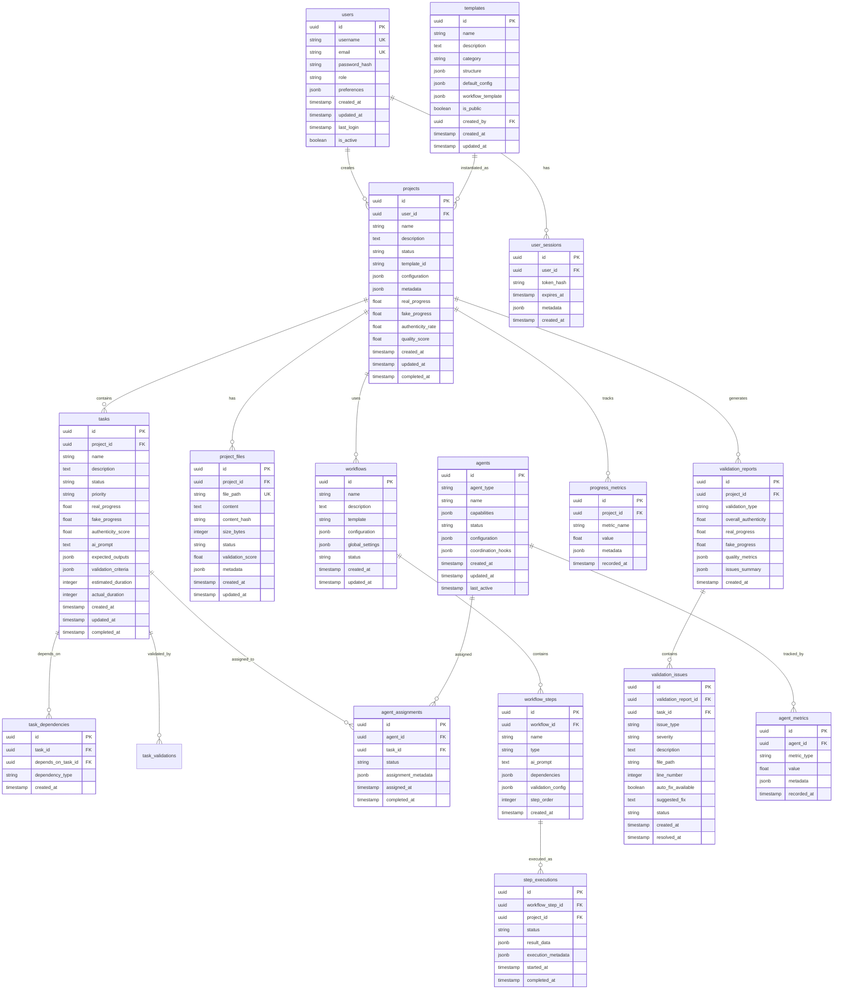

# Claude-TIU Database Schema

## Database Choice Rationale

### SQLite for Local Development
**Advantages:**
- Zero-configuration setup
- File-based storage
- Perfect for single-user development
- Built-in to Python
- Fast for small to medium datasets
- ACID compliance
- Cross-platform compatibility

**Use Cases:**
- Local development environment
- Prototyping and testing
- Personal productivity tool usage
- Offline development scenarios

### PostgreSQL for Teams & Production
**Advantages:**
- Superior concurrent access handling
- Advanced indexing and query optimization
- JSON/JSONB support for flexible schemas
- Full-text search capabilities
- Robust backup and replication
- Extensive ecosystem and tooling
- Better performance for complex queries
- Multi-user collaboration support

**Use Cases:**
- Team collaboration environments
- Production deployments
- Large-scale project management
- Advanced analytics and reporting
- Multi-tenant SaaS deployments

## Entity Relationship Diagram



## Table Definitions

### Users Table
```sql
CREATE TABLE users (
    id UUID PRIMARY KEY DEFAULT gen_random_uuid(),
    username VARCHAR(255) UNIQUE NOT NULL,
    email VARCHAR(255) UNIQUE NOT NULL,
    password_hash VARCHAR(255) NOT NULL,
    role VARCHAR(50) DEFAULT 'developer' CHECK (role IN ('admin', 'developer', 'viewer')),
    preferences JSONB DEFAULT '{}',
    created_at TIMESTAMP WITH TIME ZONE DEFAULT NOW(),
    updated_at TIMESTAMP WITH TIME ZONE DEFAULT NOW(),
    last_login TIMESTAMP WITH TIME ZONE,
    is_active BOOLEAN DEFAULT true
);

-- Indexes
CREATE INDEX idx_users_email ON users(email);
CREATE INDEX idx_users_username ON users(username);
CREATE INDEX idx_users_role ON users(role);
CREATE INDEX idx_users_last_login ON users(last_login);
```

### User Sessions Table
```sql
CREATE TABLE user_sessions (
    id UUID PRIMARY KEY DEFAULT gen_random_uuid(),
    user_id UUID NOT NULL REFERENCES users(id) ON DELETE CASCADE,
    token_hash VARCHAR(255) NOT NULL,
    expires_at TIMESTAMP WITH TIME ZONE NOT NULL,
    metadata JSONB DEFAULT '{}',
    created_at TIMESTAMP WITH TIME ZONE DEFAULT NOW()
);

-- Indexes
CREATE INDEX idx_user_sessions_user_id ON user_sessions(user_id);
CREATE INDEX idx_user_sessions_token_hash ON user_sessions(token_hash);
CREATE INDEX idx_user_sessions_expires_at ON user_sessions(expires_at);

-- Auto-cleanup expired sessions
CREATE OR REPLACE FUNCTION cleanup_expired_sessions()
RETURNS void AS $$
BEGIN
    DELETE FROM user_sessions WHERE expires_at < NOW();
END;
$$ LANGUAGE plpgsql;
```

### Projects Table
```sql
CREATE TABLE projects (
    id UUID PRIMARY KEY DEFAULT gen_random_uuid(),
    user_id UUID NOT NULL REFERENCES users(id) ON DELETE CASCADE,
    name VARCHAR(255) NOT NULL,
    description TEXT,
    status VARCHAR(50) DEFAULT 'active' CHECK (status IN ('active', 'completed', 'archived', 'failed')),
    template_id VARCHAR(255),
    configuration JSONB DEFAULT '{}',
    metadata JSONB DEFAULT '{}',
    real_progress FLOAT DEFAULT 0.0 CHECK (real_progress >= 0 AND real_progress <= 100),
    fake_progress FLOAT DEFAULT 0.0 CHECK (fake_progress >= 0 AND fake_progress <= 100),
    authenticity_rate FLOAT DEFAULT 100.0 CHECK (authenticity_rate >= 0 AND authenticity_rate <= 100),
    quality_score FLOAT DEFAULT 0.0 CHECK (quality_score >= 0 AND quality_score <= 100),
    created_at TIMESTAMP WITH TIME ZONE DEFAULT NOW(),
    updated_at TIMESTAMP WITH TIME ZONE DEFAULT NOW(),
    completed_at TIMESTAMP WITH TIME ZONE
);

-- Indexes
CREATE INDEX idx_projects_user_id ON projects(user_id);
CREATE INDEX idx_projects_status ON projects(status);
CREATE INDEX idx_projects_created_at ON projects(created_at);
CREATE INDEX idx_projects_real_progress ON projects(real_progress);
CREATE INDEX idx_projects_authenticity_rate ON projects(authenticity_rate);

-- Full-text search index
CREATE INDEX idx_projects_search ON projects USING gin(to_tsvector('english', name || ' ' || COALESCE(description, '')));
```

### Tasks Table
```sql
CREATE TABLE tasks (
    id UUID PRIMARY KEY DEFAULT gen_random_uuid(),
    project_id UUID NOT NULL REFERENCES projects(id) ON DELETE CASCADE,
    name VARCHAR(255) NOT NULL,
    description TEXT,
    status VARCHAR(50) DEFAULT 'pending' CHECK (status IN ('pending', 'in_progress', 'completed', 'failed', 'blocked')),
    priority VARCHAR(20) DEFAULT 'medium' CHECK (priority IN ('low', 'medium', 'high', 'critical')),
    real_progress FLOAT DEFAULT 0.0 CHECK (real_progress >= 0 AND real_progress <= 100),
    fake_progress FLOAT DEFAULT 0.0 CHECK (fake_progress >= 0 AND fake_progress <= 100),
    authenticity_score FLOAT DEFAULT 100.0 CHECK (authenticity_score >= 0 AND authenticity_score <= 100),
    ai_prompt TEXT,
    expected_outputs JSONB DEFAULT '[]',
    validation_criteria JSONB DEFAULT '{}',
    estimated_duration INTEGER, -- in minutes
    actual_duration INTEGER, -- in minutes
    created_at TIMESTAMP WITH TIME ZONE DEFAULT NOW(),
    updated_at TIMESTAMP WITH TIME ZONE DEFAULT NOW(),
    completed_at TIMESTAMP WITH TIME ZONE
);

-- Indexes
CREATE INDEX idx_tasks_project_id ON tasks(project_id);
CREATE INDEX idx_tasks_status ON tasks(status);
CREATE INDEX idx_tasks_priority ON tasks(priority);
CREATE INDEX idx_tasks_real_progress ON tasks(real_progress);
CREATE INDEX idx_tasks_authenticity_score ON tasks(authenticity_score);
CREATE INDEX idx_tasks_created_at ON tasks(created_at);
```

### Task Dependencies Table
```sql
CREATE TABLE task_dependencies (
    id UUID PRIMARY KEY DEFAULT gen_random_uuid(),
    task_id UUID NOT NULL REFERENCES tasks(id) ON DELETE CASCADE,
    depends_on_task_id UUID NOT NULL REFERENCES tasks(id) ON DELETE CASCADE,
    dependency_type VARCHAR(50) DEFAULT 'blocks' CHECK (dependency_type IN ('blocks', 'requires', 'suggests')),
    created_at TIMESTAMP WITH TIME ZONE DEFAULT NOW(),
    UNIQUE(task_id, depends_on_task_id)
);

-- Indexes
CREATE INDEX idx_task_dependencies_task_id ON task_dependencies(task_id);
CREATE INDEX idx_task_dependencies_depends_on ON task_dependencies(depends_on_task_id);

-- Prevent circular dependencies
CREATE OR REPLACE FUNCTION check_circular_dependency()
RETURNS TRIGGER AS $$
BEGIN
    IF EXISTS (
        WITH RECURSIVE dependency_chain AS (
            SELECT depends_on_task_id as task_id, task_id as depends_on
            FROM task_dependencies 
            WHERE task_id = NEW.depends_on_task_id
            
            UNION ALL
            
            SELECT dc.task_id, td.task_id as depends_on
            FROM dependency_chain dc
            JOIN task_dependencies td ON dc.depends_on = td.depends_on_task_id
        )
        SELECT 1 FROM dependency_chain WHERE task_id = NEW.task_id
    ) THEN
        RAISE EXCEPTION 'Circular dependency detected';
    END IF;
    RETURN NEW;
END;
$$ LANGUAGE plpgsql;

CREATE TRIGGER trigger_check_circular_dependency
    BEFORE INSERT ON task_dependencies
    FOR EACH ROW EXECUTE FUNCTION check_circular_dependency();
```

### Project Files Table
```sql
CREATE TABLE project_files (
    id UUID PRIMARY KEY DEFAULT gen_random_uuid(),
    project_id UUID NOT NULL REFERENCES projects(id) ON DELETE CASCADE,
    file_path VARCHAR(1000) NOT NULL,
    content TEXT,
    content_hash VARCHAR(64),
    size_bytes INTEGER DEFAULT 0,
    status VARCHAR(50) DEFAULT 'created' CHECK (status IN ('created', 'modified', 'validated', 'failed_validation', 'deleted')),
    validation_score FLOAT DEFAULT 0.0 CHECK (validation_score >= 0 AND validation_score <= 100),
    metadata JSONB DEFAULT '{}',
    created_at TIMESTAMP WITH TIME ZONE DEFAULT NOW(),
    updated_at TIMESTAMP WITH TIME ZONE DEFAULT NOW(),
    UNIQUE(project_id, file_path)
);

-- Indexes
CREATE INDEX idx_project_files_project_id ON project_files(project_id);
CREATE INDEX idx_project_files_file_path ON project_files(file_path);
CREATE INDEX idx_project_files_status ON project_files(status);
CREATE INDEX idx_project_files_validation_score ON project_files(validation_score);
CREATE INDEX idx_project_files_updated_at ON project_files(updated_at);

-- Full-text search on file content
CREATE INDEX idx_project_files_content_search ON project_files USING gin(to_tsvector('english', content));
```

### Workflows Table
```sql
CREATE TABLE workflows (
    id UUID PRIMARY KEY DEFAULT gen_random_uuid(),
    name VARCHAR(255) NOT NULL,
    description TEXT,
    template VARCHAR(255),
    configuration JSONB DEFAULT '{}',
    global_settings JSONB DEFAULT '{}',
    status VARCHAR(50) DEFAULT 'draft' CHECK (status IN ('draft', 'active', 'completed', 'failed', 'archived')),
    created_at TIMESTAMP WITH TIME ZONE DEFAULT NOW(),
    updated_at TIMESTAMP WITH TIME ZONE DEFAULT NOW()
);

-- Indexes
CREATE INDEX idx_workflows_name ON workflows(name);
CREATE INDEX idx_workflows_template ON workflows(template);
CREATE INDEX idx_workflows_status ON workflows(status);
```

### Workflow Steps Table
```sql
CREATE TABLE workflow_steps (
    id UUID PRIMARY KEY DEFAULT gen_random_uuid(),
    workflow_id UUID NOT NULL REFERENCES workflows(id) ON DELETE CASCADE,
    name VARCHAR(255) NOT NULL,
    type VARCHAR(100) NOT NULL CHECK (type IN ('ai_generation', 'validation', 'file_operation', 'external_command')),
    ai_prompt TEXT,
    dependencies JSONB DEFAULT '[]',
    validation_config JSONB DEFAULT '{}',
    step_order INTEGER NOT NULL,
    created_at TIMESTAMP WITH TIME ZONE DEFAULT NOW()
);

-- Indexes
CREATE INDEX idx_workflow_steps_workflow_id ON workflow_steps(workflow_id);
CREATE INDEX idx_workflow_steps_step_order ON workflow_steps(workflow_id, step_order);
CREATE INDEX idx_workflow_steps_type ON workflow_steps(type);
```

### Agents Table
```sql
CREATE TABLE agents (
    id UUID PRIMARY KEY DEFAULT gen_random_uuid(),
    agent_type VARCHAR(100) NOT NULL CHECK (agent_type IN ('backend-developer', 'frontend-developer', 'tester', 'reviewer', 'architect', 'coordinator', 'analyst')),
    name VARCHAR(255),
    capabilities JSONB DEFAULT '[]',
    status VARCHAR(50) DEFAULT 'idle' CHECK (status IN ('idle', 'busy', 'offline', 'error')),
    configuration JSONB DEFAULT '{}',
    coordination_hooks JSONB DEFAULT '{}',
    created_at TIMESTAMP WITH TIME ZONE DEFAULT NOW(),
    updated_at TIMESTAMP WITH TIME ZONE DEFAULT NOW(),
    last_active TIMESTAMP WITH TIME ZONE DEFAULT NOW()
);

-- Indexes
CREATE INDEX idx_agents_type ON agents(agent_type);
CREATE INDEX idx_agents_status ON agents(status);
CREATE INDEX idx_agents_last_active ON agents(last_active);
```

### Validation Reports Table
```sql
CREATE TABLE validation_reports (
    id UUID PRIMARY KEY DEFAULT gen_random_uuid(),
    project_id UUID NOT NULL REFERENCES projects(id) ON DELETE CASCADE,
    validation_type VARCHAR(50) NOT NULL CHECK (validation_type IN ('quick', 'deep', 'comprehensive', 'scheduled')),
    overall_authenticity FLOAT CHECK (overall_authenticity >= 0 AND overall_authenticity <= 100),
    real_progress FLOAT CHECK (real_progress >= 0 AND real_progress <= 100),
    fake_progress FLOAT CHECK (fake_progress >= 0 AND fake_progress <= 100),
    quality_metrics JSONB DEFAULT '{}',
    issues_summary JSONB DEFAULT '{}',
    created_at TIMESTAMP WITH TIME ZONE DEFAULT NOW()
);

-- Indexes
CREATE INDEX idx_validation_reports_project_id ON validation_reports(project_id);
CREATE INDEX idx_validation_reports_validation_type ON validation_reports(validation_type);
CREATE INDEX idx_validation_reports_created_at ON validation_reports(created_at);
CREATE INDEX idx_validation_reports_authenticity ON validation_reports(overall_authenticity);
```

### Validation Issues Table
```sql
CREATE TABLE validation_issues (
    id UUID PRIMARY KEY DEFAULT gen_random_uuid(),
    validation_report_id UUID NOT NULL REFERENCES validation_reports(id) ON DELETE CASCADE,
    task_id UUID REFERENCES tasks(id) ON DELETE SET NULL,
    issue_type VARCHAR(50) NOT NULL CHECK (issue_type IN ('placeholder', 'empty_function', 'mock_data', 'broken_logic', 'security_risk')),
    severity VARCHAR(20) NOT NULL CHECK (severity IN ('low', 'medium', 'high', 'critical')),
    description TEXT NOT NULL,
    file_path VARCHAR(1000),
    line_number INTEGER,
    auto_fix_available BOOLEAN DEFAULT false,
    suggested_fix TEXT,
    status VARCHAR(50) DEFAULT 'open' CHECK (status IN ('open', 'in_progress', 'resolved', 'ignored')),
    created_at TIMESTAMP WITH TIME ZONE DEFAULT NOW(),
    resolved_at TIMESTAMP WITH TIME ZONE
);

-- Indexes
CREATE INDEX idx_validation_issues_report_id ON validation_issues(validation_report_id);
CREATE INDEX idx_validation_issues_task_id ON validation_issues(task_id);
CREATE INDEX idx_validation_issues_issue_type ON validation_issues(issue_type);
CREATE INDEX idx_validation_issues_severity ON validation_issues(severity);
CREATE INDEX idx_validation_issues_status ON validation_issues(status);
CREATE INDEX idx_validation_issues_file_path ON validation_issues(file_path);
```

### Progress Metrics Table
```sql
CREATE TABLE progress_metrics (
    id UUID PRIMARY KEY DEFAULT gen_random_uuid(),
    project_id UUID NOT NULL REFERENCES projects(id) ON DELETE CASCADE,
    metric_name VARCHAR(100) NOT NULL,
    value FLOAT NOT NULL,
    metadata JSONB DEFAULT '{}',
    recorded_at TIMESTAMP WITH TIME ZONE DEFAULT NOW()
);

-- Indexes
CREATE INDEX idx_progress_metrics_project_id ON progress_metrics(project_id);
CREATE INDEX idx_progress_metrics_metric_name ON progress_metrics(metric_name);
CREATE INDEX idx_progress_metrics_recorded_at ON progress_metrics(recorded_at);

-- Composite index for time-series queries
CREATE INDEX idx_progress_metrics_project_metric_time ON progress_metrics(project_id, metric_name, recorded_at);
```

### Templates Table
```sql
CREATE TABLE templates (
    id UUID PRIMARY KEY DEFAULT gen_random_uuid(),
    name VARCHAR(255) NOT NULL,
    description TEXT,
    category VARCHAR(100),
    structure JSONB NOT NULL,
    default_config JSONB DEFAULT '{}',
    workflow_template JSONB,
    is_public BOOLEAN DEFAULT false,
    created_by UUID REFERENCES users(id) ON DELETE SET NULL,
    created_at TIMESTAMP WITH TIME ZONE DEFAULT NOW(),
    updated_at TIMESTAMP WITH TIME ZONE DEFAULT NOW()
);

-- Indexes
CREATE INDEX idx_templates_name ON templates(name);
CREATE INDEX idx_templates_category ON templates(category);
CREATE INDEX idx_templates_is_public ON templates(is_public);
CREATE INDEX idx_templates_created_by ON templates(created_by);
```

## Indexes and Optimization

### Performance Indexes
```sql
-- Composite indexes for common query patterns
CREATE INDEX idx_tasks_project_status_priority ON tasks(project_id, status, priority);
CREATE INDEX idx_files_project_status_updated ON project_files(project_id, status, updated_at DESC);
CREATE INDEX idx_validation_project_type_created ON validation_reports(project_id, validation_type, created_at DESC);

-- Partial indexes for active records only
CREATE INDEX idx_projects_active ON projects(user_id, updated_at DESC) WHERE status = 'active';
CREATE INDEX idx_tasks_incomplete ON tasks(project_id, priority DESC) WHERE status IN ('pending', 'in_progress');
CREATE INDEX idx_agents_available ON agents(agent_type, capabilities) WHERE status = 'idle';

-- Covering indexes for read-heavy queries
CREATE INDEX idx_projects_list_covering ON projects(user_id, status) INCLUDE (name, real_progress, updated_at);
CREATE INDEX idx_tasks_summary_covering ON tasks(project_id, status) INCLUDE (name, priority, real_progress);
```

### Query Optimization Examples

#### Project Dashboard Query
```sql
-- Optimized query for project dashboard
EXPLAIN (ANALYZE, BUFFERS) 
SELECT 
    p.id, p.name, p.status, p.real_progress, p.authenticity_rate,
    COUNT(t.id) as task_count,
    COUNT(CASE WHEN t.status = 'completed' THEN 1 END) as completed_tasks,
    MAX(vr.created_at) as last_validation
FROM projects p
LEFT JOIN tasks t ON p.id = t.project_id
LEFT JOIN validation_reports vr ON p.id = vr.project_id
WHERE p.user_id = $1 AND p.status = 'active'
GROUP BY p.id, p.name, p.status, p.real_progress, p.authenticity_rate
ORDER BY p.updated_at DESC
LIMIT 20;
```

#### Validation Issues Query
```sql
-- Optimized query for validation issues dashboard
WITH recent_reports AS (
    SELECT DISTINCT ON (project_id) 
        id, project_id, overall_authenticity
    FROM validation_reports 
    WHERE created_at >= NOW() - INTERVAL '24 hours'
    ORDER BY project_id, created_at DESC
)
SELECT 
    vi.issue_type,
    vi.severity,
    COUNT(*) as issue_count,
    AVG(rr.overall_authenticity) as avg_authenticity
FROM validation_issues vi
JOIN recent_reports rr ON vi.validation_report_id = rr.id
WHERE vi.status = 'open'
GROUP BY vi.issue_type, vi.severity
ORDER BY 
    CASE vi.severity 
        WHEN 'critical' THEN 1 
        WHEN 'high' THEN 2 
        WHEN 'medium' THEN 3 
        ELSE 4 
    END;
```

## Migration Strategy

### Database Migration Framework
```python
# Example migration structure
migrations/
├── 001_initial_schema.sql
├── 002_add_validation_system.sql
├── 003_enhance_metrics.sql
├── 004_add_templates.sql
└── 005_performance_indexes.sql
```

### Version-Controlled Migrations
```sql
-- Migration tracking table
CREATE TABLE schema_migrations (
    version VARCHAR(50) PRIMARY KEY,
    applied_at TIMESTAMP WITH TIME ZONE DEFAULT NOW(),
    description TEXT
);

-- Migration example: 002_add_validation_system.sql
BEGIN;

-- Insert migration record
INSERT INTO schema_migrations (version, description) 
VALUES ('002', 'Add validation system tables and constraints');

-- Create validation tables
CREATE TABLE validation_reports (
    -- table definition here
);

-- Add constraints and indexes
CREATE INDEX idx_validation_reports_project_id ON validation_reports(project_id);

COMMIT;
```

### Rollback Strategy
```sql
-- Rollback migrations table
CREATE TABLE migration_rollbacks (
    version VARCHAR(50) PRIMARY KEY,
    rollback_sql TEXT NOT NULL,
    created_at TIMESTAMP WITH TIME ZONE DEFAULT NOW()
);

-- Example rollback for validation system
INSERT INTO migration_rollbacks (version, rollback_sql) VALUES 
('002', '
BEGIN;
DROP TABLE IF EXISTS validation_issues CASCADE;
DROP TABLE IF EXISTS validation_reports CASCADE;
DELETE FROM schema_migrations WHERE version = ''002'';
COMMIT;
');
```

## Data Retention Policies

### Automated Cleanup Procedures
```sql
-- Cleanup old validation reports (keep 90 days)
CREATE OR REPLACE FUNCTION cleanup_old_validation_reports()
RETURNS void AS $$
BEGIN
    DELETE FROM validation_reports 
    WHERE created_at < NOW() - INTERVAL '90 days';
    
    GET DIAGNOSTICS @rows_deleted = ROW_COUNT;
    INSERT INTO cleanup_log (table_name, rows_deleted, cleanup_date)
    VALUES ('validation_reports', @rows_deleted, NOW());
END;
$$ LANGUAGE plpgsql;

-- Cleanup old progress metrics (keep 30 days for detailed, 1 year for daily aggregates)
CREATE OR REPLACE FUNCTION cleanup_old_metrics()
RETURNS void AS $$
BEGIN
    -- Keep hourly metrics for 30 days
    DELETE FROM progress_metrics 
    WHERE recorded_at < NOW() - INTERVAL '30 days'
    AND (metadata->>'aggregation_level')::text != 'daily';
    
    -- Keep daily aggregates for 1 year
    DELETE FROM progress_metrics 
    WHERE recorded_at < NOW() - INTERVAL '1 year'
    AND (metadata->>'aggregation_level')::text = 'daily';
END;
$$ LANGUAGE plpgsql;

-- Schedule cleanup jobs
SELECT cron.schedule('cleanup-validation-reports', '0 2 * * *', 'SELECT cleanup_old_validation_reports();');
SELECT cron.schedule('cleanup-old-metrics', '0 3 * * *', 'SELECT cleanup_old_metrics();');
```

### Archive Strategy
```sql
-- Archive completed projects older than 1 year
CREATE OR REPLACE FUNCTION archive_old_projects()
RETURNS void AS $$
BEGIN
    -- Move to archive table
    INSERT INTO projects_archive 
    SELECT * FROM projects 
    WHERE status = 'completed' 
    AND completed_at < NOW() - INTERVAL '1 year';
    
    -- Remove from active table
    DELETE FROM projects 
    WHERE status = 'completed' 
    AND completed_at < NOW() - INTERVAL '1 year';
END;
$$ LANGUAGE plpgsql;
```

## Database Connection and Configuration

### Connection Pool Configuration
```python
# PostgreSQL connection pool configuration
DATABASE_CONFIG = {
    'postgresql': {
        'host': os.getenv('DB_HOST', 'localhost'),
        'port': int(os.getenv('DB_PORT', 5432)),
        'database': os.getenv('DB_NAME', 'claude_tiu'),
        'user': os.getenv('DB_USER', 'claude_tiu'),
        'password': os.getenv('DB_PASSWORD', ''),
        'pool_size': 20,
        'max_overflow': 30,
        'pool_timeout': 30,
        'pool_recycle': 3600,
    },
    'sqlite': {
        'path': os.getenv('SQLITE_PATH', 'data/claude_tiu.db'),
        'timeout': 20.0,
        'check_same_thread': False,
    }
}
```

### Database Initialization
```python
async def initialize_database(config: dict, db_type: str = 'postgresql'):
    """Initialize database with proper schema and indexes."""
    
    if db_type == 'postgresql':
        engine = create_async_engine(
            f"postgresql+asyncpg://{config['user']}:{config['password']}"
            f"@{config['host']}:{config['port']}/{config['database']}",
            pool_size=config['pool_size'],
            max_overflow=config['max_overflow'],
        )
    else:  # SQLite
        engine = create_async_engine(
            f"sqlite+aiosqlite:///{config['path']}",
            connect_args={"check_same_thread": False}
        )
    
    # Create all tables
    async with engine.begin() as conn:
        await conn.run_sync(Base.metadata.create_all)
    
    return engine
```

## Monitoring and Maintenance

### Performance Monitoring Queries
```sql
-- Monitor table sizes and growth
SELECT 
    schemaname,
    tablename,
    pg_size_pretty(pg_total_relation_size(schemaname||'.'||tablename)) as size,
    pg_total_relation_size(schemaname||'.'||tablename) as size_bytes
FROM pg_tables 
WHERE schemaname = 'public'
ORDER BY pg_total_relation_size(schemaname||'.'||tablename) DESC;

-- Monitor slow queries
SELECT 
    query,
    calls,
    total_time,
    mean_time,
    stddev_time
FROM pg_stat_statements 
ORDER BY total_time DESC 
LIMIT 10;

-- Monitor index usage
SELECT 
    schemaname,
    tablename,
    indexname,
    idx_tup_read,
    idx_tup_fetch,
    idx_scan
FROM pg_stat_user_indexes
ORDER BY idx_scan DESC;
```

### Backup Strategy
```bash
#!/bin/bash
# Daily backup script for PostgreSQL

BACKUP_DIR="/backups/claude-tiu"
DATE=$(date +%Y%m%d_%H%M%S)
DB_NAME="claude_tiu"

# Full database backup
pg_dump -h localhost -U claude_tiu -d $DB_NAME -f "$BACKUP_DIR/full_backup_$DATE.sql"

# Compressed backup
pg_dump -h localhost -U claude_tiu -d $DB_NAME | gzip > "$BACKUP_DIR/compressed_backup_$DATE.sql.gz"

# Schema-only backup
pg_dump -h localhost -U claude_tiu -d $DB_NAME --schema-only -f "$BACKUP_DIR/schema_backup_$DATE.sql"

# Cleanup old backups (keep 30 days)
find $BACKUP_DIR -name "*.sql*" -mtime +30 -delete
```

This comprehensive database schema provides a robust foundation for the claude-tiu project management tool, with proper normalization, indexing, validation, and maintenance procedures for both development and production environments.