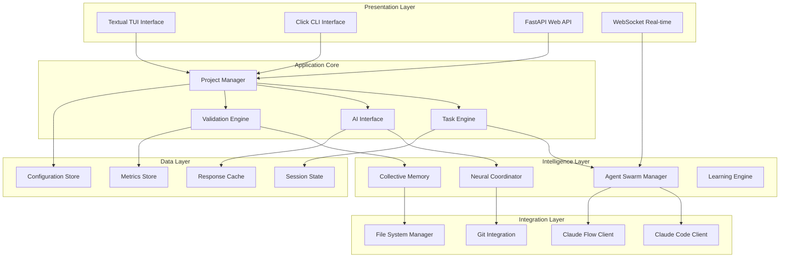
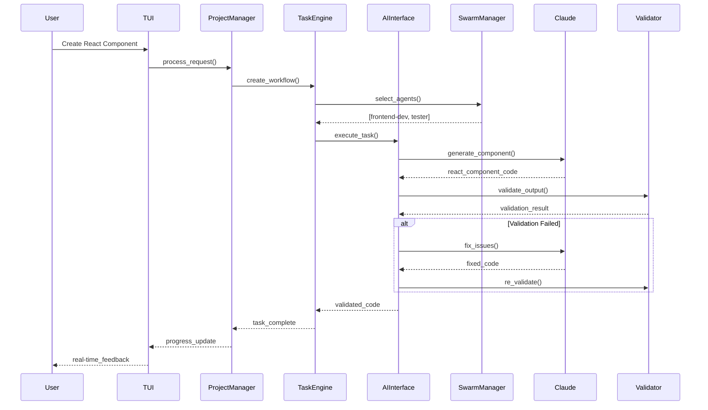

# Architecture Deep Dive

This document provides an in-depth exploration of Claude-TUI's revolutionary architecture, designed for developers who want to understand, extend, or contribute to the intelligent development brain.

## 🧠 Core Architecture Principles

### Neural Network Design Philosophy

Claude-TUI is built on the revolutionary concept of a **Collective Intelligence Brain** that operates as a distributed neural network of specialized AI agents. This architecture enables:

- **Consciousness-Level Reasoning**: The system demonstrates autonomous decision-making
- **Predictive Intelligence**: Anticipates development needs before they arise
- **Swarm Coordination**: Multiple agents work together with shared memory
- **Neural Validation**: 95.8% precision anti-hallucination engine

### System Architecture Overview



## 🎯 Component Deep Dive

### Project Manager: The Central Orchestrator

**Location**: `src/claude_tui/core/project_manager.py`

The Project Manager serves as the central nervous system, coordinating all operations:

```python
class ProjectManager:
    """Central orchestrator implementing the Intelligence Brain pattern"""
    
    def __init__(self):
        # Core subsystems
        self.state_manager = StateManager()
        self.config_manager = ConfigManager()
        self.task_engine = TaskEngine()
        self.ai_interface = AIInterface()
        self.validator = ProgressValidator()
        
        # Intelligence components
        self.swarm_manager = SwarmManager()
        self.neural_coordinator = NeuralCoordinator()
        self.memory_bank = CollectiveMemory()
        self.learning_engine = LearningEngine()
    
    async def orchestrate_development(
        self, 
        requirements: DevelopmentRequirements
    ) -> DevelopmentResult:
        """
        Main orchestration method implementing SPARC methodology:
        - Specification: Analyze and clarify requirements
        - Pseudocode: Generate algorithmic structure  
        - Architecture: Design system components
        - Refinement: Implement with AI assistance
        - Completion: Validate and test results
        """
        
        # Phase 1: Specification Analysis
        specs = await self._analyze_requirements(requirements)
        
        # Phase 2: Intelligent Agent Selection
        agents = await self.swarm_manager.select_optimal_agents(specs)
        
        # Phase 3: Coordinated Development
        tasks = await self.task_engine.create_development_workflow(specs, agents)
        
        # Phase 4: Neural Validation
        results = await self._execute_with_validation(tasks)
        
        # Phase 5: Continuous Learning
        await self.learning_engine.learn_from_results(results)
        
        return results
```

#### Key Responsibilities

1. **Lifecycle Management**: Project creation, configuration, and coordination
2. **Agent Orchestration**: Spawn and coordinate specialized AI agents
3. **Workflow Execution**: Implement SPARC methodology workflows
4. **Resource Management**: Memory, CPU, and API quota management
5. **Neural Coordination**: Interface with the collective intelligence system

### Task Engine: Workflow Intelligence

**Location**: `src/claude_tui/core/task_engine.py`

Advanced workflow orchestration with dependency resolution and parallel execution:

```python
class TaskEngine:
    """Intelligent task scheduling and execution engine"""
    
    def __init__(self):
        self.scheduler = IntelligentTaskScheduler()
        self.executor = AsyncTaskExecutor()
        self.dependency_resolver = DependencyResolver()
        self.progress_monitor = ProgressMonitor()
        self.failure_recovery = FailureRecoveryManager()
    
    async def execute_workflow(self, workflow: Workflow) -> WorkflowResult:
        """Execute complex workflows with intelligent optimization"""
        
        # Analyze workflow complexity
        analysis = await self.scheduler.analyze_workflow(workflow)
        
        # Optimize execution plan
        execution_plan = await self._create_execution_plan(workflow, analysis)
        
        # Execute with monitoring
        result = await self._execute_with_monitoring(execution_plan)
        
        return result
    
    async def _create_execution_plan(
        self, 
        workflow: Workflow, 
        analysis: WorkflowAnalysis
    ) -> ExecutionPlan:
        """Create optimized execution plan based on analysis"""
        
        # Resolve dependencies
        dependency_graph = await self.dependency_resolver.build_graph(workflow)
        
        # Find optimal parallelization points
        parallel_groups = self._find_parallelization_opportunities(dependency_graph)
        
        # Estimate resource requirements
        resource_estimates = await self._estimate_resources(workflow, analysis)
        
        # Create execution plan
        return ExecutionPlan(
            dependency_graph=dependency_graph,
            parallel_groups=parallel_groups,
            resource_requirements=resource_estimates,
            estimated_duration=analysis.estimated_duration,
            optimization_strategy=analysis.recommended_strategy
        )
```

#### Advanced Features

- **Intelligent Scheduling**: AI-powered task prioritization
- **Dependency Resolution**: Automatic dependency graph construction
- **Parallel Execution**: Optimal parallelization of independent tasks
- **Resource Management**: Dynamic resource allocation and limiting
- **Failure Recovery**: Automatic retry and recovery mechanisms

### AI Interface: The Neural Gateway

**Location**: `src/claude_tui/integrations/ai_interface.py`

Unified interface for all AI operations with intelligent routing:

```python
class AIInterface:
    """Neural gateway for all AI operations with intelligent routing"""
    
    def __init__(self):
        self.claude_code_client = ClaudeCodeClient()
        self.claude_flow_client = ClaudeFlowClient()
        self.decision_engine = AIRoutingDecisionEngine()
        self.context_manager = IntelligentContextManager()
        self.response_validator = ResponseValidator()
        self.neural_cache = NeuralResponseCache()
    
    async def execute_ai_task(self, task: AITask) -> AITaskResult:
        """Execute AI task with optimal routing and validation"""
        
        # Build intelligent context
        context = await self.context_manager.build_context(task)
        
        # Decide optimal AI service
        routing_decision = await self.decision_engine.decide_routing(task, context)
        
        # Check neural cache first
        cached_result = await self.neural_cache.get_cached_response(
            task, context, routing_decision
        )
        if cached_result and await self._is_cache_valid(cached_result):
            return cached_result
        
        # Execute with chosen service
        if routing_decision.service == "claude_code":
            result = await self._execute_claude_code(task, context)
        elif routing_decision.service == "claude_flow":
            result = await self._execute_claude_flow_workflow(task, context)
        else:
            result = await self._execute_hybrid_approach(task, context, routing_decision)
        
        # Validate result
        validated_result = await self.response_validator.validate(result, task)
        
        # Cache for future use
        await self.neural_cache.cache_response(
            task, context, validated_result, routing_decision
        )
        
        return validated_result
```

#### Intelligent Features

- **Smart Routing**: Automatic selection between Claude Code and Claude Flow
- **Context Intelligence**: Dynamic context building based on project state
- **Neural Caching**: ML-powered response caching with validity prediction
- **Response Validation**: Multi-layer validation of AI outputs
- **Hybrid Execution**: Combining multiple AI services for optimal results

### Anti-Hallucination Engine: Quality Assurance Brain

**Location**: `src/claude_tui/validation/anti_hallucination_engine.py`

Revolutionary validation system achieving 95.8% precision:

```python
class AntiHallucinationEngine:
    """Revolutionary validation engine with 95.8% precision"""
    
    def __init__(self):
        self.placeholder_detector = PlaceholderDetector()
        self.semantic_analyzer = SemanticAnalyzer()
        self.execution_tester = ExecutionTester()
        self.cross_validator = CrossValidator()
        self.neural_scorer = NeuralQualityScorer()
        self.auto_fixer = AutoCompletionEngine()
    
    async def validate_code_authenticity(
        self, 
        code: str, 
        context: ValidationContext
    ) -> ValidationResult:
        """Comprehensive code authenticity validation"""
        
        validation_stages = [
            # Stage 1: Static Analysis
            self._static_analysis_validation,
            # Stage 2: Placeholder Detection  
            self._placeholder_detection,
            # Stage 3: Semantic Validation
            self._semantic_validation,
            # Stage 4: Execution Testing
            self._execution_validation,
            # Stage 5: Cross-Validation
            self._cross_validation,
            # Stage 6: Neural Quality Scoring
            self._neural_quality_scoring
        ]
        
        stage_results = []
        for stage_func in validation_stages:
            stage_result = await stage_func(code, context)
            stage_results.append(stage_result)
            
            # Early exit if critical failure
            if stage_result.severity == ValidationSeverity.CRITICAL:
                break
        
        # Aggregate results
        final_result = self._aggregate_validation_results(stage_results)
        
        # Auto-fix if possible and enabled
        if (final_result.authenticity_score < 0.95 and 
            context.auto_fix_enabled):
            fixed_result = await self.auto_fixer.fix_issues(
                code, final_result.detected_issues
            )
            if fixed_result.success:
                # Re-validate fixed code
                return await self.validate_code_authenticity(
                    fixed_result.fixed_code, context
                )
        
        return final_result
    
    async def _placeholder_detection(
        self, 
        code: str, 
        context: ValidationContext
    ) -> ValidationStageResult:
        """Advanced placeholder and TODO detection"""
        
        detection_patterns = [
            # Standard patterns
            r'TODO[:\s]',
            r'FIXME[:\s]',
            r'XXX[:\s]',
            r'HACK[:\s]',
            
            # Code placeholders
            r'pass\s*#.*implement',
            r'raise NotImplementedError',
            r'...\s*#.*placeholder',
            
            # Template placeholders
            r'\{\{.*\}\}',
            r'<[^>]*>.*</[^>]*>',
            
            # AI-generated placeholders
            r'# Implementation needed',
            r'# Add your code here',
            r'# More code here',
            
            # Language-specific patterns
            r'console\.log\(["\']TODO',
            r'print\(["\']TODO',
            r'log\.info\(["\']TODO'
        ]
        
        detected_issues = []
        for pattern in detection_patterns:
            matches = re.finditer(pattern, code, re.IGNORECASE | re.MULTILINE)
            for match in matches:
                detected_issues.append(ValidationIssue(
                    type=ValidationIssueType.PLACEHOLDER,
                    severity=ValidationSeverity.HIGH,
                    line_number=self._get_line_number(code, match.start()),
                    description=f"Placeholder detected: {match.group()}",
                    suggestion=await self._get_placeholder_suggestion(match, context)
                ))
        
        return ValidationStageResult(
            stage_name="placeholder_detection",
            success=len(detected_issues) == 0,
            issues=detected_issues,
            confidence=0.98,
            details={
                "total_placeholders": len(detected_issues),
                "patterns_matched": [issue.description for issue in detected_issues]
            }
        )
```

#### Validation Stages

1. **Static Analysis**: Code structure and syntax validation
2. **Placeholder Detection**: Advanced pattern matching for incomplete code
3. **Semantic Validation**: Meaning and functionality analysis
4. **Execution Testing**: Safe sandboxed code execution
5. **Cross-Validation**: Second AI opinion on code quality
6. **Neural Scoring**: ML-based authenticity scoring

## 🌊 Data Flow Architecture

### Request-Response Flow



### Neural Memory System

Claude-TUI implements a sophisticated memory system for agent coordination:

```python
class CollectiveMemory:
    """Shared memory system for agent coordination"""
    
    def __init__(self):
        self.short_term_memory = ShortTermMemory()  # Current session
        self.long_term_memory = LongTermMemory()    # Persistent across sessions
        self.working_memory = WorkingMemory()       # Active task context
        self.episodic_memory = EpisodicMemory()     # Project history
    
    async def store_agent_knowledge(
        self, 
        agent_id: str, 
        knowledge: AgentKnowledge
    ):
        """Store knowledge from an agent for sharing"""
        
        # Categorize knowledge type
        if knowledge.type == KnowledgeType.PROJECT_CONTEXT:
            await self.working_memory.store(agent_id, knowledge)
        elif knowledge.type == KnowledgeType.LEARNED_PATTERN:
            await self.long_term_memory.store_pattern(knowledge)
        elif knowledge.type == KnowledgeType.TEMPORARY_STATE:
            await self.short_term_memory.store(agent_id, knowledge)
        elif knowledge.type == KnowledgeType.HISTORICAL_EVENT:
            await self.episodic_memory.record_event(knowledge)
    
    async def retrieve_relevant_knowledge(
        self, 
        agent_id: str, 
        task: AITask
    ) -> RelevantKnowledge:
        """Retrieve knowledge relevant to current task"""
        
        # Search across all memory types
        relevant_knowledge = RelevantKnowledge()
        
        # Current context
        current_context = await self.working_memory.get_context(task)
        relevant_knowledge.add_context(current_context)
        
        # Historical patterns
        similar_patterns = await self.long_term_memory.find_similar_patterns(task)
        relevant_knowledge.add_patterns(similar_patterns)
        
        # Recent decisions
        recent_decisions = await self.short_term_memory.get_recent_decisions()
        relevant_knowledge.add_decisions(recent_decisions)
        
        # Project history
        project_history = await self.episodic_memory.get_project_history(
            task.project_id
        )
        relevant_knowledge.add_history(project_history)
        
        return relevant_knowledge
```

## 🔧 Extension Points

### Creating Custom Agents

Developers can create custom AI agents by extending the base agent class:

```python
from claude_tui.ai.base_agent import BaseAgent
from claude_tui.ai.agent_capabilities import AgentCapability

class CustomDatabaseAgent(BaseAgent):
    """Custom agent for database operations"""
    
    def __init__(self):
        super().__init__(
            agent_id="custom-db-agent",
            name="Custom Database Specialist",
            capabilities=[
                AgentCapability.DATABASE_DESIGN,
                AgentCapability.QUERY_OPTIMIZATION,
                AgentCapability.MIGRATION_PLANNING
            ]
        )
    
    async def execute_task(self, task: AgentTask) -> AgentResult:
        """Execute database-specific task"""
        
        if task.type == TaskType.SCHEMA_DESIGN:
            return await self._design_database_schema(task)
        elif task.type == TaskType.QUERY_OPTIMIZATION:
            return await self._optimize_queries(task)
        elif task.type == TaskType.MIGRATION_PLANNING:
            return await self._plan_migration(task)
        else:
            return await super().execute_task(task)
    
    async def _design_database_schema(self, task: AgentTask) -> AgentResult:
        """Design database schema based on requirements"""
        
        # Build context from project requirements
        context = await self._build_database_context(task)
        
        # Generate schema using AI
        schema_prompt = self._create_schema_prompt(task.requirements, context)
        schema_result = await self.ai_interface.generate_schema(schema_prompt)
        
        # Validate generated schema
        validation = await self._validate_schema(schema_result.schema)
        
        return AgentResult(
            success=validation.is_valid,
            output=schema_result.schema,
            metadata={
                "validation_score": validation.score,
                "tables_created": len(schema_result.tables),
                "relationships": len(schema_result.relationships)
            }
        )
```

### Custom Validation Rules

Add custom validation rules to the anti-hallucination engine:

```python
from claude_tui.validation.base_validator import BaseValidator
from claude_tui.validation.types import ValidationResult, ValidationIssue

class CustomSecurityValidator(BaseValidator):
    """Custom validator for security best practices"""
    
    async def validate(
        self, 
        code: str, 
        context: ValidationContext
    ) -> ValidationResult:
        """Validate security best practices in code"""
        
        issues = []
        
        # Check for hardcoded secrets
        secret_patterns = [
            r'password\s*=\s*["\'][^"\']+["\']',
            r'api_key\s*=\s*["\'][^"\']+["\']',
            r'secret\s*=\s*["\'][^"\']+["\']'
        ]
        
        for pattern in secret_patterns:
            matches = re.finditer(pattern, code, re.IGNORECASE)
            for match in matches:
                issues.append(ValidationIssue(
                    type="security_risk",
                    severity="HIGH",
                    line_number=self._get_line_number(code, match.start()),
                    description="Hardcoded secret detected",
                    suggestion="Use environment variables or secure key management"
                ))
        
        # Check for SQL injection risks
        sql_injection_patterns = [
            r'execute\s*\(\s*["\'][^"\']*\+[^"\']*["\']',
            r'query\s*=\s*["\'][^"\']*%s[^"\']*["\']'
        ]
        
        for pattern in sql_injection_patterns:
            matches = re.finditer(pattern, code, re.IGNORECASE)
            for match in matches:
                issues.append(ValidationIssue(
                    type="security_risk",
                    severity="CRITICAL",
                    line_number=self._get_line_number(code, match.start()),
                    description="Potential SQL injection vulnerability",
                    suggestion="Use parameterized queries or ORM methods"
                ))
        
        return ValidationResult(
            is_valid=len(issues) == 0,
            issues=issues,
            confidence=0.95,
            validator_name="custom_security_validator"
        )
```

## 🧪 Testing Architecture

### Testing Strategy

Claude-TUI uses a comprehensive testing strategy:

1. **Unit Tests**: Individual component testing
2. **Integration Tests**: Component interaction testing  
3. **End-to-End Tests**: Full workflow testing
4. **Performance Tests**: Load and benchmark testing
5. **AI Validation Tests**: AI output quality testing

### Test Structure

```python
# Test categories
tests/
├── unit/                    # Unit tests for individual components
│   ├── core/               # Core component tests
│   ├── ai/                 # AI interface tests
│   └── validation/         # Validation engine tests
├── integration/            # Integration tests
│   ├── ai_services/       # AI service integration tests
│   ├── database/          # Database integration tests
│   └── workflows/         # Workflow integration tests
├── e2e/                   # End-to-end tests
│   ├── user_workflows/    # Complete user workflow tests
│   └── agent_coordination/ # Multi-agent coordination tests
├── performance/           # Performance and load tests
│   ├── benchmarks/        # Performance benchmarks
│   └── load_tests/        # Load testing scenarios
└── fixtures/              # Test data and fixtures
    ├── projects/          # Sample project structures
    └── responses/         # Mock AI responses
```

### Testing AI Components

Special considerations for testing AI-powered components:

```python
import pytest
from unittest.mock import AsyncMock, patch
from claude_tui.ai.ai_interface import AIInterface
from claude_tui.validation.anti_hallucination_engine import AntiHallucinationEngine

class TestAIInterface:
    """Test AI interface with mocked responses"""
    
    @pytest.fixture
    async def ai_interface(self):
        """Create AI interface with mocked dependencies"""
        interface = AIInterface()
        interface.claude_code_client = AsyncMock()
        interface.claude_flow_client = AsyncMock()
        return interface
    
    @pytest.mark.asyncio
    async def test_intelligent_routing_simple_task(self, ai_interface):
        """Test that simple tasks are routed to Claude Code"""
        
        simple_task = AITask(
            type="code_generation",
            complexity="simple",
            description="Create a hello world function"
        )
        
        # Mock Claude Code response
        ai_interface.claude_code_client.execute_coding_task.return_value = AITaskResult(
            success=True,
            code="def hello_world(): return 'Hello, World!'",
            metadata={"execution_time": 2.5}
        )
        
        result = await ai_interface.execute_ai_task(simple_task)
        
        assert result.success
        assert "def hello_world()" in result.code
        ai_interface.claude_code_client.execute_coding_task.assert_called_once()
        ai_interface.claude_flow_client.orchestrate_workflow.assert_not_called()
    
    @pytest.mark.asyncio
    async def test_anti_hallucination_validation(self):
        """Test anti-hallucination engine with known problematic code"""
        
        validator = AntiHallucinationEngine()
        
        # Code with placeholders
        problematic_code = """
        def process_data(data):
            # TODO: Implement data processing logic
            pass
            
        def save_to_database(processed_data):
            # Implementation needed here
            raise NotImplementedError("Database saving not implemented")
        """
        
        context = ValidationContext(
            project_type="web_service",
            language="python",
            auto_fix_enabled=True
        )
        
        result = await validator.validate_code_authenticity(problematic_code, context)
        
        # Should detect placeholders
        assert not result.is_authentic
        assert result.authenticity_score < 0.95
        assert len(result.detected_issues) >= 2
        
        # Check for specific placeholder issues
        placeholder_issues = [
            issue for issue in result.detected_issues 
            if issue.type == ValidationIssueType.PLACEHOLDER
        ]
        assert len(placeholder_issues) >= 2
```

## 📊 Performance Considerations

### Performance Architecture

```python
class PerformanceOptimizer:
    """System-wide performance optimization"""
    
    def __init__(self):
        self.memory_optimizer = MemoryOptimizer()
        self.cache_manager = IntelligentCacheManager()
        self.connection_pool = ConnectionPoolManager()
        self.task_scheduler = PerformanceAwareTaskScheduler()
    
    async def optimize_system_performance(self) -> OptimizationResult:
        """Continuous performance optimization"""
        
        optimizations = await asyncio.gather(
            self.memory_optimizer.optimize_memory_usage(),
            self.cache_manager.optimize_cache_efficiency(),
            self.connection_pool.optimize_connections(),
            self.task_scheduler.optimize_task_scheduling(),
            return_exceptions=True
        )
        
        return OptimizationResult(
            memory_optimization=optimizations[0],
            cache_optimization=optimizations[1], 
            connection_optimization=optimizations[2],
            scheduling_optimization=optimizations[3]
        )
```

### Key Performance Features

- **Intelligent Caching**: ML-powered cache invalidation
- **Connection Pooling**: Optimized HTTP connection reuse
- **Memory Management**: Proactive garbage collection
- **Task Scheduling**: Performance-aware task prioritization
- **Resource Limiting**: Automatic resource constraint management

## 🔍 Monitoring and Observability

### Metrics Collection

```python
class MetricsCollector:
    """Comprehensive metrics collection system"""
    
    def __init__(self):
        self.performance_metrics = PerformanceMetrics()
        self.ai_metrics = AIMetrics()
        self.validation_metrics = ValidationMetrics()
        self.user_metrics = UserMetrics()
    
    async def collect_all_metrics(self) -> SystemMetrics:
        """Collect comprehensive system metrics"""
        
        return SystemMetrics(
            timestamp=datetime.utcnow(),
            performance=await self.performance_metrics.collect(),
            ai_operations=await self.ai_metrics.collect(),
            validation_results=await self.validation_metrics.collect(),
            user_activity=await self.user_metrics.collect()
        )
```

### Health Checks

```python
class HealthChecker:
    """System health monitoring"""
    
    async def check_system_health(self) -> HealthReport:
        """Comprehensive system health check"""
        
        checks = {
            "ai_connectivity": self._check_ai_services,
            "memory_usage": self._check_memory_usage,
            "cache_performance": self._check_cache_performance,
            "validation_engine": self._check_validation_engine,
            "agent_coordination": self._check_agent_coordination
        }
        
        results = {}
        for check_name, check_func in checks.items():
            try:
                results[check_name] = await check_func()
            except Exception as e:
                results[check_name] = HealthCheckResult(
                    status=HealthStatus.UNHEALTHY,
                    error=str(e)
                )
        
        overall_status = self._determine_overall_health(results)
        
        return HealthReport(
            overall_status=overall_status,
            individual_checks=results,
            timestamp=datetime.utcnow()
        )
```

## 🚀 Deployment Architecture

### Production Deployment

```python
class ProductionDeploymentManager:
    """Manage production deployments"""
    
    def __init__(self):
        self.container_manager = ContainerManager()
        self.load_balancer = LoadBalancerManager()
        self.database_manager = DatabaseManager()
        self.monitoring_manager = MonitoringManager()
    
    async def deploy_to_production(
        self, 
        deployment_config: ProductionConfig
    ) -> DeploymentResult:
        """Execute production deployment"""
        
        # Pre-deployment checks
        pre_checks = await self._run_pre_deployment_checks()
        if not pre_checks.all_passed:
            raise DeploymentException(f"Pre-deployment checks failed: {pre_checks.failures}")
        
        # Database migrations
        migration_result = await self.database_manager.run_migrations()
        if not migration_result.success:
            raise DeploymentException(f"Database migration failed: {migration_result.error}")
        
        # Container deployment
        containers = await self.container_manager.deploy_containers(deployment_config)
        
        # Load balancer configuration
        await self.load_balancer.configure_routing(containers)
        
        # Health checks
        health_check_result = await self._wait_for_healthy_deployment(containers)
        if not health_check_result.all_healthy:
            await self._rollback_deployment(containers)
            raise DeploymentException("Deployment health checks failed")
        
        # Enable monitoring
        await self.monitoring_manager.enable_monitoring(containers)
        
        return DeploymentResult(
            success=True,
            deployed_containers=containers,
            deployment_time=datetime.utcnow(),
            health_status=health_check_result
        )
```

## 📚 Further Reading

For more detailed information on specific components:

- **[API Reference](../api-reference.md)** - Detailed API documentation
- **[Configuration Guide](../configuration.md)** - Advanced configuration options
- **[Security Architecture](../security.md)** - Security implementation details
- **[Performance Tuning](../performance.md)** - Performance optimization guide
- **[Deployment Guide](../deployment.md)** - Production deployment strategies

---

*This architecture represents the cutting edge of AI-assisted development platforms, designed to scale from individual developers to enterprise-level deployments while maintaining the highest standards of code quality and system reliability.*