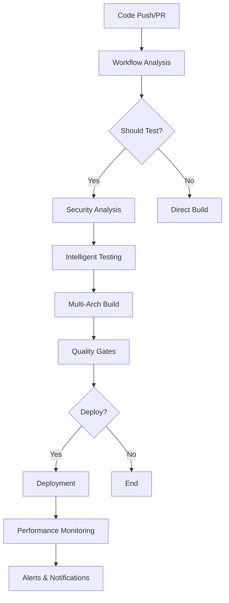

# 🚀 Claude TIU DevOps & Deployment Guide

## Table of Contents
- [Overview](#overview)
- [CI/CD Architecture](#cicd-architecture)
- [Deployment Strategies](#deployment-strategies)
- [Environment Management](#environment-management)
- [Performance Monitoring](#performance-monitoring)
- [Security & Compliance](#security--compliance)
- [Troubleshooting](#troubleshooting)
- [Runbooks](#runbooks)

## Overview

This guide provides comprehensive information about the Claude TIU DevOps practices, CI/CD pipelines, and deployment strategies.

### Key Features
- **Multi-architecture builds** (AMD64, ARM64, ARMv7)
- **Intelligent workflow analysis** with dynamic test execution
- **Advanced security scanning** with multiple tools
- **Blue-green, rolling, and canary deployments**
- **Performance monitoring** with regression detection
- **Quality gates** with automated rollback

## CI/CD Architecture

### Workflow Structure



### Key Workflows

#### 1. Enhanced CI/CD Pipeline (`enhanced-ci-cd.yml`)
- **Triggers**: Push to main/develop, tags, manual dispatch
- **Features**: 
  - Intelligent workflow analysis
  - Multi-architecture Docker builds
  - Comprehensive quality gates
  - Multiple deployment strategies

#### 2. Pull Request Validation (`pr-validation.yml`)
- **Triggers**: PR events
- **Features**:
  - Impact assessment
  - Targeted testing based on changes
  - Security validation
  - Build validation

#### 3. Performance Monitoring (`performance-monitoring.yml`)
- **Triggers**: Scheduled (every 4 hours), manual
- **Features**:
  - Load testing with k6
  - Regression detection
  - Baseline management
  - Automated alerting

#### 4. Comprehensive Testing Suite (`comprehensive-testing.yml`)
- **Triggers**: Push, PR, scheduled
- **Features**:
  - Matrix testing across Python versions
  - Multiple test categories
  - Coverage reporting
  - Security scanning

## Deployment Strategies

### 1. Rolling Deployment (Default)
```bash
./scripts/devops/deploy-production.sh \
  --image ghcr.io/claude-tiu/claude-tiu:v1.0.0 \
  --strategy rolling
```

**Characteristics:**
- Zero-downtime deployment
- Gradual replacement of instances
- Quick rollback capability
- Minimal resource overhead

### 2. Blue-Green Deployment
```bash
./scripts/devops/deploy-production.sh \
  --image ghcr.io/claude-tiu/claude-tiu:v1.0.0 \
  --strategy blue-green
```

**Characteristics:**
- Complete environment switch
- Instant traffic switching
- Full rollback capability
- Higher resource requirements

### 3. Canary Deployment
```bash
./scripts/devops/deploy-production.sh \
  --image ghcr.io/claude-tiu/claude-tiu:v1.0.0 \
  --strategy canary
```

**Characteristics:**
- Gradual traffic migration (10% initially)
- Risk mitigation through monitoring
- Automated promotion/rollback
- Extended deployment time

## Environment Management

### Environment Configuration

#### Development
- **URL**: `http://localhost:8000`
- **Purpose**: Local development and testing
- **Features**: Hot reload, debug mode, extended logging

#### Staging
- **URL**: `https://staging.claude-tiu.dev`
- **Purpose**: Pre-production testing and validation
- **Features**: Production-like configuration, performance testing

#### Production
- **URL**: `https://claude-tiu.dev`
- **Purpose**: Live user-facing environment
- **Features**: High availability, monitoring, security hardening

### Environment-Specific Configurations

```yaml
# config/environments/production.yaml
environment: production
database:
  pool_size: 20
  max_connections: 100
security:
  enable_https_redirect: true
  enable_security_headers: true
monitoring:
  enable_metrics: true
  enable_tracing: true
```

### Secrets Management

```bash
# GitHub Secrets Required
CLAUDE_API_KEY_TEST          # Test API key
AWS_ACCESS_KEY_ID            # AWS credentials
AWS_SECRET_ACCESS_KEY        # AWS credentials
AWS_PRODUCTION_ACCESS_KEY_ID # Production AWS credentials
GITHUB_TOKEN                 # GitHub token for packages
SLACK_WEBHOOK_URL           # Slack notifications
CODECOV_TOKEN               # Code coverage reporting
```

## Performance Monitoring

### Monitoring Stack
- **Load Testing**: k6
- **Metrics Collection**: Custom Python scripts
- **Alerting**: GitHub Issues, Slack notifications
- **Baseline Management**: Git-based storage

### Key Metrics
- **Response Time**: Average, P95, P99
- **Error Rate**: HTTP errors percentage
- **Throughput**: Requests per second
- **Resource Usage**: CPU, Memory, Network

### Alert Thresholds
- **Response Time Degradation**: > 20% increase
- **Error Rate**: > 5% error rate
- **Availability**: < 99% uptime

## Security & Compliance

### Security Scanning Tools
1. **Bandit**: Python security linting
2. **Safety**: Dependency vulnerability scanning
3. **Semgrep**: Static analysis security testing
4. **Trivy**: Container and filesystem scanning
5. **GitLeaks**: Secret detection

### Security Policies
- **Container Security**: Non-root user, minimal base images
- **Network Security**: TLS/SSL enforcement, security headers
- **Access Control**: RBAC, principle of least privilege
- **Secrets Management**: No hardcoded secrets, encrypted storage

### Compliance Checks
- **OWASP Top 10**: Automated scanning
- **Security Headers**: Strict-Transport-Security, X-Frame-Options
- **Dependency Updates**: Automated security patches
- **Code Quality**: Linting, formatting, type checking

## Troubleshooting

### Common Issues

#### 1. Deployment Failures
```bash
# Check deployment status
kubectl get deployments -n production
kubectl rollout status deployment/claude-tiu-app -n production

# View logs
kubectl logs -f deployment/claude-tiu-app -n production

# Rollback if needed
kubectl rollout undo deployment/claude-tiu-app -n production
```

#### 2. Performance Issues
```bash
# Run manual performance test
./scripts/devops/smoke-tests.sh https://claude-tiu.dev --verbose

# Check resource usage
kubectl top pods -n production
kubectl describe hpa claude-tiu-hpa -n production
```

#### 3. Security Scan Failures
```bash
# Run local security scan
bandit -r src/ -ll
safety check
semgrep --config=auto src/
```

#### 4. Build Failures
```bash
# Test local build
docker build -t claude-tiu:test .
docker run --rm claude-tiu:test python -c "import claude_tiu; print('OK')"
```

### Log Locations
- **GitHub Actions**: Workflow run logs
- **Kubernetes**: `kubectl logs` command
- **Application**: `/app/logs/` in containers
- **Performance**: Uploaded as workflow artifacts

## Runbooks

### Emergency Deployment Rollback

1. **Identify the Issue**
   ```bash
   # Check current deployment status
   kubectl get deployments -n production -o wide
   ```

2. **Immediate Rollback**
   ```bash
   # Rolling deployment rollback
   kubectl rollout undo deployment/claude-tiu-app -n production
   
   # Blue-green rollback (manual traffic switch)
   kubectl patch service claude-tiu-service -n production \
     -p '{"spec":{"selector":{"color":"blue"}}}'
   ```

3. **Verification**
   ```bash
   # Verify rollback success
   ./scripts/devops/smoke-tests.sh https://claude-tiu.dev
   ```

4. **Post-Incident**
   - Update incident response documentation
   - Schedule post-mortem meeting
   - Create GitHub issue for root cause analysis

### Performance Incident Response

1. **Detection**
   - Automated alerts from performance monitoring
   - User reports of slow response times
   - Infrastructure monitoring alerts

2. **Initial Assessment**
   ```bash
   # Quick health check
   curl -w "@curl-format.txt" -o /dev/null -s https://claude-tiu.dev/health
   
   # Check error rates
   kubectl logs --tail=1000 deployment/claude-tiu-app -n production | grep ERROR
   ```

3. **Scaling Response**
   ```bash
   # Increase replicas temporarily
   kubectl scale deployment claude-tiu-app --replicas=10 -n production
   
   # Check HPA settings
   kubectl get hpa -n production
   ```

4. **Investigation**
   - Review recent deployments
   - Analyze performance metrics
   - Check database performance
   - Review external service dependencies

### Security Incident Response

1. **Immediate Actions**
   ```bash
   # Review recent security scans
   gh run list --workflow="Security Monitoring"
   
   # Check for suspicious activity
   kubectl logs deployment/claude-tiu-app -n production | grep -E "(403|404|500)"
   ```

2. **Isolation (if needed)**
   ```bash
   # Temporarily block traffic
   kubectl scale deployment claude-tiu-app --replicas=0 -n production
   
   # Or redirect to maintenance page
   kubectl patch ingress claude-tiu-ingress -n production \
     --patch '{"spec":{"rules":[{"host":"claude-tiu.dev","http":{"paths":[{"path":"/","backend":{"serviceName":"maintenance-service","servicePort":80}}]}}]}}'
   ```

3. **Investigation and Remediation**
   - Review security scan results
   - Update dependencies if needed
   - Apply security patches
   - Update security policies

### Disaster Recovery

1. **Backup Verification**
   ```bash
   # Check database backups
   kubectl get cronjobs -n production
   kubectl logs job/claude-tiu-backup -n production
   ```

2. **Recovery Procedures**
   ```bash
   # Restore from backup (example)
   kubectl create job claude-tiu-restore --from=cronjob/claude-tiu-backup -n production
   ```

3. **Service Restoration**
   ```bash
   # Redeploy application
   ./scripts/devops/deploy-production.sh \
     --image ghcr.io/claude-tiu/claude-tiu:latest \
     --strategy rolling
   ```

## Monitoring and Alerting

### Health Check Endpoints
- `GET /health` - Basic application health
- `GET /api/v1/health` - API health with database connectivity
- `GET /api/v1/health/database` - Database connection status
- `GET /api/v1/health/redis` - Redis connection status
- `GET /api/v1/metrics` - Application metrics

### Key Performance Indicators (KPIs)
- **Availability**: 99.9% uptime target
- **Response Time**: < 2s average, < 5s P99
- **Error Rate**: < 1% for 4xx/5xx responses
- **Throughput**: Handle 1000+ concurrent requests

### Dashboard Links
- **Production Monitoring**: `https://monitoring.claude-tiu.dev`
- **GitHub Actions**: Repository Actions tab
- **Container Registry**: `ghcr.io/claude-tiu/claude-tiu`

## Best Practices

### Development Workflow
1. **Feature Branches**: Create feature branches for all changes
2. **Pull Requests**: Use PR validation workflow
3. **Code Review**: Require at least one reviewer
4. **Testing**: Write tests for new features
5. **Documentation**: Update docs with changes

### Deployment Practices
1. **Gradual Rollouts**: Use canary deployments for high-risk changes
2. **Monitoring**: Always monitor deployments post-release
3. **Rollback Plan**: Have a rollback strategy ready
4. **Communication**: Notify team of production deployments

### Security Practices
1. **Regular Updates**: Keep dependencies up to date
2. **Least Privilege**: Minimal required permissions
3. **Secrets Rotation**: Regular secret rotation
4. **Audit Logs**: Maintain comprehensive audit trails

---

For additional support or questions, please:
- Create an issue in the GitHub repository
- Check the troubleshooting section
- Contact the DevOps team via Slack

*Last updated: $(date -u +"%Y-%m-%d %H:%M:%S UTC")*