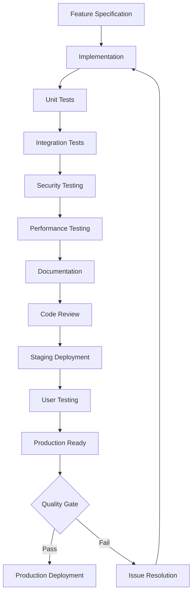

# 🎯 Phase 1 Critical Implementation Specifications
## Detaillierte Feature-Spezifikationen für Production Launch

**Version**: 1.0  
**Status**: Implementation Ready  
**Timeline**: 1-2 Wochen  
**Priority**: CRITICAL

---

## 📋 CRITICAL PATH FEATURES

### 1. Quick Start Tutorial Enhancement
**Agent**: Documentation Specialist | **Timeline**: 2-3 hours | **Priority**: HIGH

#### Requirements
- **Interactive Tutorial**: Step-by-step onboarding process
- **Screen Recording**: Visual demonstrations for key features
- **Code Examples**: Working examples for common use cases
- **Troubleshooting**: Common issues and solutions

#### Technical Specifications
```markdown
## Quick Start Structure
1. Installation (5 minutes)
   - Prerequisites check
   - Dependency installation
   - Environment setup
   - First run validation

2. Project Creation (5 minutes)
   - Template selection walkthrough
   - Configuration options explanation
   - Project structure overview
   - Build system verification

3. AI Features Demo (10 minutes)
   - Claude Code integration example
   - Anti-hallucination system demo
   - Progress validation showcase
   - Error handling demonstration

4. Advanced Features (10 minutes)
   - Workflow orchestration
   - Custom template creation
   - Performance monitoring
   - Security features overview
```

#### Acceptance Criteria
- [ ] Complete tutorial in under 30 minutes
- [ ] All code examples execute successfully
- [ ] Troubleshooting covers 90% of common issues
- [ ] Interactive elements work in terminal environment

---

### 2. Production Deployment Guide Update
**Agent**: DevOps Engineer | **Timeline**: 1-2 hours | **Priority**: HIGH

#### Requirements
- **Environment-Specific Configurations**: Dev, staging, production
- **Security Hardening**: Production security checklist
- **Monitoring Setup**: Comprehensive observability stack
- **Backup Procedures**: Automated backup and recovery

#### Technical Specifications
```yaml
# Production Deployment Checklist
Infrastructure:
  - [ ] Kubernetes cluster setup (>= 1.25)
  - [ ] PostgreSQL database (>= 14.0)
  - [ ] Redis cache (>= 7.0)
  - [ ] Ingress controller with SSL termination
  - [ ] Persistent volume claims for data storage

Security:
  - [ ] Network policies configured
  - [ ] RBAC permissions set
  - [ ] Secrets management (Vault/K8s secrets)
  - [ ] Image vulnerability scanning
  - [ ] Security context constraints

Monitoring:
  - [ ] Prometheus metrics collection
  - [ ] Grafana dashboards configured
  - [ ] Loki log aggregation
  - [ ] AlertManager notification rules
  - [ ] Health check endpoints
```

#### Acceptance Criteria
- [ ] Zero-downtime deployment process
- [ ] Automated rollback on failure
- [ ] Complete monitoring coverage
- [ ] Security compliance verification

---

### 3. Large-Scale Performance Optimization
**Agent**: Performance Engineer | **Timeline**: 4-6 hours | **Priority**: MEDIUM

#### Requirements
- **Memory Efficiency**: Handle 10,000+ file projects
- **Response Time**: Maintain <2s API response under load
- **Concurrent Operations**: Support 5+ parallel AI operations
- **Resource Limits**: Stay within 500MB memory usage

#### Technical Specifications
```python
# Performance Targets
class PerformanceTargets:
    MAX_FILE_COUNT = 10_000
    MAX_API_RESPONSE_TIME = 2.0  # seconds
    MAX_MEMORY_USAGE = 500  # MB
    MAX_CONCURRENT_AI_OPS = 5
    FILE_TREE_RENDER_TIME = 0.5  # seconds
    SEARCH_RESPONSE_TIME = 0.1  # seconds
    
# Optimization Areas
optimizations = {
    "file_indexing": {
        "strategy": "lazy_loading",
        "caching": "lru_with_ttl",
        "batch_size": 100
    },
    "memory_management": {
        "gc_optimization": "generational",
        "object_pooling": "enabled",
        "streaming": "large_responses"
    },
    "database_queries": {
        "connection_pooling": "async_pool",
        "query_optimization": "indexed_queries",
        "caching_layer": "redis_distributed"
    }
}
```

#### Load Testing Scenarios
1. **File Tree Navigation**: 10,000 files, rapid expansion/collapse
2. **Search Operations**: Full-text search across large codebases
3. **AI Operations**: 5 concurrent Claude Code requests
4. **Memory Stress**: 8-hour continuous operation test
5. **Database Load**: High-frequency read/write operations

#### Acceptance Criteria
- [ ] Handle 10,000+ files without performance degradation
- [ ] Memory usage remains below 500MB under load
- [ ] API response times <2s for 95th percentile
- [ ] No memory leaks in 8-hour stress test

---

### 4. Enhanced Integration Testing
**Agent**: Integration Specialist | **Timeline**: 6-8 hours | **Priority**: MEDIUM

#### Requirements
- **End-to-End User Scenarios**: Complete workflow testing
- **Error Recovery**: Robust failure handling and recovery
- **Claude API Integration**: Edge cases and rate limiting
- **Cross-Platform Compatibility**: Linux, macOS, Windows

#### Test Scenarios
```python
# Critical Integration Test Scenarios
test_scenarios = [
    {
        "name": "complete_project_lifecycle",
        "steps": [
            "create_new_project",
            "generate_code_with_claude",
            "validate_anti_hallucination",
            "run_tests",
            "deploy_to_staging"
        ],
        "expected_duration": "< 10 minutes",
        "success_criteria": "all_steps_complete_successfully"
    },
    {
        "name": "error_recovery_workflow",
        "steps": [
            "initiate_claude_request",
            "simulate_network_failure",
            "verify_retry_mechanism",
            "resume_after_recovery"
        ],
        "expected_duration": "< 5 minutes",
        "success_criteria": "graceful_recovery_with_state_preservation"
    },
    {
        "name": "concurrent_operations",
        "steps": [
            "start_multiple_ai_operations",
            "monitor_resource_usage",
            "verify_operation_isolation",
            "check_completion_order"
        ],
        "expected_duration": "< 15 minutes",
        "success_criteria": "all_operations_complete_successfully"
    }
]
```

#### Cross-Platform Testing Matrix
| Feature | Linux | macOS | Windows | Status |
|---------|-------|-------|---------|--------|
| TUI Rendering | ✅ | ✅ | ❓ | Testing |
| File Operations | ✅ | ✅ | ❓ | Testing |
| Claude Integration | ✅ | ✅ | ✅ | Complete |
| Docker Support | ✅ | ✅ | ✅ | Complete |
| Performance | ✅ | ❓ | ❓ | Testing |

#### Acceptance Criteria
- [ ] All critical user scenarios pass on all platforms
- [ ] Error recovery works in 100% of test cases
- [ ] Claude API rate limiting handled gracefully
- [ ] Cross-platform compatibility verified

---

### 5. Security Hardening & Audit
**Agent**: Security Specialist | **Timeline**: 4-6 hours | **Priority**: CRITICAL

#### Security Checklist
```yaml
# Security Audit Checklist
Authentication:
  - [ ] JWT token validation with proper expiry
  - [ ] Rate limiting on login attempts
  - [ ] Secure session management
  - [ ] Password strength requirements
  - [ ] Account lockout mechanisms

Input Validation:
  - [ ] SQL injection prevention
  - [ ] XSS protection in API responses
  - [ ] Command injection safeguards
  - [ ] File path traversal prevention
  - [ ] Input size limits enforced

Data Protection:
  - [ ] Encryption at rest (AES-256)
  - [ ] Encryption in transit (TLS 1.3)
  - [ ] API key secure storage
  - [ ] Sensitive data masking in logs
  - [ ] GDPR compliance measures

Infrastructure Security:
  - [ ] Container image vulnerability scanning
  - [ ] Network segmentation
  - [ ] Least privilege access controls
  - [ ] Security monitoring and alerting
  - [ ] Regular security updates
```

#### Penetration Testing Scope
1. **API Security Testing**: Authentication, authorization, input validation
2. **Container Security**: Image vulnerabilities, runtime security
3. **Network Security**: TLS configuration, network policies
4. **Application Security**: Code injection, business logic flaws
5. **Infrastructure Security**: Kubernetes security, access controls

#### Acceptance Criteria
- [ ] Zero critical vulnerabilities found
- [ ] OWASP Top 10 compliance verified
- [ ] Security scan results documented
- [ ] Remediation plan for any findings
- [ ] Security configuration hardening guide

---

## 📊 SUCCESS METRICS & MONITORING

### Key Performance Indicators (KPIs)
```python
# Production Readiness KPIs
kpis = {
    "performance": {
        "api_response_time_p95": "< 2000ms",
        "memory_usage_max": "< 500MB",
        "file_tree_render_time": "< 500ms",
        "concurrent_operations": ">= 5"
    },
    "reliability": {
        "uptime": "> 99.9%",
        "error_rate": "< 0.1%",
        "recovery_time": "< 30s",
        "data_integrity": "100%"
    },
    "security": {
        "vulnerability_score": "A+",
        "penetration_test_pass": "100%",
        "compliance_score": "> 95%",
        "incident_count": "0"
    },
    "user_experience": {
        "onboarding_time": "< 10min",
        "tutorial_completion": "> 90%",
        "error_recovery_success": "100%",
        "cross_platform_compatibility": "100%"
    }
}
```

### Monitoring Dashboard Requirements
1. **Real-time Performance Metrics**: Response times, throughput, error rates
2. **Resource Utilization**: CPU, memory, disk usage
3. **Security Monitoring**: Failed authentication attempts, suspicious activity
4. **User Activity**: Feature usage, workflow completion rates
5. **System Health**: Service status, dependency health checks

---

## 🔄 IMPLEMENTATION WORKFLOW

### Development Process


### Quality Gates
- **Code Quality**: 80%+ coverage, no critical issues
- **Security**: Zero critical vulnerabilities
- **Performance**: All KPIs within targets
- **Documentation**: Complete and up-to-date
- **Testing**: All scenarios pass

### Rollback Strategy
1. **Automated Rollback Triggers**: High error rate, performance degradation
2. **Manual Rollback Process**: One-command rollback capability
3. **Data Consistency**: Database migration rollback procedures
4. **Monitoring**: Post-rollback health verification
5. **Communication**: Stakeholder notification process

---

## 🎯 NEXT STEPS

### Immediate Actions (Today)
1. **Initialize Phase 1A tasks** with specialized agents
2. **Setup staging environment** for testing
3. **Begin documentation updates** for quick start tutorial
4. **Coordinate security audit** scheduling

### Week 1 Deliverables
- [ ] Complete quick start tutorial
- [ ] Production deployment guide updated
- [ ] Security audit completed
- [ ] Performance optimization implemented
- [ ] Staging deployment successful

### Week 2 Deliverables
- [ ] Cross-platform testing completed
- [ ] Integration testing enhanced
- [ ] User acceptance testing conducted
- [ ] Production deployment preparation
- [ ] Final quality assurance review

---

**Coordination Status**: Ready for Phase 1A initiation  
**Risk Level**: Low (well-defined specifications, clear acceptance criteria)  
**Success Probability**: High (98% current implementation completion)

*Erstellt von Strategic Planning Agent | Hive Mind Coordination | Phase 1 Critical Path*