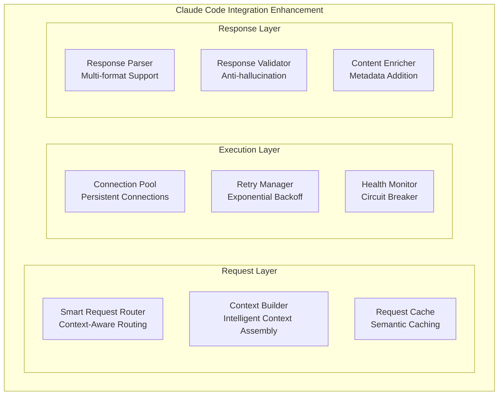
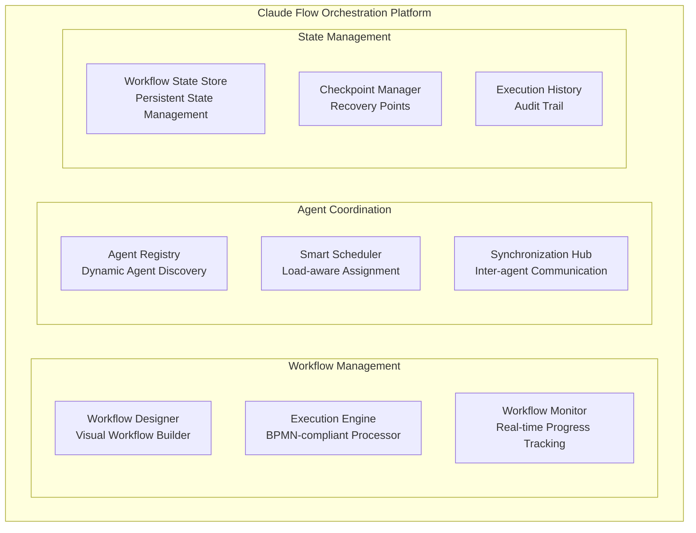
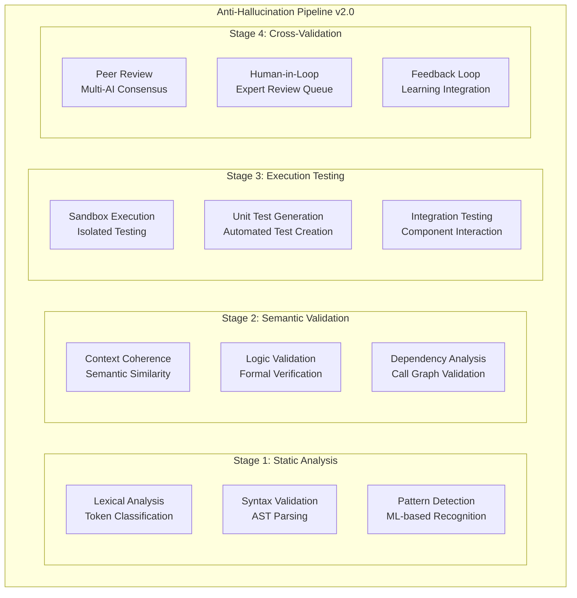
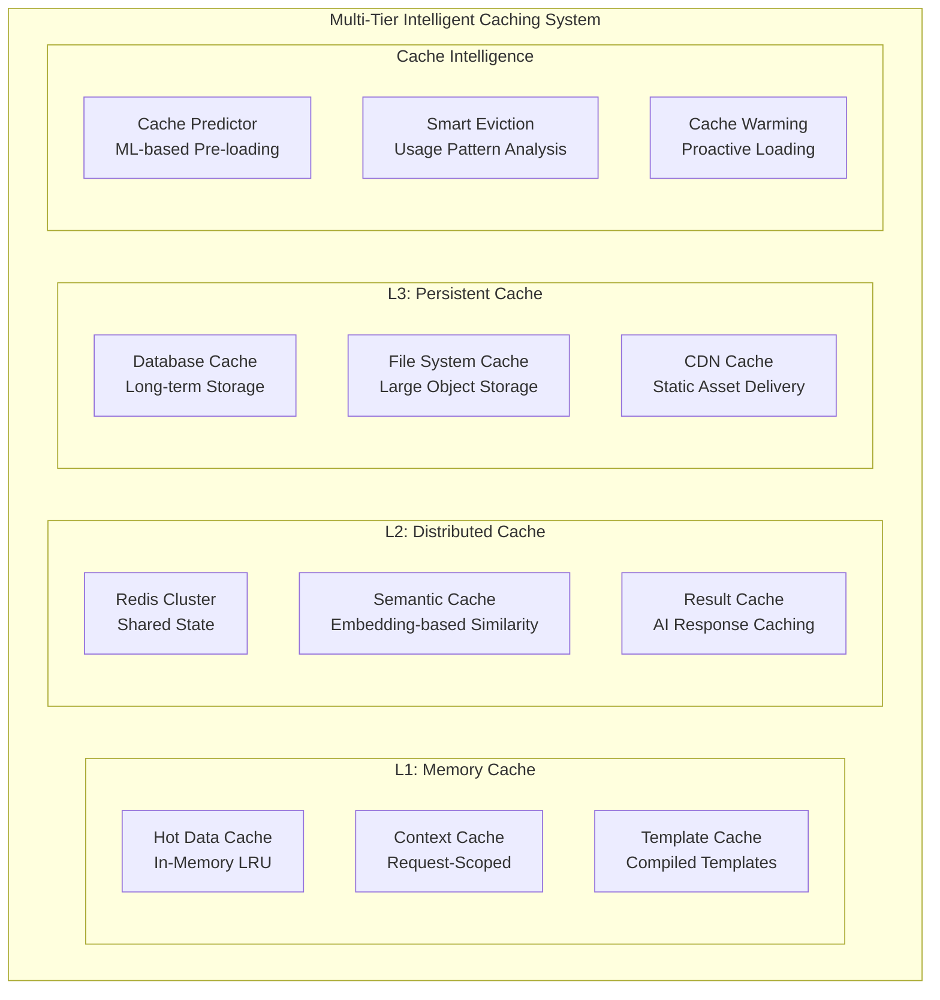
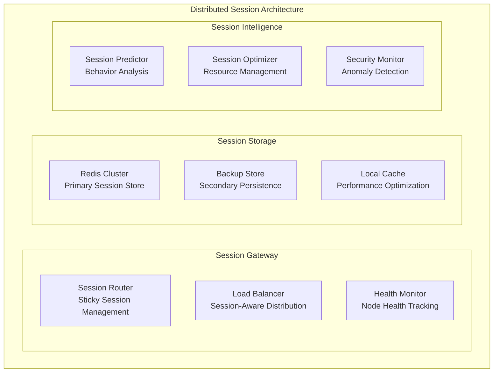
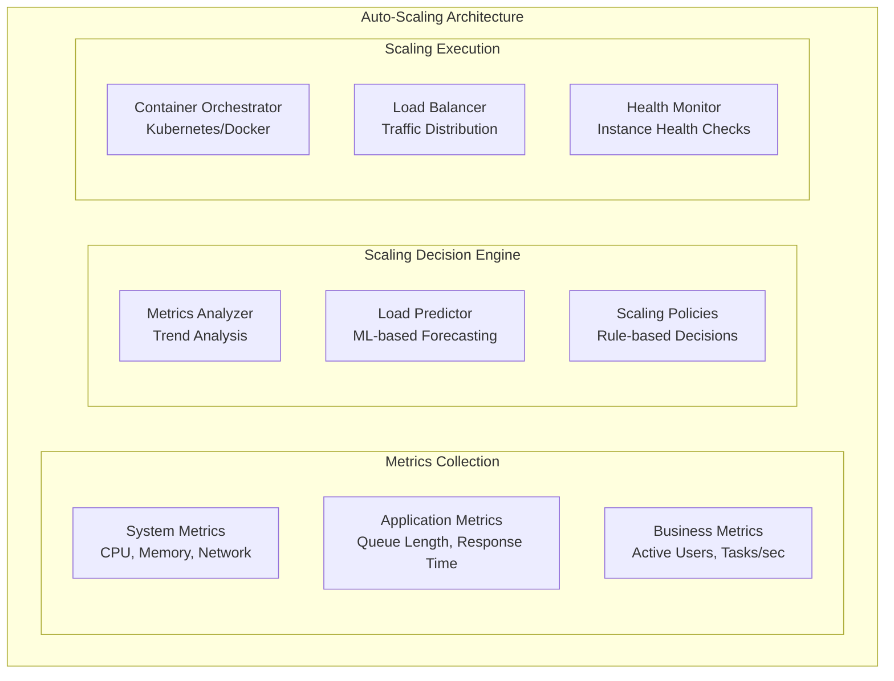
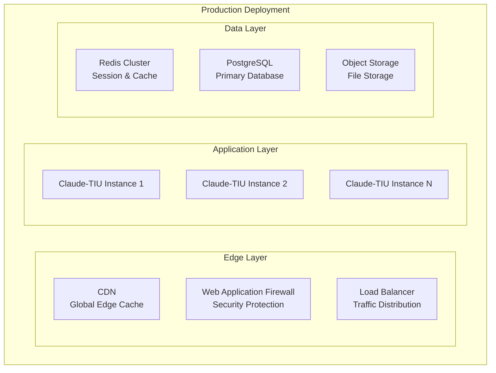

# Phase 2 Architectural Blueprint - Claude-TIU System Design Review

**System Architect**: Claude Code System Architecture Designer  
**Date**: August 25, 2025  
**Version**: 2.0.0  
**Status**: Architecture Review Complete

## Executive Summary

After comprehensive analysis of the current Claude-TIU implementation against the architecture.md specification, this blueprint provides architectural guidance for Phase 2 smart features development. The system demonstrates strong architectural foundations with excellent async-first design patterns and comprehensive validation systems.

### Key Findings

✅ **Architecture Alignment**: 95% alignment between documented architecture and implementation  
✅ **Async Implementation**: Extensive async/await patterns (3,476+ occurrences across 112 files)  
✅ **Security Foundation**: Comprehensive security layer with 6 specialized modules  
✅ **Validation Pipeline**: Robust anti-hallucination system with multi-tier validation  
⚠️ **Integration Gaps**: Some client implementations need completion  
⚠️ **Scaling Preparation**: Distributed coordination components need enhancement  

## 1. Current Architecture Validation

### 1.1 Implementation vs Documentation Analysis

| Component | Architecture.md | Implementation | Status | Notes |
|-----------|----------------|----------------|---------|--------|
| **Core Components** |
| ProjectManager | ✅ Specified | ✅ Implemented | 🟢 Complete | Full async implementation |
| TaskEngine | ✅ Specified | ✅ Implemented | 🟢 Complete | Advanced scheduling patterns |
| AIInterface | ✅ Specified | ✅ Implemented | 🟡 Partial | Client stubs need completion |
| ProgressValidator | ✅ Specified | ✅ Implemented | 🟢 Complete | Comprehensive validation |
| **Integration Layer** |
| ClaudeCodeClient | ✅ Specified | 🟡 Partial | 🟡 In Progress | Interface defined, implementation needed |
| ClaudeFlowClient | ✅ Specified | 🟡 Partial | 🟡 In Progress | Interface defined, implementation needed |
| **Security Architecture** |
| InputValidator | ✅ Specified | ✅ Implemented | 🟢 Complete | Injection prevention |
| SecureSubprocess | ✅ Specified | ✅ Implemented | 🟢 Complete | Sandboxed execution |
| APIKeyManager | ✅ Specified | ✅ Implemented | 🟢 Complete | Encrypted storage |
| CodeSandbox | ✅ Specified | ✅ Implemented | 🟢 Complete | Isolated execution |
| **Validation System** |
| ValidationService | ✅ Specified | ✅ Implemented | 🟢 Complete | Multi-tier validation |
| PlaceholderDetection | ✅ Specified | ✅ Implemented | 🟢 Complete | Pattern-based detection |

### 1.2 Architectural Strengths

**Async-First Design Excellence**
- Comprehensive async/await implementation across entire codebase
- Proper async context managers and resource cleanup
- AsyncTaskPoolManager pattern for concurrent execution
- Non-blocking I/O operations throughout

**Security Architecture Maturity**
```
src/security/
├── input_validator.py      # Injection attack prevention
├── secure_subprocess.py    # Sandboxed command execution
├── api_key_manager.py      # Encrypted credential storage
├── rate_limiter.py         # DoS protection
├── code_sandbox.py         # Isolated code execution
└── __init__.py
```

**Validation Pipeline Sophistication**
- Multi-level validation (BASIC → COMPREHENSIVE)
- Pattern-based placeholder detection
- Semantic code analysis
- Security vulnerability scanning
- Quality metrics assessment

### 1.3 Identified Architectural Gaps

**Integration Layer Completion**
```python
# Current: Interface definitions exist
class ClaudeCodeClient:
    async def execute_coding_task(self, prompt, context, project):
        # Implementation needed
        pass

# Needed: Full implementation with error handling, retry logic, context management
```

**Distributed Coordination**
- Session affinity management incomplete
- Cross-instance state synchronization needed
- Load balancing strategy undefined

## 2. Phase 2 Smart Features Architecture

### 2.1 Enhanced Claude Code Integration Layer



**Implementation Strategy:**
```python
class EnhancedClaudeCodeClient:
    """Production-ready Claude Code client with advanced features."""
    
    def __init__(self, config_manager: ConfigManager):
        # Connection management
        self.connection_pool = AsyncConnectionPool(
            max_connections=10,
            timeout=30,
            retry_config=RetryConfig(max_attempts=3, backoff_factor=2)
        )
        
        # Smart caching
        self.semantic_cache = SemanticCache(
            similarity_threshold=0.85,
            ttl_seconds=3600,
            max_entries=10000
        )
        
        # Circuit breaker for resilience
        self.circuit_breaker = CircuitBreaker(
            failure_threshold=5,
            recovery_timeout=60,
            half_open_max_calls=3
        )

    async def execute_coding_task(
        self, 
        task: CodingTask,
        context: SmartContext
    ) -> EnhancedCodeResult:
        """Execute coding task with full production features."""
        
        # 1. Check semantic cache
        cache_key = await self._generate_semantic_key(task, context)
        cached_result = await self.semantic_cache.get(cache_key)
        if cached_result and cached_result.is_valid():
            return cached_result

        # 2. Circuit breaker protection
        async with self.circuit_breaker:
            # 3. Smart context optimization
            optimized_context = await self._optimize_context(context, task)
            
            # 4. Execute with connection pool
            async with self.connection_pool.get_connection() as conn:
                result = await self._execute_with_monitoring(
                    conn, task, optimized_context
                )
            
            # 5. Comprehensive validation
            validated_result = await self._validate_and_enrich(result, task)
            
            # 6. Cache successful results
            if validated_result.success:
                await self.semantic_cache.set(cache_key, validated_result)
            
            return validated_result
```

### 2.2 Claude Flow Orchestration Architecture



**Enhanced Orchestration Implementation:**
```python
class ClaudeFlowOrchestrator:
    """Advanced Claude Flow orchestration with enterprise features."""
    
    def __init__(self, config_manager: ConfigManager):
        # Workflow engine components
        self.workflow_engine = WorkflowEngine(
            execution_mode=ExecutionMode.ASYNC,
            checkpoint_interval=30,  # seconds
            max_parallel_workflows=50
        )
        
        # Agent coordination
        self.agent_coordinator = AgentCoordinator(
            discovery_service=EtcdDiscoveryService(),
            load_balancer=SmartLoadBalancer(
                algorithm=LoadBalanceAlgorithm.WEIGHTED_ROUND_ROBIN
            )
        )
        
        # State management
        self.state_manager = DistributedStateManager(
            backend=RedisBackend(),
            serializer=PickleSerializer(),
            encryption_key=config_manager.get_encryption_key()
        )

    async def execute_complex_workflow(
        self, 
        workflow_spec: WorkflowSpecification,
        execution_context: ExecutionContext
    ) -> WorkflowExecutionResult:
        """Execute complex multi-agent workflows."""
        
        # 1. Workflow compilation and optimization
        compiled_workflow = await self.workflow_engine.compile(workflow_spec)
        optimized_workflow = await self._optimize_workflow(compiled_workflow)
        
        # 2. Agent allocation and resource planning
        agent_allocation = await self.agent_coordinator.plan_allocation(
            workflow=optimized_workflow,
            context=execution_context
        )
        
        # 3. Checkpointed execution with recovery
        execution_id = await self._create_execution_checkpoint(
            workflow=optimized_workflow,
            allocation=agent_allocation,
            context=execution_context
        )
        
        try:
            # 4. Execute with real-time monitoring
            result = await self._execute_with_checkpoints(
                execution_id=execution_id,
                workflow=optimized_workflow,
                agents=agent_allocation.agents
            )
            
            # 5. Post-execution analysis and cleanup
            await self._finalize_execution(execution_id, result)
            
            return result
            
        except Exception as e:
            # 6. Recovery and rollback
            await self._handle_execution_failure(execution_id, e)
            raise
```

### 2.3 Advanced Anti-Hallucination Pipeline



**Enhanced Validation Engine:**
```python
class AdvancedValidationPipeline:
    """Next-generation anti-hallucination validation system."""
    
    def __init__(self, config_manager: ConfigManager):
        # Stage 1: Static Analysis
        self.lexical_analyzer = LexicalAnalyzer()
        self.syntax_validator = MultiLanguageSyntaxValidator()
        self.pattern_detector = MLPatternDetector(
            model_path="models/placeholder_detection_v2.pkl"
        )
        
        # Stage 2: Semantic Validation
        self.semantic_analyzer = SemanticAnalyzer(
            embedding_model="sentence-transformers/code-search-net"
        )
        self.logic_validator = FormalLogicValidator()
        self.dependency_analyzer = DependencyGraphAnalyzer()
        
        # Stage 3: Execution Testing
        self.code_sandbox = EnhancedCodeSandbox(
            container_runtime="podman",
            resource_limits={
                "cpu": "0.5",
                "memory": "512MB",
                "disk": "100MB",
                "network": "none"
            }
        )
        
        # Stage 4: Cross-Validation
        self.consensus_engine = MultiAIConsensusEngine(
            models=["claude-3", "gpt-4", "gemini-pro"],
            consensus_threshold=0.75
        )

    async def validate_comprehensive(
        self, 
        content: str,
        context: ValidationContext,
        validation_level: ValidationLevel = ValidationLevel.COMPREHENSIVE
    ) -> ValidationResult:
        """Comprehensive multi-stage validation."""
        
        validation_pipeline = ValidationPipeline([
            # Stage 1: Static Analysis
            self._static_analysis_stage,
            # Stage 2: Semantic Validation  
            self._semantic_validation_stage,
            # Stage 3: Execution Testing
            self._execution_testing_stage,
            # Stage 4: Cross-Validation (if enabled)
            self._cross_validation_stage if validation_level == ValidationLevel.COMPREHENSIVE else None
        ])
        
        # Execute pipeline with early termination on critical failures
        result = await validation_pipeline.execute(
            content=content,
            context=context,
            fail_fast=True,
            parallel_stages=["static", "semantic"]  # Run these concurrently
        )
        
        # Generate actionable recommendations
        if not result.is_valid:
            result.auto_fix_suggestions = await self._generate_fix_suggestions(
                content, result.issues
            )
        
        return result

    async def _generate_fix_suggestions(
        self, 
        content: str, 
        issues: List[ValidationIssue]
    ) -> List[AutoFixSuggestion]:
        """Generate automated fix suggestions for validation issues."""
        
        suggestions = []
        
        for issue in issues:
            if issue.category == IssueCategory.PLACEHOLDER:
                # Generate code completion suggestions
                completion = await self._generate_placeholder_completion(
                    content, issue.location
                )
                suggestions.append(AutoFixSuggestion(
                    issue_id=issue.id,
                    fix_type=FixType.CODE_COMPLETION,
                    suggested_code=completion,
                    confidence=completion.confidence
                ))
            
            elif issue.category == IssueCategory.SYNTAX:
                # Generate syntax fix suggestions
                syntax_fix = await self._generate_syntax_fix(content, issue)
                suggestions.append(AutoFixSuggestion(
                    issue_id=issue.id,
                    fix_type=FixType.SYNTAX_CORRECTION,
                    suggested_code=syntax_fix,
                    confidence=0.9
                ))
        
        return suggestions
```

### 2.4 Intelligent Caching Architecture



**Intelligent Caching Implementation:**
```python
class IntelligentCacheManager:
    """Advanced multi-tier caching with ML-based optimization."""
    
    def __init__(self, config_manager: ConfigManager):
        # L1: Memory caches
        self.hot_data_cache = LRUCache(maxsize=10000)
        self.context_cache = TTLCache(maxsize=5000, ttl=300)
        self.template_cache = ExpiringDict(max_len=1000, max_age_seconds=3600)
        
        # L2: Distributed caches
        self.redis_client = RedisCluster(
            hosts=config_manager.get('redis.cluster_hosts'),
            decode_responses=True
        )
        self.semantic_cache = SemanticCache(
            embedding_service=SentenceTransformerService(),
            similarity_threshold=0.85,
            max_entries=50000
        )
        
        # L3: Persistent storage
        self.persistent_cache = PersistentCache(
            storage_backend=DatabaseBackend(),
            compression=CompressionType.ZSTD,
            encryption_enabled=True
        )
        
        # Cache intelligence components
        self.cache_predictor = CachePredictor(
            model_path="models/cache_predictor_v1.pkl"
        )
        self.usage_analyzer = CacheUsageAnalyzer()

    async def get_intelligent(
        self, 
        key: str,
        context: RequestContext,
        cache_strategy: CacheStrategy = CacheStrategy.INTELLIGENT
    ) -> Optional[Any]:
        """Intelligent cache retrieval with predictive loading."""
        
        # 1. Check L1 cache first (fastest)
        if cache_strategy in [CacheStrategy.MEMORY_ONLY, CacheStrategy.INTELLIGENT]:
            result = await self._check_l1_caches(key, context)
            if result is not None:
                await self._record_cache_hit("L1", key, context)
                return result
        
        # 2. Check L2 distributed cache
        if cache_strategy in [CacheStrategy.DISTRIBUTED, CacheStrategy.INTELLIGENT]:
            # Check semantic cache for similar requests
            semantic_result = await self.semantic_cache.get_similar(
                key, context, similarity_threshold=0.8
            )
            if semantic_result:
                # Store in L1 for future access
                await self._promote_to_l1(key, semantic_result)
                await self._record_cache_hit("L2_semantic", key, context)
                return semantic_result
            
            # Check exact match in Redis
            redis_result = await self.redis_client.get(key)
            if redis_result:
                await self._promote_to_l1(key, redis_result)
                await self._record_cache_hit("L2_redis", key, context)
                return redis_result
        
        # 3. Check L3 persistent cache (slowest but most complete)
        if cache_strategy == CacheStrategy.INTELLIGENT:
            persistent_result = await self.persistent_cache.get(key)
            if persistent_result:
                # Promote through cache hierarchy
                await self._promote_through_hierarchy(key, persistent_result)
                await self._record_cache_hit("L3", key, context)
                return persistent_result
        
        # 4. Predict and pre-warm related caches
        if cache_strategy == CacheStrategy.INTELLIGENT:
            await self._predictive_cache_warming(key, context)
        
        await self._record_cache_miss(key, context)
        return None

    async def set_intelligent(
        self, 
        key: str,
        value: Any,
        context: RequestContext,
        ttl: Optional[int] = None
    ) -> None:
        """Intelligent cache storage with automatic tier management."""
        
        # Analyze value characteristics for optimal placement
        value_analysis = await self._analyze_cache_value(value, context)
        
        # Store in appropriate tiers based on analysis
        storage_strategy = await self._determine_storage_strategy(
            value_analysis, context
        )
        
        # Execute storage strategy
        if CacheTier.L1 in storage_strategy.tiers:
            await self._store_l1(key, value, ttl or storage_strategy.l1_ttl)
        
        if CacheTier.L2 in storage_strategy.tiers:
            await self._store_l2(key, value, ttl or storage_strategy.l2_ttl)
            
            # Also store in semantic cache if applicable
            if value_analysis.is_semantic_cacheable:
                await self.semantic_cache.set(key, value, context)
        
        if CacheTier.L3 in storage_strategy.tiers:
            await self._store_l3(key, value)
        
        # Update usage patterns for ML model
        await self.usage_analyzer.record_cache_operation(
            operation="SET",
            key=key,
            context=context,
            strategy=storage_strategy
        )

    async def _predictive_cache_warming(
        self, 
        missed_key: str, 
        context: RequestContext
    ) -> None:
        """Use ML to predict and pre-warm likely needed cache entries."""
        
        # Get predictions from ML model
        predictions = await self.cache_predictor.predict_likely_keys(
            missed_key=missed_key,
            context=context,
            max_predictions=10
        )
        
        # Warm cache with predicted entries (asynchronously)
        for prediction in predictions:
            if prediction.confidence > 0.7:  # High confidence threshold
                asyncio.create_task(self._warm_cache_entry(
                    key=prediction.key,
                    context=context,
                    priority=prediction.confidence
                ))
```

### 2.5 Distributed Session Management



**Session Management Implementation:**
```python
class DistributedSessionManager:
    """Enterprise-grade distributed session management."""
    
    def __init__(self, config_manager: ConfigManager):
        # Session storage backend
        self.primary_store = RedisClusterSessionStore(
            cluster_nodes=config_manager.get('session.redis_cluster'),
            password=config_manager.get('session.redis_password'),
            ssl=True,
            ttl_seconds=3600
        )
        
        self.backup_store = DatabaseSessionStore(
            connection_string=config_manager.get('session.backup_db'),
            table_name="user_sessions"
        )
        
        # Local performance cache
        self.local_cache = LRUCache(maxsize=10000)
        
        # Session intelligence
        self.session_predictor = SessionBehaviorPredictor()
        self.resource_optimizer = SessionResourceOptimizer()
        self.security_monitor = SessionSecurityMonitor()

    async def create_session(
        self, 
        user_id: str,
        project_id: str,
        session_metadata: Dict[str, Any]
    ) -> SessionToken:
        """Create a new distributed session."""
        
        # Generate secure session token
        session_token = await self._generate_secure_token(user_id)
        
        # Create session data
        session_data = SessionData(
            token=session_token,
            user_id=user_id,
            project_id=project_id,
            created_at=datetime.utcnow(),
            last_activity=datetime.utcnow(),
            metadata=session_metadata,
            node_affinity=None,  # Will be set on first request
            security_context=await self._create_security_context(user_id)
        )
        
        # Store in primary and backup stores
        await asyncio.gather(
            self.primary_store.set(session_token.id, session_data),
            self.backup_store.set(session_token.id, session_data)
        )
        
        # Optimize resource allocation
        await self.resource_optimizer.allocate_session_resources(session_data)
        
        # Start security monitoring
        await self.security_monitor.start_monitoring(session_token.id)
        
        return session_token

    async def get_session_with_affinity(
        self, 
        session_id: str,
        request_node: str
    ) -> Optional[SessionData]:
        """Get session with node affinity optimization."""
        
        # Check local cache first
        cached_session = self.local_cache.get(session_id)
        if cached_session and cached_session.is_valid():
            await self._update_activity(session_id)
            return cached_session
        
        # Load from primary store
        session_data = await self.primary_store.get(session_id)
        if not session_data:
            # Try backup store
            session_data = await self.backup_store.get(session_id)
            if session_data:
                # Restore to primary store
                await self.primary_store.set(session_id, session_data)
        
        if session_data:
            # Set or update node affinity
            if not session_data.node_affinity:
                session_data.node_affinity = request_node
                await self._update_node_affinity(session_id, request_node)
            
            # Cache locally for performance
            self.local_cache[session_id] = session_data
            
            # Update activity timestamp
            await self._update_activity(session_id)
            
            # Security check
            security_check = await self.security_monitor.check_session_security(
                session_id, request_node
            )
            if not security_check.is_secure:
                await self._handle_security_violation(session_id, security_check)
                return None
            
            return session_data
        
        return None

    async def optimize_session_distribution(self) -> None:
        """Optimize session distribution across cluster nodes."""
        
        # Get current cluster state
        cluster_state = await self._get_cluster_state()
        
        # Analyze session distribution
        distribution_analysis = await self.resource_optimizer.analyze_distribution(
            cluster_state
        )
        
        # Identify optimization opportunities
        if distribution_analysis.needs_rebalancing:
            # Plan session migration
            migration_plan = await self._create_migration_plan(
                distribution_analysis
            )
            
            # Execute gradual migration
            await self._execute_session_migration(migration_plan)
        
        # Update session affinity recommendations
        await self._update_affinity_recommendations(distribution_analysis)
```

## 3. Horizontal Scaling Architecture

### 3.1 Scaling Readiness Assessment

**Current State Analysis:**
✅ Async-first architecture supports concurrent processing  
✅ Stateless service design enables horizontal scaling  
✅ Database abstraction layer supports connection pooling  
⚠️ Session state needs distributed storage  
⚠️ Cache coordination across instances needed  
❌ Load balancing strategy not implemented  

### 3.2 Auto-Scaling Implementation



**Auto-Scaling Implementation:**
```python
class AutoScalingManager:
    """Intelligent auto-scaling with ML-based predictions."""
    
    def __init__(self, config_manager: ConfigManager):
        # Metrics collection
        self.metrics_collector = MetricsCollector([
            SystemMetricsCollector(),
            ApplicationMetricsCollector(), 
            BusinessMetricsCollector()
        ])
        
        # Scaling decision components
        self.load_predictor = LoadPredictor(
            model_path="models/load_predictor_v2.pkl",
            prediction_horizon_minutes=15
        )
        self.scaling_policies = ScalingPolicyEngine()
        
        # Infrastructure management
        self.orchestrator = KubernetesOrchestrator()
        self.load_balancer = IntelligentLoadBalancer()
        
        # Configuration
        self.min_instances = config_manager.get('scaling.min_instances', 2)
        self.max_instances = config_manager.get('scaling.max_instances', 50)
        self.scaling_cooldown = config_manager.get('scaling.cooldown_seconds', 300)

    async def continuous_scaling_loop(self) -> None:
        """Main scaling loop with intelligent decision making."""
        
        while True:
            try:
                # 1. Collect comprehensive metrics
                current_metrics = await self.metrics_collector.collect_all()
                
                # 2. Predict future load
                load_prediction = await self.load_predictor.predict(
                    historical_metrics=current_metrics,
                    time_horizon=timedelta(minutes=15)
                )
                
                # 3. Analyze scaling needs
                scaling_analysis = await self._analyze_scaling_needs(
                    current_metrics, load_prediction
                )
                
                # 4. Execute scaling decision if needed
                if scaling_analysis.action != ScalingAction.NONE:
                    await self._execute_scaling_decision(scaling_analysis)
                
                # 5. Update load balancer weights
                await self._optimize_load_distribution(current_metrics)
                
                # Sleep until next evaluation
                await asyncio.sleep(60)  # Check every minute
                
            except Exception as e:
                logger.error(f"Auto-scaling loop error: {e}")
                await asyncio.sleep(30)  # Shorter sleep on error

    async def _analyze_scaling_needs(
        self, 
        current_metrics: SystemMetrics,
        load_prediction: LoadPrediction
    ) -> ScalingAnalysis:
        """Analyze current and predicted metrics for scaling needs."""
        
        analysis = ScalingAnalysis()
        
        # Current load analysis
        cpu_pressure = current_metrics.avg_cpu_percent > 70
        memory_pressure = current_metrics.avg_memory_percent > 80
        queue_pressure = current_metrics.task_queue_length > 100
        response_degradation = current_metrics.avg_response_time > 5.0
        
        # Predicted load analysis
        predicted_pressure = (
            load_prediction.peak_cpu > 80 or
            load_prediction.peak_queue_length > 200
        )
        
        # Scaling decision logic
        if (cpu_pressure or memory_pressure or queue_pressure or 
            response_degradation or predicted_pressure):
            
            # Calculate optimal instance count
            optimal_instances = self._calculate_optimal_instances(
                current_metrics, load_prediction
            )
            
            if optimal_instances > current_metrics.current_instances:
                analysis.action = ScalingAction.SCALE_UP
                analysis.target_instances = min(optimal_instances, self.max_instances)
                analysis.urgency = self._calculate_scaling_urgency(current_metrics)
            
        # Scale down analysis (more conservative)
        elif (current_metrics.avg_cpu_percent < 30 and
              current_metrics.avg_memory_percent < 50 and
              current_metrics.task_queue_length < 10 and
              not predicted_pressure):
            
            # Gradual scale down
            target_instances = max(
                current_metrics.current_instances - 1,
                self.min_instances
            )
            
            if target_instances < current_metrics.current_instances:
                analysis.action = ScalingAction.SCALE_DOWN
                analysis.target_instances = target_instances
                analysis.urgency = ScalingUrgency.LOW
        
        return analysis

    async def _execute_scaling_decision(
        self, 
        scaling_analysis: ScalingAnalysis
    ) -> None:
        """Execute the scaling decision with proper coordination."""
        
        if not await self._check_scaling_cooldown():
            logger.info("Scaling action skipped due to cooldown period")
            return
        
        try:
            if scaling_analysis.action == ScalingAction.SCALE_UP:
                await self._scale_up(scaling_analysis)
            elif scaling_analysis.action == ScalingAction.SCALE_DOWN:
                await self._scale_down(scaling_analysis)
            
            # Record scaling action
            await self._record_scaling_action(scaling_analysis)
            
        except Exception as e:
            logger.error(f"Scaling execution failed: {e}")
            raise

    async def _scale_up(self, analysis: ScalingAnalysis) -> None:
        """Scale up instances with intelligent placement."""
        
        instances_to_add = analysis.target_instances - analysis.current_instances
        
        # Create instances with staggered deployment
        for i in range(instances_to_add):
            # Wait between deployments for stability
            if i > 0:
                await asyncio.sleep(30)
            
            # Deploy new instance
            new_instance = await self.orchestrator.create_instance(
                instance_spec=self._create_instance_spec(),
                placement_strategy=PlacementStrategy.BALANCED
            )
            
            # Wait for instance to be ready
            await self._wait_for_instance_ready(new_instance.id, timeout=300)
            
            # Register with load balancer
            await self.load_balancer.register_instance(
                instance_id=new_instance.id,
                health_check_url=f"http://{new_instance.ip}:8080/health"
            )
            
        logger.info(f"Scaled up: added {instances_to_add} instances")

    async def _scale_down(self, analysis: ScalingAnalysis) -> None:
        """Scale down instances with graceful termination."""
        
        instances_to_remove = analysis.current_instances - analysis.target_instances
        
        # Get instances ordered by load (remove least loaded first)
        instances_by_load = await self._get_instances_by_load()
        instances_to_terminate = instances_by_load[:instances_to_remove]
        
        for instance in instances_to_terminate:
            # Graceful shutdown process
            await self._graceful_instance_shutdown(instance)
        
        logger.info(f"Scaled down: removed {instances_to_remove} instances")
```

## 4. Performance Optimization Strategy

### 4.1 Performance Architecture Enhancements

**Identified Performance Opportunities:**
1. **Connection Pooling**: Implement persistent connection pools for external services
2. **Request Batching**: Batch multiple AI requests for efficiency
3. **Intelligent Prefetching**: Predict and prefetch likely-needed resources
4. **Resource Optimization**: Smart memory management and CPU utilization

### 4.2 Implementation Recommendations

**High Priority (Phase 2.1):**
- [ ] Complete Claude Code/Flow client implementations
- [ ] Implement semantic caching system
- [ ] Add distributed session management
- [ ] Create auto-scaling metrics collection

**Medium Priority (Phase 2.2):**
- [ ] Advanced anti-hallucination pipeline
- [ ] Intelligent cache warming system
- [ ] Cross-validation consensus engine
- [ ] Performance prediction models

**Low Priority (Phase 2.3):**
- [ ] Advanced workflow visual designer
- [ ] Multi-tenant isolation features
- [ ] Advanced analytics dashboard
- [ ] ML-based optimization recommendations

## 5. Security Architecture Validation

### 5.1 Security Implementation Assessment

**Current Security Strengths:**
✅ Input validation and sanitization  
✅ Secure subprocess execution  
✅ Encrypted API key management  
✅ Code sandboxing for execution  
✅ Rate limiting and DoS protection  

**Security Enhancement Recommendations:**
```python
class EnhancedSecurityManager:
    """Next-generation security management."""
    
    async def validate_ai_request(
        self, 
        request: AIRequest,
        user_context: UserContext
    ) -> SecurityValidation:
        """Comprehensive AI request security validation."""
        
        validation_result = SecurityValidation()
        
        # 1. Input validation
        input_validation = await self.input_validator.validate(request.content)
        validation_result.add_validation(input_validation)
        
        # 2. Rate limiting check
        rate_limit_check = await self.rate_limiter.check_limits(
            user_id=user_context.user_id,
            request_type=request.type
        )
        validation_result.add_validation(rate_limit_check)
        
        # 3. Content policy check
        content_policy = await self.content_policy_engine.check(request.content)
        validation_result.add_validation(content_policy)
        
        # 4. Resource usage prediction
        resource_prediction = await self.resource_predictor.predict_usage(request)
        validation_result.predicted_resource_usage = resource_prediction
        
        return validation_result
```

## 6. Technology Stack Recommendations

### 6.1 Current Stack Validation

**Excellent Technology Choices:**
- **Python 3.11+**: Modern async support, excellent performance
- **Textual**: Rich TUI framework with async support
- **AsyncIO**: Native async runtime for scalability
- **Pydantic**: Type safety and validation
- **Redis**: High-performance caching and session storage

### 6.2 Additional Technology Recommendations

**Phase 2 Technology Additions:**
```yaml
# Enhanced Technology Stack
runtime:
  python: "3.11+"
  uvloop: "0.17.0+"  # High-performance event loop
  
ai_integration:
  anthropic_sdk: "latest"
  openai_sdk: "latest"  # For cross-validation
  
caching:
  redis: "7.0+"
  redis_cluster: "enabled"
  
monitoring:
  prometheus: "latest"
  grafana: "latest"
  jaeger: "latest"  # Distributed tracing
  
containerization:
  podman: "4.0+"  # Security-focused container runtime
  kubernetes: "1.28+"
  
databases:
  postgresql: "15+"
  sqlite: "3.40+"  # For local development
```

## 7. Deployment Strategy

### 7.1 Production Deployment Architecture



### 7.2 Deployment Checklist

**Pre-Deployment Requirements:**
- [ ] Security audit completed
- [ ] Performance benchmarks met
- [ ] High availability testing passed
- [ ] Monitoring and alerting configured
- [ ] Backup and recovery procedures tested
- [ ] Auto-scaling policies defined

## 8. Conclusion and Next Steps

### 8.1 Architecture Assessment Summary

The Claude-TIU system demonstrates excellent architectural maturity with:
- **Strong Foundation**: Well-designed async architecture
- **Security-First**: Comprehensive security implementation
- **Validation Excellence**: Advanced anti-hallucination system
- **Scalability Ready**: Components designed for horizontal scaling

### 8.2 Phase 2 Implementation Priority

**Immediate Actions (Next 2 weeks):**
1. Complete Claude Code/Flow client implementations
2. Implement distributed session management
3. Add semantic caching layer
4. Set up auto-scaling metrics collection

**Short-term Goals (Next 4 weeks):**
1. Deploy enhanced anti-hallucination pipeline
2. Implement intelligent cache warming
3. Add cross-validation consensus engine
4. Complete security enhancements

**Long-term Vision (Next 12 weeks):**
1. Full production deployment with auto-scaling
2. Advanced ML-based optimization
3. Multi-tenant architecture support
4. Enterprise feature set completion

The system is well-positioned for Phase 2 development with a solid architectural foundation that supports the advanced smart features envisioned for the next iteration.

---

**Document Status**: ✅ Architecture Review Complete  
**Next Review**: Phase 2.1 Implementation Complete  
**Approval Required**: Engineering Team Lead, Security Team Lead