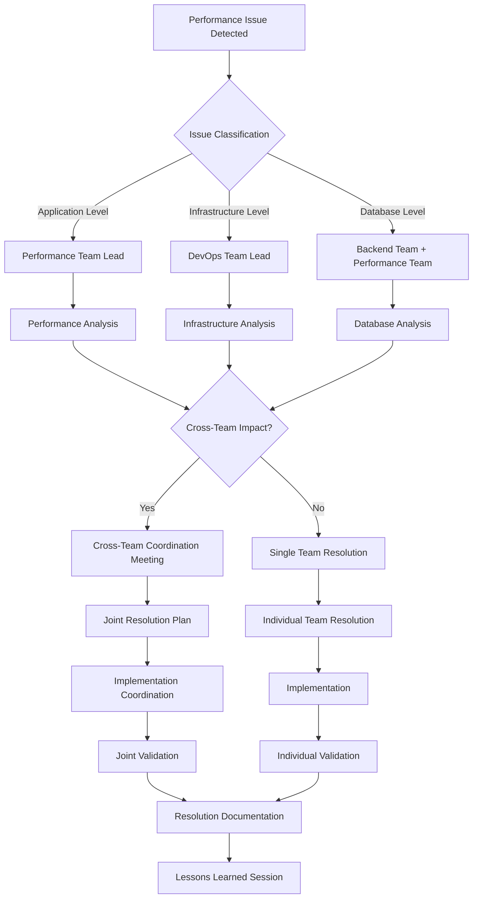

# Team Coordination Strategy - Performance Optimization

**Document Version:** 1.0  
**Created:** 2025-08-25  
**Owner:** Performance Optimization Team

---

## Team Coordination Overview

### Performance Optimization Impact Map
```
Performance Optimization Team (Core)
├── Backend Development Team (Critical Dependency)
├── DevOps/Infrastructure Team (Critical Dependency)  
├── Quality Assurance Team (High Dependency)
├── Architecture Team (High Dependency)
├── Product Team (Medium Dependency)
├── Security Team (Medium Dependency)
└── Frontend Team (Low Dependency)
```

---

## Critical Team Dependencies

### 1. Backend Development Team Coordination

#### Shared Responsibilities
```yaml
shared_areas:
  database_optimization:
    backend_team: "Query optimization, schema design"
    performance_team: "Connection pooling, caching strategies"
    
  api_performance:
    backend_team: "Endpoint logic, business rules"
    performance_team: "Response time optimization, load testing"
    
  memory_management:
    backend_team: "Application-level memory usage"
    performance_team: "System-level memory optimization"
    
  async_operations:
    backend_team: "Business logic implementation"
    performance_team: "Concurrency patterns, resource management"
```

#### Collaboration Protocols
```yaml
coordination_meetings:
  daily_sync:
    frequency: "daily"
    duration: "15min"
    participants: ["perf_lead", "backend_lead"]
    agenda: ["blockers", "shared_tasks", "dependencies"]
    
  architectural_review:
    frequency: "bi-weekly"
    duration: "1hour"
    participants: ["both_teams", "architect"]
    agenda: ["performance_impact_review", "optimization_opportunities"]
    
  sprint_planning:
    frequency: "per_sprint"
    duration: "2hours"
    focus: "cross-team_task_planning"
```

#### Communication Channels
```yaml
communication:
  primary_channel: "#backend-performance-sync"
  escalation_channel: "#architecture-escalation"
  documentation: "shared_confluence_space"
  
  notification_triggers:
    performance_regression: "automatic slack notification"
    optimization_opportunity: "weekly summary report"
    critical_issue: "immediate escalation"
```

### 2. DevOps/Infrastructure Team Coordination

#### Infrastructure Performance Responsibilities
```yaml
devops_focus:
  infrastructure_scaling:
    - auto_scaling_configuration
    - load_balancer_optimization
    - container_orchestration
    - resource_allocation
    
  monitoring_infrastructure:
    - metrics_collection_setup
    - alerting_configuration
    - dashboard_deployment
    - log_aggregation
    
  deployment_optimization:
    - ci_cd_performance
    - blue_green_deployments
    - rollback_procedures
    - environment_consistency

performance_team_focus:
  application_performance:
    - code_optimization
    - caching_strategies
    - database_tuning
    - performance_testing
    
  performance_analysis:
    - bottleneck_identification
    - optimization_recommendations
    - sla_monitoring
    - capacity_planning
```

#### Joint Responsibilities
```yaml
shared_ownership:
  performance_monitoring:
    setup: "devops_team"
    configuration: "performance_team"
    maintenance: "joint_responsibility"
    
  scaling_decisions:
    infrastructure: "devops_team"
    triggers: "performance_team"
    validation: "joint_validation"
    
  incident_response:
    infrastructure_issues: "devops_lead"
    application_issues: "performance_lead"
    coordination: "incident_commander"
```

### 3. Quality Assurance Team Integration

#### Performance Testing Coordination
```yaml
qa_performance_integration:
  test_strategy_alignment:
    functional_testing: "qa_team_focus"
    performance_testing: "joint_responsibility"
    load_testing: "performance_team_lead"
    
  test_environment_management:
    environment_setup: "devops_team"
    test_data_preparation: "qa_team"
    performance_validation: "performance_team"
    
  automation_integration:
    functional_test_automation: "qa_team"
    performance_test_automation: "performance_team"
    ci_cd_integration: "joint_effort"
```

#### Quality Gates Coordination
```yaml
performance_quality_gates:
  development_stage:
    owner: "performance_team"
    qa_input: "test_case_review"
    criteria: "micro_benchmarks"
    
  integration_stage:
    owner: "qa_team"
    performance_input: "performance_assertions"
    criteria: "component_performance"
    
  pre_production:
    owner: "joint_ownership"
    criteria: "full_load_test_validation"
    sign_off: "both_teams_required"
```

---

## Coordination Workflows

### 1. Performance Issue Resolution Workflow



### 2. Optimization Project Workflow

```yaml
optimization_project_lifecycle:
  initiation:
    trigger: "performance_bottleneck_identification"
    stakeholders: ["performance_team", "affected_teams"]
    deliverable: "optimization_proposal"
    
  planning:
    duration: "1-2 sprints"
    activities:
      - impact_assessment
      - resource_allocation
      - timeline_definition
      - risk_assessment
    deliverable: "coordination_plan"
    
  execution:
    coordination_model: "cross_functional_squad"
    communication_frequency: "daily_standups"
    progress_tracking: "shared_kanban_board"
    
  validation:
    performance_validation: "performance_team"
    functional_validation: "qa_team"
    infrastructure_validation: "devops_team"
    
  deployment:
    deployment_strategy: "gradual_rollout"
    monitoring_intensified: "first_48_hours"
    rollback_readiness: "all_teams_standby"
```

### 3. Escalation Procedures

#### Performance Escalation Matrix
```yaml
escalation_levels:
  level_1:
    trigger: "performance_degradation_detected"
    response_time: "15_minutes"
    responders: ["performance_engineer", "backend_engineer"]
    
  level_2:
    trigger: "sla_breach_imminent"
    response_time: "30_minutes"  
    responders: ["team_leads", "architecture_team"]
    
  level_3:
    trigger: "sla_breach_occurred"
    response_time: "immediate"
    responders: ["management", "all_team_leads", "incident_commander"]
    
  level_4:
    trigger: "system_wide_performance_failure"
    response_time: "immediate"
    responders: ["executive_team", "all_engineering_teams"]
```

---

## Knowledge Sharing & Communication

### 1. Regular Communication Cadence

#### Weekly Coordination Schedule
```yaml
monday:
  - "09:00": cross_team_standup (15min)
  - "14:00": architecture_sync (30min)
  
tuesday:
  - "10:00": performance_metrics_review (30min)
  - "15:00": backend_performance_sync (30min)
  
wednesday:
  - "09:30": devops_infrastructure_sync (30min)
  - "16:00": qa_performance_testing_review (45min)
  
thursday:
  - "10:00": optimization_project_reviews (1hour)
  - "14:30": capacity_planning_discussion (45min)
  
friday:
  - "09:00": weekly_retrospective (45min)
  - "15:00": knowledge_sharing_session (30min)
```

#### Monthly Coordination Activities
```yaml
monthly_activities:
  performance_review_board:
    frequency: "monthly"
    participants: ["all_team_leads", "management"]
    agenda:
      - performance_metrics_review
      - optimization_project_status
      - resource_allocation_review
      - quarterly_planning_updates
      
  cross_team_workshop:
    frequency: "monthly"
    format: "hands_on_learning"
    topics:
      - new_optimization_techniques
      - tool_introductions
      - best_practices_sharing
      
  architecture_alignment:
    frequency: "monthly"
    participants: ["architects", "team_leads"]
    focus: "long_term_performance_strategy"
```

### 2. Documentation & Knowledge Management

#### Shared Documentation Strategy
```yaml
documentation_structure:
  performance_runbooks:
    location: "shared_wiki"
    maintainers: ["performance_team", "devops_team"]
    update_frequency: "continuous"
    
  optimization_case_studies:
    location: "knowledge_base"
    contributors: ["all_teams"]
    review_process: "peer_review"
    
  best_practices_guide:
    location: "development_portal"
    ownership: "performance_team"
    input_from: "all_engineering_teams"
    
  incident_post_mortems:
    location: "incident_management_system"
    access: "all_engineering_teams"
    follow_up: "lessons_learned_sessions"
```

#### Knowledge Transfer Mechanisms
```yaml
knowledge_transfer:
  lunch_and_learn:
    frequency: "bi_weekly"
    duration: "45min"
    format: "informal_presentation"
    topics: "optimization_wins_and_lessons"
    
  code_review_involvement:
    performance_team: "reviews_performance_critical_code"
    backend_team: "reviews_optimization_implementations"
    cross_pollination: "knowledge_sharing_through_reviews"
    
  pair_programming_sessions:
    frequency: "weekly"
    duration: "2hours"
    participants: "rotating_cross_team_pairs"
    focus: "performance_optimization_techniques"
```

---

## Performance Culture Integration

### 1. Cross-Team Performance Mindset

#### Performance Champions Program
```yaml
performance_champions:
  concept: "performance_advocates_in_each_team"
  selection: "volunteer_basis_with_aptitude"
  responsibilities:
    - performance_awareness_in_team
    - early_bottleneck_identification
    - optimization_opportunity_spotting
    - cross_team_communication_bridge
    
  support_provided:
    - monthly_champions_meeting
    - performance_training_resources
    - direct_access_to_performance_team
    - recognition_and_rewards_program
```

#### Performance Metrics Integration
```yaml
team_performance_integration:
  backend_team_metrics:
    - api_response_times
    - database_query_performance
    - memory_usage_patterns
    - code_complexity_metrics
    
  devops_team_metrics:
    - infrastructure_response_times
    - scaling_efficiency
    - deployment_performance
    - resource_utilization
    
  qa_team_metrics:
    - test_execution_performance
    - performance_test_coverage
    - regression_detection_rate
    - validation_accuracy
```

### 2. Performance-First Development Practices

#### Development Process Integration
```yaml
development_integration:
  design_phase:
    performance_consideration: "mandatory"
    performance_team_input: "architectural_reviews"
    deliverable: "performance_impact_assessment"
    
  implementation_phase:
    performance_checkpoints: "milestone_reviews"
    optimization_opportunities: "continuous_identification"
    cross_team_collaboration: "embedded_performance_mindset"
    
  testing_phase:
    performance_validation: "integrated_testing"
    cross_team_sign_off: "performance_criteria_met"
    production_readiness: "joint_assessment"
```

---

## Success Metrics & KPIs

### Team Coordination Effectiveness
```yaml
coordination_metrics:
  communication_effectiveness:
    - cross_team_issue_resolution_time
    - escalation_frequency_reduction
    - knowledge_sharing_participation
    
  collaboration_quality:
    - joint_project_success_rate
    - cross_team_satisfaction_scores
    - optimization_implementation_speed
    
  performance_culture_adoption:
    - performance_champion_engagement
    - proactive_optimization_initiatives
    - performance_first_mindset_metrics
```

### Operational Excellence Indicators
```yaml
operational_metrics:
  issue_resolution:
    - mean_time_to_detection (MTTD)
    - mean_time_to_resolution (MTTR)
    - first_time_fix_rate
    
  optimization_delivery:
    - optimization_project_cycle_time
    - performance_improvement_realized
    - sustainable_optimization_rate
    
  knowledge_effectiveness:
    - cross_team_skill_development
    - best_practices_adoption_rate
    - innovation_and_improvement_rate
```

---

## Risk Management & Contingency Planning

### Coordination Risk Mitigation
```yaml
risk_mitigation:
  communication_breakdown:
    prevention: "multiple_communication_channels"
    detection: "regular_sync_meetings"
    response: "escalation_protocols"
    
  conflicting_priorities:
    prevention: "shared_roadmap_planning"
    detection: "priority_alignment_reviews"
    response: "management_arbitration_process"
    
  knowledge_silos:
    prevention: "cross_team_knowledge_sharing"
    detection: "knowledge_audit_sessions"
    response: "targeted_knowledge_transfer"
    
  resource_conflicts:
    prevention: "capacity_planning_coordination"
    detection: "resource_utilization_monitoring"
    response: "resource_reallocation_protocols"
```

---

## Implementation Timeline

### Phase 1: Foundation (Weeks 1-2)
- [ ] Establish communication channels and meeting cadence
- [ ] Define roles and responsibilities matrix
- [ ] Set up shared documentation spaces
- [ ] Launch performance champions program

### Phase 2: Process Integration (Weeks 3-4)
- [ ] Implement cross-team workflows
- [ ] Establish escalation procedures
- [ ] Integrate performance gates in development process
- [ ] Launch knowledge sharing initiatives

### Phase 3: Culture Development (Weeks 5-6)
- [ ] Performance-first mindset training
- [ ] Cross-team collaboration exercises
- [ ] Best practices documentation and sharing
- [ ] Metrics and feedback loop establishment

### Phase 4: Optimization (Weeks 7-8)
- [ ] Refine coordination processes based on feedback
- [ ] Scale successful coordination patterns
- [ ] Establish continuous improvement mechanisms
- [ ] Validate team coordination effectiveness

---

**Strategy Prepared by:** Performance Optimization Team  
**Stakeholder Review:** Required from all mentioned teams  
**Implementation Start:** Upon stakeholder approval  
**Review Frequency:** Monthly coordination effectiveness review

*This strategy ensures seamless collaboration between teams while maintaining focus on performance optimization goals and delivering measurable improvements to the Claude TUI system.*