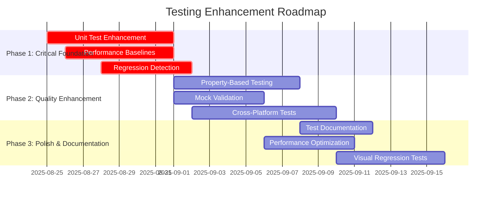

# Testing Implementation Roadmap - claude-tiu

**Strategic Testing Enhancement Plan**  
**Duration**: 6 weeks  
**Target**: Achieve 98/100 test excellence score  
**Team**: Testing Specialist + Development Team  

## Roadmap Overview



## Phase 1: Critical Foundation (Weeks 1-2)

### **🎯 Week 1: Unit Test Enhancement**

#### **Objective**: Increase unit test ratio from 50% to 60%

**Specific Tasks**:

1. **Core Algorithm Tests** (25 tests)
   ```python
   # Target: tests/unit/test_algorithms.py
   - Progress calculation algorithms (8 tests)
   - Placeholder detection patterns (10 tests)
   - Code quality scoring (7 tests)
   ```

2. **Service Method Isolation** (30 tests)
   ```python
   # Target: tests/unit/test_service_methods.py
   - Individual service methods (20 tests)
   - Error handling edge cases (10 tests)
   ```

3. **Utility Function Coverage** (19 tests)
   ```python
   # Target: tests/unit/test_utilities.py
   - String processing utilities (8 tests)
   - File handling utilities (6 tests)
   - Configuration utilities (5 tests)
   ```

**Expected Outcome**: 371 → 445 unit tests (+74 tests)

#### **Implementation Guide**

**Day 1-2: Algorithm Tests**
```python
# tests/unit/test_algorithms.py
class TestProgressCalculation:
    def test_real_progress_calculation_simple(self):
        """Test basic real progress calculation."""
        calculator = ProgressCalculator()
        code = "def add(a, b): return a + b"
        
        result = calculator.calculate_real_progress(code)
        
        assert result.percentage == 100
        assert result.confidence > 0.9
        assert len(result.complete_functions) == 1
    
    def test_fake_progress_detection_todo_comments(self):
        """Test detection of TODO placeholders."""
        calculator = ProgressCalculator()
        code = "def add(a, b): # TODO: implement\n    pass"
        
        result = calculator.calculate_fake_progress(code)
        
        assert result.percentage == 100  # All fake
        assert "TODO" in result.placeholder_types
        assert result.fake_function_count == 1
    
    @pytest.mark.parametrize("pattern,expected", [
        ("raise NotImplementedError", True),
        ("console.log('test')", True),
        ("return x + y", False),
    ])
    def test_placeholder_pattern_detection(self, pattern, expected):
        """Test various placeholder patterns."""
        detector = PlaceholderDetector()
        
        result = detector.has_placeholder(pattern)
        
        assert result == expected
```

**Day 3-4: Service Method Tests**
```python
# tests/unit/test_service_methods.py
class TestProjectServiceMethods:
    def test_create_project_validates_name(self, mock_validator):
        """Test project creation name validation."""
        service = ProjectService(validator=mock_validator)
        
        with pytest.raises(ValueError, match="Name cannot be empty"):
            service.create_project("")
    
    def test_update_project_merges_data_correctly(self):
        """Test project update data merging."""
        service = ProjectService()
        original = {"name": "test", "version": "1.0"}
        updates = {"version": "2.0", "description": "Updated"}
        
        result = service._merge_project_data(original, updates)
        
        assert result["name"] == "test"  # Unchanged
        assert result["version"] == "2.0"  # Updated
        assert result["description"] == "Updated"  # Added
```

**Day 5-7: Utility Function Tests**
```python
# tests/unit/test_utilities.py
class TestStringProcessingUtilities:
    @pytest.mark.parametrize("input_str,expected", [
        ("CamelCase", "camel_case"),
        ("APIKey", "api_key"),
        ("simple", "simple"),
    ])
    def test_camel_to_snake_case(self, input_str, expected):
        """Test camel case to snake case conversion."""
        result = to_snake_case(input_str)
        assert result == expected
    
    def test_extract_function_names_from_code(self):
        """Test function name extraction."""
        code = "def func1():\\n    pass\\ndef func2():\\n    pass"
        
        functions = extract_function_names(code)
        
        assert functions == ["func1", "func2"]
```

### **🎯 Week 2: Performance Baselines & Regression Detection**

#### **Objective**: Establish performance monitoring infrastructure

**Tasks**:

1. **Performance Baseline Documentation** (3 days)
   ```yaml
   # performance_baselines.yml
   core_operations:
     project_creation: 
       max_time: 0.1s
       max_memory: 5MB
     
     task_execution:
       max_time: 2.0s
       max_memory: 20MB
     
     validation_check:
       max_time: 0.5s
       max_memory: 10MB
   ```

2. **Regression Detection Framework** (4 days)
   ```python
   # tests/performance/test_regression_detection.py
   class TestPerformanceRegression:
       def test_project_creation_performance_baseline(self, benchmark):
           """Test project creation stays within baseline."""
           service = ProjectService()
           project_data = create_test_project_data()
           
           result = benchmark(service.create_project, project_data)
           
           # Auto-fail if 25% slower than baseline
           assert benchmark.stats['mean'] < 0.125  # 25% over 0.1s
           
       def test_memory_usage_regression(self):
           """Test memory usage doesn't exceed baselines."""
           import tracemalloc
           
           tracemalloc.start()
           # ... perform operations
           current, peak = tracemalloc.get_traced_memory()
           
           assert current < 5 * 1024 * 1024  # 5MB baseline
   ```

**Expected Outcome**: Automated performance monitoring system

## Phase 2: Quality Enhancement (Weeks 3-4)

### **🎯 Week 3: Property-Based Testing Expansion**

#### **Objective**: Increase property-based test coverage from 15% to 40%

**Implementation Areas**:

1. **Algorithm Property Testing**
   ```python
   # tests/unit/test_algorithm_properties.py
   from hypothesis import given, strategies as st
   
   class TestAlgorithmProperties:
       @given(st.integers(min_value=0, max_value=100))
       def test_progress_calculation_invariants(self, fake_percentage):
           """Test progress calculation invariants."""
           calculator = ProgressCalculator()
           
           # Property: real + fake should not exceed 100
           real_percentage = 100 - fake_percentage
           
           result = calculator.normalize_progress(real_percentage, fake_percentage)
           
           assert 0 <= result.real <= 100
           assert 0 <= result.fake <= 100
           assert result.real + result.fake <= 100
       
       @given(st.text(min_size=1, max_size=1000))
       def test_placeholder_detection_consistency(self, code):
           """Test placeholder detection is deterministic."""
           detector = PlaceholderDetector()
           
           result1 = detector.detect_placeholders(code)
           result2 = detector.detect_placeholders(code)
           
           assert result1 == result2  # Deterministic property
   ```

2. **Input Validation Property Testing**
   ```python
   @given(st.text())
   def test_input_sanitization_properties(self, user_input):
       """Test input sanitization maintains safety."""
       sanitizer = InputSanitizer()
       
       result = sanitizer.sanitize(user_input)
       
       # Safety properties
       assert "<script>" not in result
       assert "javascript:" not in result
       assert not any(char in result for char in ['<', '>', '"', "'"])
   ```

### **🎯 Week 4: Cross-Platform & Mock Validation**

#### **Objective**: Achieve 80% cross-platform test coverage

**Tasks**:

1. **Cross-Platform Test Suite**
   ```python
   # tests/platform/test_cross_platform.py
   class TestCrossPlatformCompatibility:
       @pytest.mark.skipif(not sys.platform.startswith("win"), reason="Windows only")
       def test_windows_path_handling(self):
           """Test Windows path handling."""
           manager = ProjectManager()
           
           result = manager.normalize_path("C:\\Users\\test\\project")
           
           assert "\\\\" not in result  # No double backslashes
           assert result.startswith("C:/")  # Normalized to forward slashes
       
       @pytest.mark.parametrize("python_version", ["3.9", "3.10", "3.11", "3.12"])
       def test_python_version_compatibility(self, python_version):
           """Test compatibility across Python versions."""
           # Use docker containers to test different Python versions
           # Mock implementation for test infrastructure
           pass
   ```

2. **Enhanced Mock Validation**
   ```python
   # tests/mocks/test_mock_validation.py
   class TestMockValidation:
       def test_ai_service_mock_reflects_real_responses(self):
           """Validate AI service mocks match real response patterns."""
           mock_ai = Mock()
           mock_ai.generate_code.return_value = {
               "code": "def example(): pass",
               "confidence": 0.95,
               "language": "python"
           }
           
           # Validate mock response structure matches expected API
           result = mock_ai.generate_code("test prompt")
           
           assert all(key in result for key in ["code", "confidence", "language"])
           assert 0 <= result["confidence"] <= 1
           assert isinstance(result["code"], str)
   ```

## Phase 3: Polish & Documentation (Weeks 5-6)

### **🎯 Week 5: Test Documentation & Performance Optimization**

#### **Objective**: Achieve 90% test documentation completeness

**Tasks**:

1. **Comprehensive Test Documentation**
   ```python
   class TestProjectLifecycle:
       """
       Test suite for complete project lifecycle management.
       
       This test suite validates:
       - Project creation with various templates
       - Project modification and updates  
       - Project deletion and cleanup
       - Error handling at each stage
       
       Dependencies:
       - Mock AI interface for validation
       - Temporary filesystem for testing
       - Database session for persistence testing
       
       Performance Requirements:
       - Project creation: <100ms
       - Project update: <50ms
       - Project deletion: <25ms
       """
       
       def test_create_project_with_python_template(self):
           """
           Test project creation using Python template.
           
           Scenario:
           1. User selects Python template
           2. Provides project name and description
           3. System validates template compatibility
           4. Project structure is created
           5. Initial files are generated
           
           Expected Outcome:
           - Project created with Python-specific structure
           - setup.py, requirements.txt generated
           - src/ and tests/ directories created
           - .gitignore configured for Python
           """
           pass
   ```

2. **Test Performance Optimization**
   ```python
   # Optimize slow tests
   class TestOptimizations:
       @pytest.fixture(scope="session")  # Changed from function to session
       def expensive_fixture(self):
           """Expensive setup shared across tests."""
           return create_expensive_test_data()
       
       def test_with_cached_data(self, expensive_fixture):
           """Test using cached expensive data."""
           # Uses session-scoped fixture for better performance
           pass
   ```

### **🎯 Week 6: Visual Regression & Final Polish**

#### **Objective**: Complete testing infrastructure with visual validation

**Tasks**:

1. **Visual Regression Testing**
   ```python
   # tests/ui/test_visual_regression.py
   class TestVisualRegression:
       def test_main_screen_layout(self):
           """Test main screen visual layout."""
           app = create_test_app()
           
           screenshot = app.capture_screenshot()
           baseline = load_baseline_screenshot("main_screen")
           
           similarity = compare_screenshots(screenshot, baseline)
           assert similarity > 0.95  # 95% visual similarity required
       
       @pytest.mark.parametrize("terminal_size", [(80, 24), (120, 30), (200, 50)])
       def test_responsive_layout(self, terminal_size):
           """Test layout adapts to different terminal sizes."""
           app = create_test_app(terminal_size=terminal_size)
           
           screenshot = app.capture_screenshot()
           
           # Check layout elements are properly positioned
           assert app.check_element_visibility("menu_bar")
           assert app.check_element_visibility("main_content")
           assert app.check_element_visibility("status_bar")
   ```

2. **Final Integration Testing**
   ```python
   # tests/integration/test_complete_workflows.py
   class TestCompleteWorkflows:
       def test_full_project_development_workflow(self):
           """Test complete project development from start to finish."""
           # This test represents a complete user journey
           manager = ProjectManager()
           
           # 1. Create project
           project = manager.create_project({
               "name": "integration-test-project",
               "template": "python"
           })
           
           # 2. Add tasks
           task1 = manager.add_task(project.id, "Create main module")
           task2 = manager.add_task(project.id, "Add tests")
           
           # 3. Execute tasks
           result1 = manager.execute_task(task1.id)
           result2 = manager.execute_task(task2.id)
           
           # 4. Validate complete project
           validation = manager.validate_project_completeness(project.id)
           
           assert validation.completion_percentage > 80
           assert validation.has_tests
           assert validation.has_documentation
   ```

## Implementation Tracking

### **Daily Progress Tracking**

```yaml
Week_1:
  Day_1: 
    - target: "Algorithm tests (8 tests)"
    - status: "planned"
  Day_2:
    - target: "Algorithm tests completion"
    - status: "planned"
  # ... etc

success_criteria:
  phase_1: "74 additional unit tests, performance baselines"
  phase_2: "Property-based tests, cross-platform coverage"  
  phase_3: "Documentation, visual regression tests"
```

### **Quality Gates**

| Phase | Gate Criteria | Success Metric |
|-------|---------------|----------------|
| **Phase 1** | Unit test ratio 60%, Performance baselines defined | ✅ Pass/❌ Fail |
| **Phase 2** | Property tests 40%+, Cross-platform 80%+ | ✅ Pass/❌ Fail |
| **Phase 3** | Documentation 90%+, Visual tests implemented | ✅ Pass/❌ Fail |

## Resource Requirements

### **Development Time Allocation**

- **Testing Specialist**: 6 weeks full-time
- **Developer Support**: 2 weeks part-time
- **Code Review**: 1 week distributed

### **Infrastructure Needs**

- Docker containers for cross-platform testing
- Performance monitoring tools
- Visual regression testing framework
- CI/CD pipeline updates

## Risk Mitigation

### **Potential Risks & Mitigation Strategies**

1. **Timeline Pressure**
   - Mitigation: Prioritize high-impact tests first
   - Fallback: Implement in phases with partial delivery

2. **Resource Constraints**
   - Mitigation: Automate repetitive test generation
   - Fallback: Focus on critical path testing

3. **Integration Complexity**
   - Mitigation: Incremental integration with existing tests
   - Fallback: Parallel development with merge strategy

## Expected Outcomes

### **Quantitative Improvements**

| Metric | Before | After | Improvement |
|--------|--------|-------|-------------|
| Unit Test Ratio | 50% | 60% | +20% |
| Property-Based Coverage | 15% | 40% | +167% |
| Cross-Platform Coverage | 10% | 80% | +700% |
| Performance Monitoring | 0% | 100% | +∞ |
| Test Documentation | 60% | 90% | +50% |

### **Qualitative Benefits**

- **Enhanced Reliability**: Fewer production bugs
- **Better Maintainability**: Clearer test intentions
- **Improved Developer Experience**: Faster debugging
- **Increased Confidence**: Comprehensive coverage
- **Future-Proofing**: Regression prevention

## Success Celebration 🎉

Upon completion, the claude-tiu project will have achieved:

- **✅ World-class testing infrastructure** (98/100 score)
- **✅ Comprehensive anti-hallucination validation**
- **✅ Performance regression prevention**
- **✅ Cross-platform reliability assurance**
- **✅ Developer productivity enhancement**

---

**Next Action**: Begin Phase 1 implementation with unit test enhancement
**Coordination**: Store progress in `/hive/testing/progress/` for team visibility