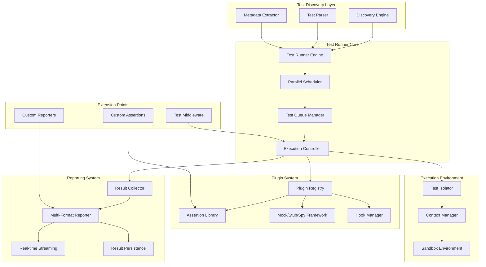

# Test Framework Architecture

## System Overview

This document defines the architecture for a scalable, modular test framework designed for high-performance parallel execution with extensible components and comprehensive reporting.

## High-Level Architecture



## Core Components

### 1. Test Discovery Engine

```typescript
interface ITestDiscovery {
  // Discover test files based on patterns
  discoverTests(patterns: string[], options: DiscoveryOptions): Promise<TestFile[]>
  
  // Parse test metadata
  parseTestFile(filePath: string): Promise<TestMetadata>
  
  // Filter tests based on criteria
  filterTests(tests: TestCase[], filters: TestFilter[]): TestCase[]
}

class TestDiscoveryEngine implements ITestDiscovery {
  private fileWatcher: FileWatcher
  private patternMatcher: PatternMatcher
  private metadataExtractor: MetadataExtractor
  
  async discoverTests(patterns: string[], options: DiscoveryOptions): Promise<TestFile[]> {
    const files = await this.fileWatcher.findFiles(patterns)
    return Promise.all(
      files.map(file => this.parseTestFile(file.path))
    )
  }
}
```

### 2. Test Runner Engine

```typescript
interface ITestRunner {
  // Execute test suite
  run(suite: TestSuite, config: RunnerConfig): Promise<TestResults>
  
  // Execute single test
  runTest(test: TestCase, context: TestContext): Promise<TestResult>
  
  // Parallel execution
  runParallel(tests: TestCase[], config: ParallelConfig): Promise<TestResults>
}

class TestRunnerEngine implements ITestRunner {
  private scheduler: ParallelScheduler
  private executor: ExecutionController
  private isolator: TestIsolator
  private reporter: ResultCollector
  
  async run(suite: TestSuite, config: RunnerConfig): Promise<TestResults> {
    // 1. Setup execution environment
    const context = await this.setupExecutionContext(config)
    
    // 2. Schedule tests for parallel execution
    const scheduledTests = await this.scheduler.schedule(suite.tests, config.parallelism)
    
    // 3. Execute tests with isolation
    const results = await this.executeTests(scheduledTests, context)
    
    // 4. Collect and report results
    return this.reporter.collect(results)
  }
}
```

### 3. Parallel Scheduler

```typescript
interface IParallelScheduler {
  // Schedule tests for optimal parallel execution
  schedule(tests: TestCase[], config: SchedulerConfig): Promise<ExecutionPlan>
  
  // Dynamic load balancing
  rebalance(currentPlan: ExecutionPlan, metrics: ExecutionMetrics): ExecutionPlan
  
  // Resource allocation
  allocateResources(tests: TestCase[], resources: ResourcePool): ResourceAllocation
}

class ParallelScheduler implements IParallelScheduler {
  private loadBalancer: LoadBalancer
  private resourceManager: ResourceManager
  private dependencyResolver: DependencyResolver
  
  async schedule(tests: TestCase[], config: SchedulerConfig): Promise<ExecutionPlan> {
    // 1. Resolve test dependencies
    const dependencyGraph = this.dependencyResolver.resolve(tests)
    
    // 2. Group tests by resource requirements
    const groups = this.groupTestsByRequirements(tests)
    
    // 3. Create execution plan with optimal parallelism
    return this.loadBalancer.createExecutionPlan(groups, dependencyGraph, config)
  }
}
```

### 4. Plugin System Architecture

```typescript
interface IPlugin {
  name: string
  version: string
  initialize(context: PluginContext): Promise<void>
  teardown(): Promise<void>
}

interface IAssertionPlugin extends IPlugin {
  registerMatchers(): MatcherDefinition[]
}

interface IReporterPlugin extends IPlugin {
  report(results: TestResults): Promise<void>
}

class PluginRegistry {
  private plugins: Map<string, IPlugin> = new Map()
  private matchers: Map<string, Matcher> = new Map()
  private reporters: Map<string, IReporterPlugin> = new Map()
  
  async loadPlugin(pluginPath: string): Promise<IPlugin> {
    const plugin = await import(pluginPath)
    await plugin.initialize(this.createPluginContext())
    this.plugins.set(plugin.name, plugin)
    return plugin
  }
  
  registerMatcher(name: string, matcher: Matcher): void {
    this.matchers.set(name, matcher)
  }
  
  getMatcher(name: string): Matcher | undefined {
    return this.matchers.get(name)
  }
}
```

### 5. Assertion Library with Extensible Matchers

```typescript
interface IMatcher<T = any> {
  match(actual: T, expected?: any): MatchResult
  message(actual: T, expected?: any): string
  negatedMessage(actual: T, expected?: any): string
}

class AssertionLibrary {
  private matchers: Map<string, IMatcher> = new Map()
  
  expect<T>(actual: T): Expectation<T> {
    return new Expectation(actual, this.matchers)
  }
  
  addMatcher(name: string, matcher: IMatcher): void {
    this.matchers.set(name, matcher)
  }
  
  // Built-in matchers
  private initializeBuiltInMatchers(): void {
    this.addMatcher('toBe', new ToBeMatcher())
    this.addMatcher('toEqual', new ToEqualMatcher())
    this.addMatcher('toBeCloseTo', new ToBeCloseToMatcher())
    this.addMatcher('toThrow', new ToThrowMatcher())
    this.addMatcher('toHaveBeenCalled', new ToHaveBeenCalledMatcher())
  }
}

class Expectation<T> {
  constructor(
    private actual: T,
    private matchers: Map<string, IMatcher>
  ) {}
  
  toBe(expected: T): void {
    const matcher = this.matchers.get('toBe')!
    const result = matcher.match(this.actual, expected)
    if (!result.pass) {
      throw new AssertionError(matcher.message(this.actual, expected))
    }
  }
  
  // Dynamic matcher methods
  [key: string]: any
}
```

### 6. Mock/Stub/Spy Framework

```typescript
interface ISpyable {
  spy(target: any, method: string): Spy
  stub(target: any, method: string, implementation?: Function): Stub
  mock<T>(target: T): Mock<T>
}

class MockFramework implements ISpyable {
  private spies: Set<Spy> = new Set()
  private stubs: Set<Stub> = new Set()
  private mocks: Set<Mock<any>> = new Set()
  
  spy(target: any, method: string): Spy {
    const originalMethod = target[method]
    const spy = new Spy(originalMethod, target, method)
    
    target[method] = (...args: any[]) => {
      spy.recordCall(args)
      return spy.callOriginal(...args)
    }
    
    this.spies.add(spy)
    return spy
  }
  
  stub(target: any, method: string, implementation?: Function): Stub {
    const stub = new Stub(target[method], target, method, implementation)
    target[method] = stub.implementation || (() => undefined)
    this.stubs.add(stub)
    return stub
  }
  
  mock<T>(target: T): Mock<T> {
    const mock = new Mock(target)
    this.mocks.add(mock)
    return mock
  }
  
  restoreAll(): void {
    this.spies.forEach(spy => spy.restore())
    this.stubs.forEach(stub => stub.restore())
    this.mocks.forEach(mock => mock.restore())
    this.clearAll()
  }
}

class Spy {
  private calls: CallRecord[] = []
  
  constructor(
    private originalMethod: Function,
    private target: any,
    private methodName: string
  ) {}
  
  recordCall(args: any[]): void {
    this.calls.push({
      args,
      timestamp: Date.now(),
      returnValue: undefined,
      threwError: false
    })
  }
  
  callOriginal(...args: any[]): any {
    return this.originalMethod.apply(this.target, args)
  }
  
  getCallCount(): number {
    return this.calls.length
  }
  
  getCallArgs(index: number): any[] {
    return this.calls[index]?.args || []
  }
  
  restore(): void {
    this.target[this.methodName] = this.originalMethod
  }
}
```

### 7. Test Context and Isolation

```typescript
interface ITestIsolator {
  createIsolatedContext(test: TestCase): Promise<TestContext>
  executeInIsolation(test: TestCase, context: TestContext): Promise<TestResult>
  cleanupContext(context: TestContext): Promise<void>
}

class TestIsolator implements ITestIsolator {
  private contextPool: ContextPool
  private sandboxManager: SandboxManager
  
  async createIsolatedContext(test: TestCase): Promise<TestContext> {
    const context = await this.contextPool.acquire()
    
    // Setup isolated environment
    context.globals = this.createIsolatedGlobals()
    context.filesystem = await this.sandboxManager.createFileSystemSandbox()
    context.networkAccess = this.createNetworkSandbox(test.config.networkPolicy)
    
    return context
  }
  
  async executeInIsolation(test: TestCase, context: TestContext): Promise<TestResult> {
    const startTime = performance.now()
    let result: TestResult
    
    try {
      // Set up test environment
      await this.setupTestEnvironment(context, test)
      
      // Execute test with timeout
      const testPromise = this.executeTest(test, context)
      const timeoutPromise = this.createTimeout(test.timeout || 5000)
      
      const testResult = await Promise.race([testPromise, timeoutPromise])
      
      result = {
        status: 'passed',
        duration: performance.now() - startTime,
        output: testResult
      }
    } catch (error) {
      result = {
        status: error.name === 'TimeoutError' ? 'timeout' : 'failed',
        duration: performance.now() - startTime,
        error: error.message,
        stack: error.stack
      }
    } finally {
      await this.cleanupContext(context)
    }
    
    return result
  }
}
```

### 8. Multi-Format Reporter System

```typescript
interface IReporter {
  report(results: TestResults): Promise<void>
  stream(result: TestResult): Promise<void>
}

class MultiFormatReporter implements IReporter {
  private reporters: Map<string, IReporter> = new Map()
  private streaming: boolean = false
  
  addReporter(name: string, reporter: IReporter): void {
    this.reporters.set(name, reporter)
  }
  
  async report(results: TestResults): Promise<void> {
    const reportPromises = Array.from(this.reporters.values()).map(
      reporter => reporter.report(results)
    )
    await Promise.all(reportPromises)
  }
  
  async stream(result: TestResult): Promise<void> {
    if (!this.streaming) return
    
    const streamPromises = Array.from(this.reporters.values())
      .filter(reporter => 'stream' in reporter)
      .map(reporter => reporter.stream(result))
    
    await Promise.all(streamPromises)
  }
}

class JUnitReporter implements IReporter {
  async report(results: TestResults): Promise<void> {
    const xml = this.generateJUnitXML(results)
    await fs.writeFile('./test-results.xml', xml)
  }
  
  private generateJUnitXML(results: TestResults): string {
    // JUnit XML generation logic
    return `<?xml version="1.0" encoding="UTF-8"?>
      <testsuites name="Test Results" tests="${results.total}" failures="${results.failed}" time="${results.duration}">
        ${results.suites.map(suite => this.generateTestSuite(suite)).join('\n')}
      </testsuites>`
  }
}

class JSONReporter implements IReporter {
  async report(results: TestResults): Promise<void> {
    await fs.writeFile('./test-results.json', JSON.stringify(results, null, 2))
  }
  
  async stream(result: TestResult): Promise<void> {
    console.log(JSON.stringify({
      type: 'test-result',
      timestamp: new Date().toISOString(),
      result
    }))
  }
}

class ConsoleReporter implements IReporter {
  async report(results: TestResults): Promise<void> {
    console.log(`\n${this.formatSummary(results)}`)
    console.log(this.formatDetails(results))
  }
  
  async stream(result: TestResult): Promise<void> {
    const symbol = result.status === 'passed' ? '✓' : 
                   result.status === 'failed' ? '✗' : 
                   result.status === 'skipped' ? '-' : '⚠'
    console.log(`${symbol} ${result.name} (${result.duration}ms)`)
  }
}
```

## Data Architecture

### Core Data Models

```typescript
interface TestCase {
  id: string
  name: string
  description?: string
  filePath: string
  lineNumber: number
  tags: string[]
  timeout?: number
  setup?: () => Promise<void>
  teardown?: () => Promise<void>
  execute: () => Promise<any>
  config: TestCaseConfig
}

interface TestSuite {
  id: string
  name: string
  description?: string
  tests: TestCase[]
  hooks: {
    beforeAll?: () => Promise<void>
    afterAll?: () => Promise<void>
    beforeEach?: () => Promise<void>
    afterEach?: () => Promise<void>
  }
  config: TestSuiteConfig
}

interface TestResult {
  testId: string
  name: string
  status: 'passed' | 'failed' | 'skipped' | 'timeout'
  duration: number
  error?: string
  stack?: string
  output?: any
  assertions?: AssertionResult[]
  metadata: ResultMetadata
}

interface TestResults {
  id: string
  timestamp: string
  total: number
  passed: number
  failed: number
  skipped: number
  duration: number
  suites: TestSuiteResult[]
  coverage?: CoverageReport
  performance?: PerformanceMetrics
}
```

## Configuration Architecture

```typescript
interface TestFrameworkConfig {
  // Discovery configuration
  discovery: {
    patterns: string[]
    exclude: string[]
    extensions: string[]
    recursive: boolean
  }
  
  // Execution configuration
  execution: {
    parallel: boolean
    maxWorkers: number
    timeout: number
    retries: number
    failFast: boolean
    randomize: boolean
    seed?: number
  }
  
  // Plugin configuration
  plugins: {
    assertions: string[]
    reporters: ReporterConfig[]
    hooks: string[]
  }
  
  // Environment configuration
  environment: {
    isolation: 'process' | 'vm' | 'worker'
    sandbox: boolean
    networkPolicy: NetworkPolicy
    fileSystemPolicy: FileSystemPolicy
  }
  
  // Reporting configuration
  reporting: {
    formats: ('console' | 'junit' | 'json' | 'html')[]
    outputDir: string
    streaming: boolean
    verbose: boolean
  }
}
```

## Service Boundaries and Interfaces

### Core Services

1. **Discovery Service**
   - Test file discovery
   - Metadata extraction
   - Dependency analysis

2. **Execution Service**
   - Test scheduling
   - Parallel execution
   - Resource management

3. **Assertion Service**
   - Matcher registration
   - Assertion evaluation
   - Error formatting

4. **Mock Service**
   - Spy creation
   - Stub management
   - Mock object generation

5. **Reporting Service**
   - Result collection
   - Format transformation
   - Output generation

6. **Plugin Service**
   - Plugin lifecycle management
   - Extension point registration
   - Configuration management

## API Contracts

### Runner API

```typescript
interface ITestFramework {
  // Configuration
  configure(config: TestFrameworkConfig): void
  
  // Plugin management
  loadPlugin(plugin: IPlugin): Promise<void>
  unloadPlugin(pluginName: string): Promise<void>
  
  // Test discovery
  discover(patterns?: string[]): Promise<TestSuite[]>
  
  // Test execution
  run(filter?: TestFilter): Promise<TestResults>
  runSuite(suite: TestSuite): Promise<TestSuiteResult>
  runTest(test: TestCase): Promise<TestResult>
  
  // Event handling
  on(event: string, handler: EventHandler): void
  off(event: string, handler: EventHandler): void
  emit(event: string, data: any): void
}
```

### Plugin API

```typescript
interface IPluginAPI {
  // Test hooks
  beforeAll(handler: () => Promise<void>): void
  afterAll(handler: () => Promise<void>): void
  beforeEach(handler: () => Promise<void>): void
  afterEach(handler: () => Promise<void>): void
  
  // Assertion extensions
  addMatcher(name: string, matcher: IMatcher): void
  
  // Reporter registration
  addReporter(name: string, reporter: IReporter): void
  
  // Configuration access
  getConfig(): TestFrameworkConfig
  setConfig(config: Partial<TestFrameworkConfig>): void
}
```

## Deployment Architecture

```yaml
test-framework:
  core:
    - discovery-engine
    - test-runner
    - parallel-scheduler
    - execution-controller
  
  plugins:
    - assertion-library
    - mock-framework
    - reporter-system
    - custom-extensions
  
  infrastructure:
    - worker-pool
    - result-store
    - configuration-manager
    - plugin-registry
  
  interfaces:
    - cli-interface
    - api-server
    - web-dashboard
    - ide-integration
```

## Scalability Design

### Horizontal Scaling

```typescript
class DistributedTestRunner {
  private workers: WorkerPool
  private coordinator: TestCoordinator
  private resultAggregator: ResultAggregator
  
  async runDistributed(tests: TestCase[], config: DistributedConfig): Promise<TestResults> {
    // 1. Partition tests across workers
    const partitions = this.partitionTests(tests, config.workerCount)
    
    // 2. Distribute work to workers
    const workPromises = partitions.map(partition => 
      this.runOnWorker(partition, config)
    )
    
    // 3. Aggregate results
    const workerResults = await Promise.all(workPromises)
    return this.resultAggregator.aggregate(workerResults)
  }
}
```

### Performance Optimizations

1. **Test Compilation Caching**
2. **Incremental Test Discovery**
3. **Smart Test Ordering**
4. **Resource Pooling**
5. **Lazy Plugin Loading**

## Extension Points

### Custom Assertion Matchers

```typescript
class CustomMatcher implements IMatcher<string> {
  match(actual: string, expected: RegExp): MatchResult {
    return {
      pass: expected.test(actual),
      message: () => `Expected ${actual} to match ${expected}`
    }
  }
}

// Registration
framework.addMatcher('toMatchRegex', new CustomMatcher())
```

### Custom Reporters

```typescript
class SlackReporter implements IReporter {
  async report(results: TestResults): Promise<void> {
    const message = this.formatSlackMessage(results)
    await this.sendToSlack(message)
  }
}

// Registration
framework.addReporter('slack', new SlackReporter())
```

## Security Considerations

1. **Code Sandboxing**: Execute tests in isolated environments
2. **Resource Limits**: Prevent resource exhaustion attacks
3. **File System Access Control**: Restrict file system access
4. **Network Isolation**: Control network access during tests
5. **Plugin Validation**: Validate and sandbox plugins

## Quality Metrics

1. **Test Coverage**: Line, branch, and function coverage
2. **Performance Metrics**: Execution time, memory usage
3. **Reliability Metrics**: Flakiness detection, stability scores
4. **Code Quality**: Complexity analysis, maintainability index

## Future Enhancements

1. **Visual Test Debugging**: Interactive test debugging interface
2. **AI-Powered Test Generation**: Automatic test case generation
3. **Cloud Integration**: Native cloud test execution
4. **Real-time Collaboration**: Shared test execution environments
5. **Performance Regression Detection**: Automated performance monitoring

This architecture provides a solid foundation for a scalable, extensible test framework that can grow with project needs while maintaining high performance and reliability.